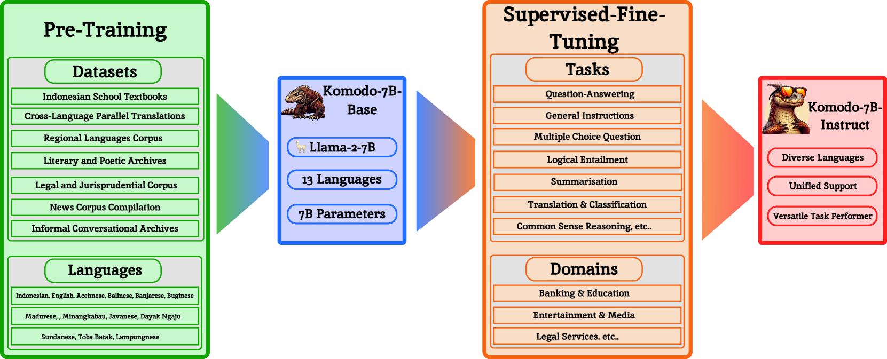
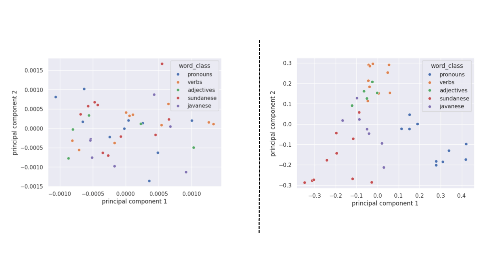
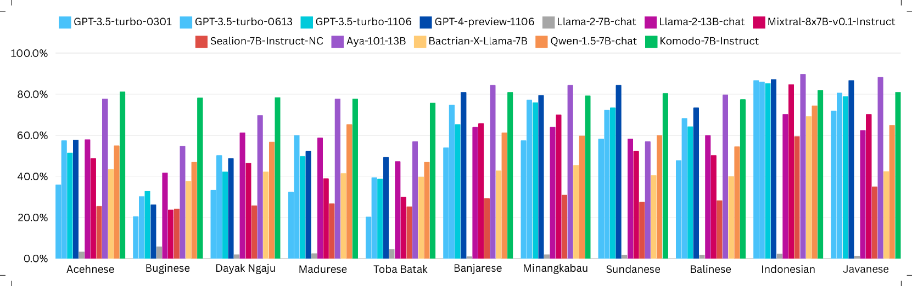
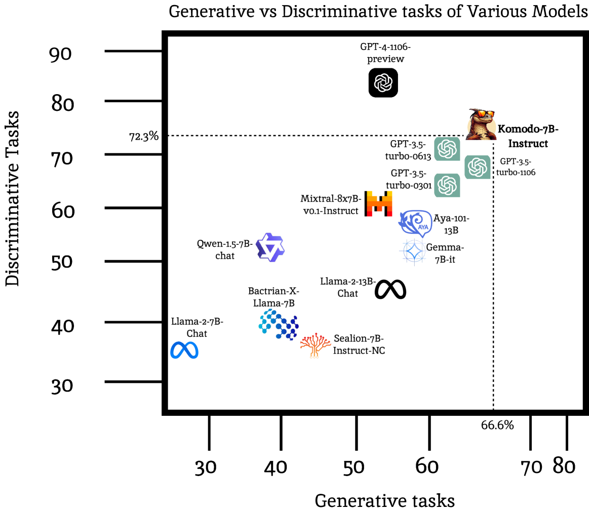
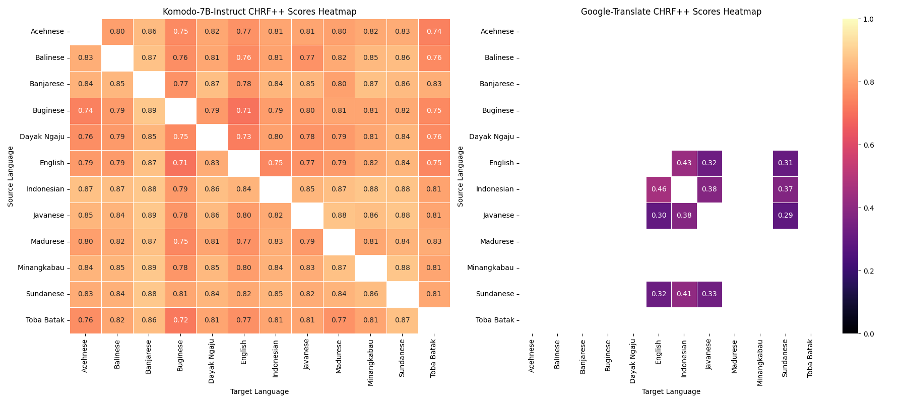
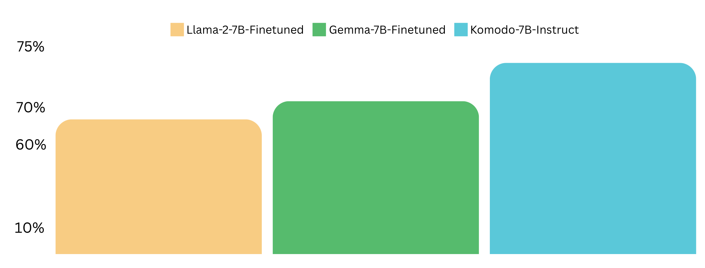
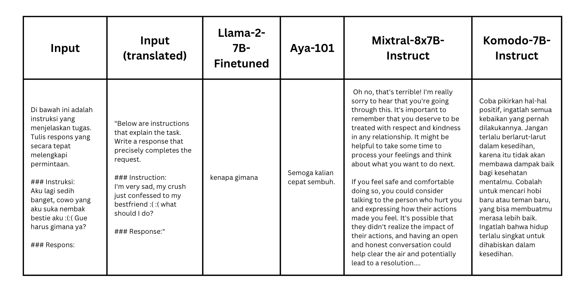
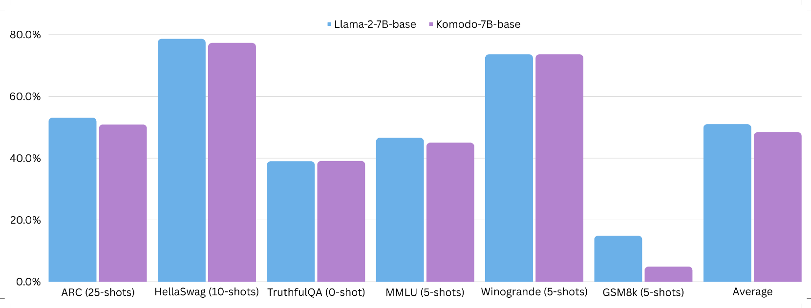

# Komodo项目：一场探索印尼区域语言的深度语言学之旅

发布时间：2024年03月14日

`LLM应用` `小语种`

> Komodo: A Linguistic Expedition into Indonesia's Regional Languages

# 摘要

> 近年来LLMs的重大进展大多聚焦于资源充足易得的语言，例如英语；但针对公开领域内资源匮乏的语言，尤其是诸多小语种，技术进步的步伐尚有较大空间。为此，我们推出了Komodo-7B——一款70亿参数的大型语言模型，旨在跨越印尼语、英语及印度尼西亚境内的11种地方语言，无缝衔接并填补这一领域的空白。Komodo-7B系列包括Komodo-7B-Base和Komodo-7B-Instruct两款模型，其中后者以卓越性能在多项任务和多种语言测试中崭露头角，成功超越了OpenAI的GPT-3.5、Cohere的Aya-101等诸多业界标杆。这款模型不仅在单个语言及综合评测中表现出类拔萃，更展现出强大的跨语言适应力。我们持续致力于推动语言模型发展，力求惠及更多资源有限的小语种。尤为值得一提的是，Komodo-7B-Instruct强化了跨语言理解功能，助力缩小印度尼西亚教育领域的差异，可直接实现从英语到11种地方语言的一站式翻译，与现有翻译服务相比，这一特性无疑是一大飞跃。总而言之，Komodo-7B标志着语言模型在包容性与实用性上的重大进步，切实服务于多元化的语言社群需求。

> The recent breakthroughs in Large Language Models (LLMs) have mostly focused on languages with easily available and sufficient resources, such as English. However, there remains a significant gap for languages that lack sufficient linguistic resources in the public domain. Our work introduces Komodo-7B, 7-billion-parameter Large Language Models designed to address this gap by seamlessly operating across Indonesian, English, and 11 regional languages in Indonesia. Komodo-7B is a family of LLMs that consist of Komodo-7B-Base and Komodo-7B-Instruct. Komodo-7B-Instruct stands out by achieving state-of-the-art performance in various tasks and languages, outperforming the benchmarks set by OpenAI's GPT-3.5, Cohere's Aya-101, Llama-2-Chat-13B, Mixtral-8x7B-Instruct-v0.1, Gemma-7B-it , and many more. This model not only demonstrates superior performance in both language-specific and overall assessments but also highlights its capability to excel in linguistic diversity. Our commitment to advancing language models extends beyond well-resourced languages, aiming to bridge the gap for those with limited linguistic assets. Additionally, Komodo-7B-Instruct's better cross-language understanding contributes to addressing educational disparities in Indonesia, offering direct translations from English to 11 regional languages, a significant improvement compared to existing language translation services. Komodo-7B represents a crucial step towards inclusivity and effectiveness in language models, providing to the linguistic needs of diverse communities.

[Arxiv](https://arxiv.org/abs/2403.09362)