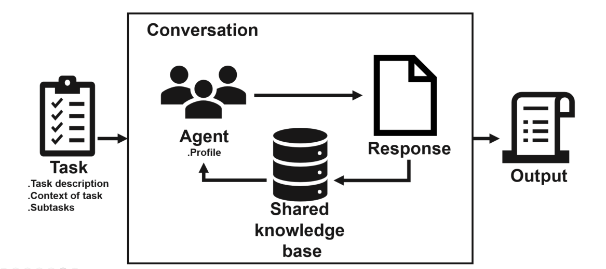
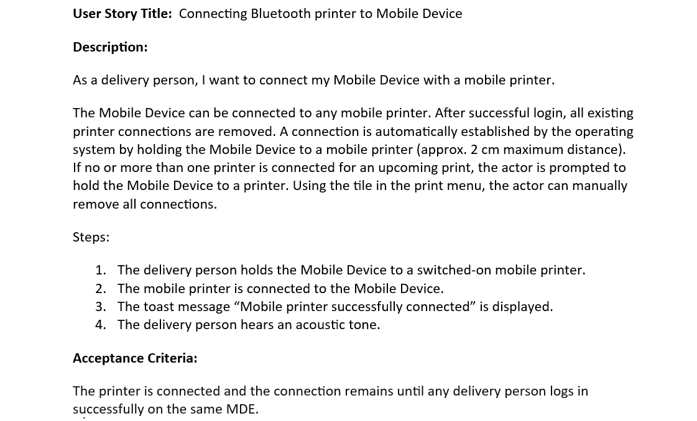
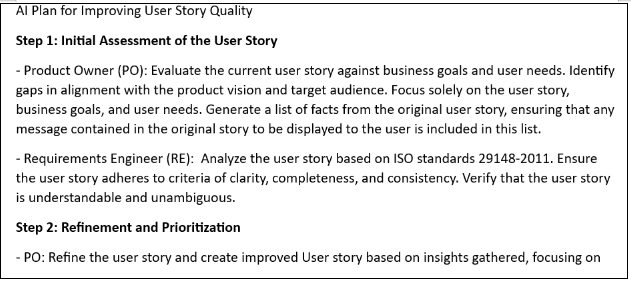
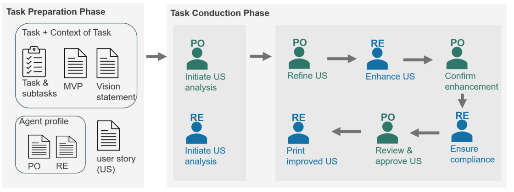
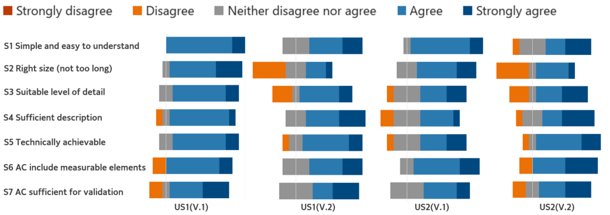

# [一份早期报告显示，利用 LLM 技术开发的智能代理能够实现用户故事质量的自动化优化。](https://arxiv.org/abs/2403.09442)

发布时间：2024年03月14日

`Agent`

`敏捷开发`

`人工智能`

> LLM-based agents for automating the enhancement of user story quality: An early report

> 在敏捷开发实践中，高质量用户故事的维护是关键但也充满困难。本研究着眼于运用大型语言模型来优化奥地利邮政集团IT敏捷团队的用户故事质量。我们创新设计了一款基于LLM的自主代理系统的参照模型，并成功在企业内部实现应用。来自六个敏捷团队共计11位参与者对研究中用户故事的质量改善情况及这些智能代理的有效性进行了评估。研究揭示了LLM在提升用户故事质量上的巨大潜能，丰富了关于AI在敏捷开发中作用的研究内容，并以实例展示了AI技术在产业界产生的变革性影响。

> In agile software development, maintaining high-quality user stories is crucial, but also challenging. This study explores the use of large language models to automatically improve the user story quality in Austrian Post Group IT agile teams. We developed a reference model for an Autonomous LLM-based Agent System and implemented it at the company. The quality of user stories in the study and the effectiveness of these agents for user story quality improvement was assessed by 11 participants across six agile teams. Our findings demonstrate the potential of LLMs in improving user story quality, contributing to the research on AI role in agile development, and providing a practical example of the transformative impact of AI in an industry setting.

