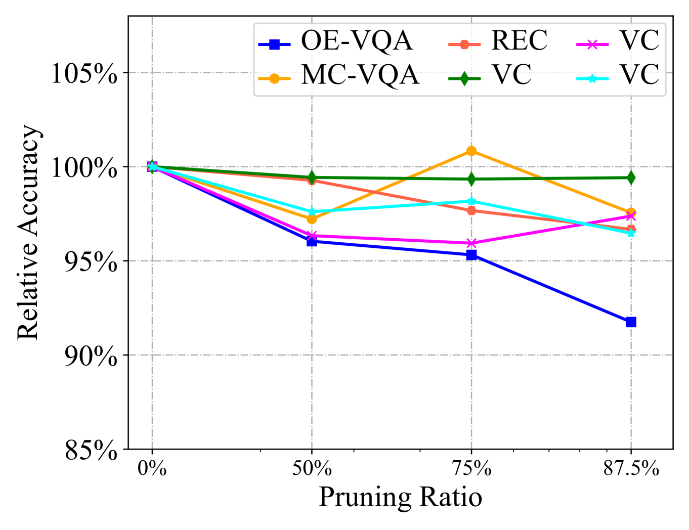
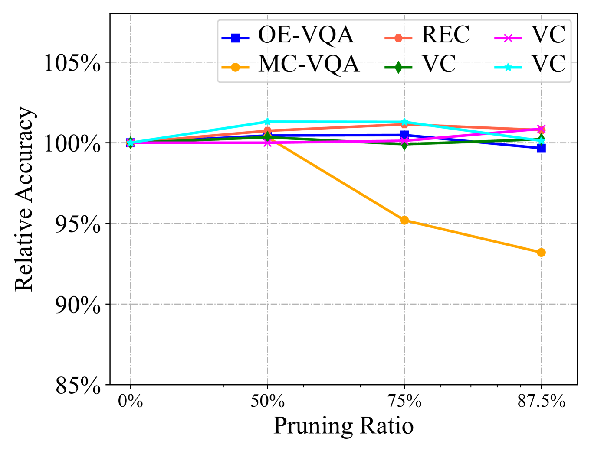
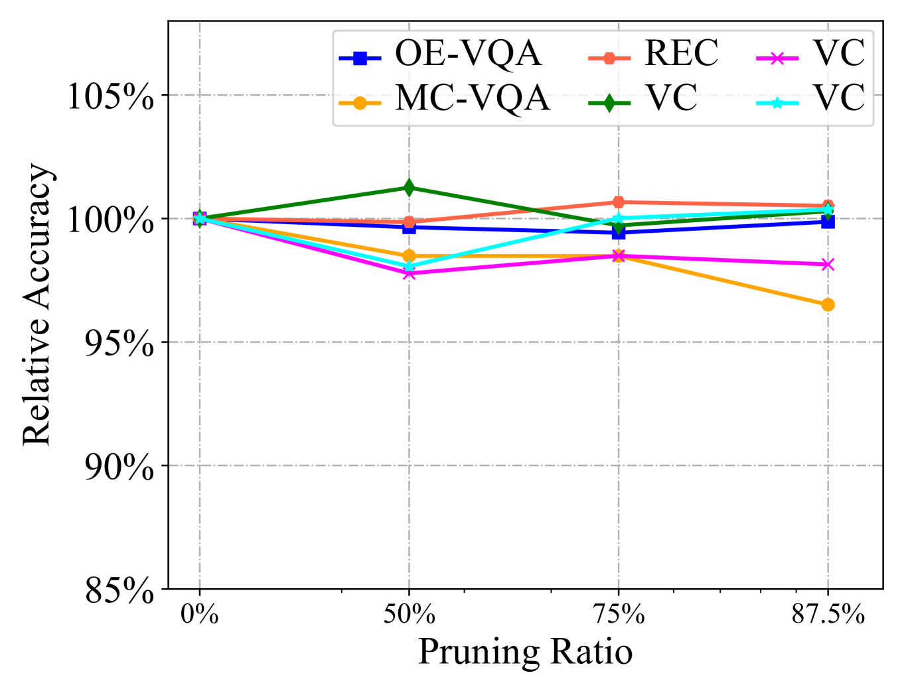
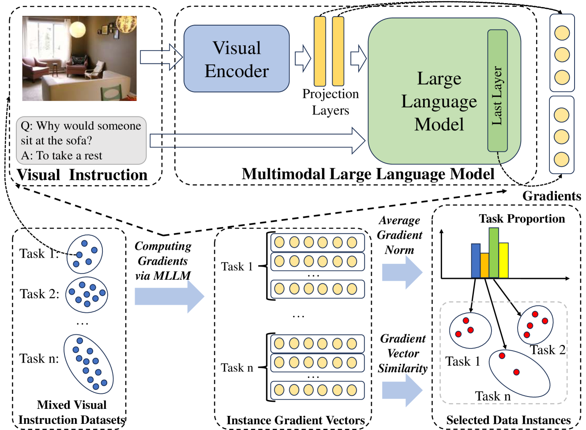
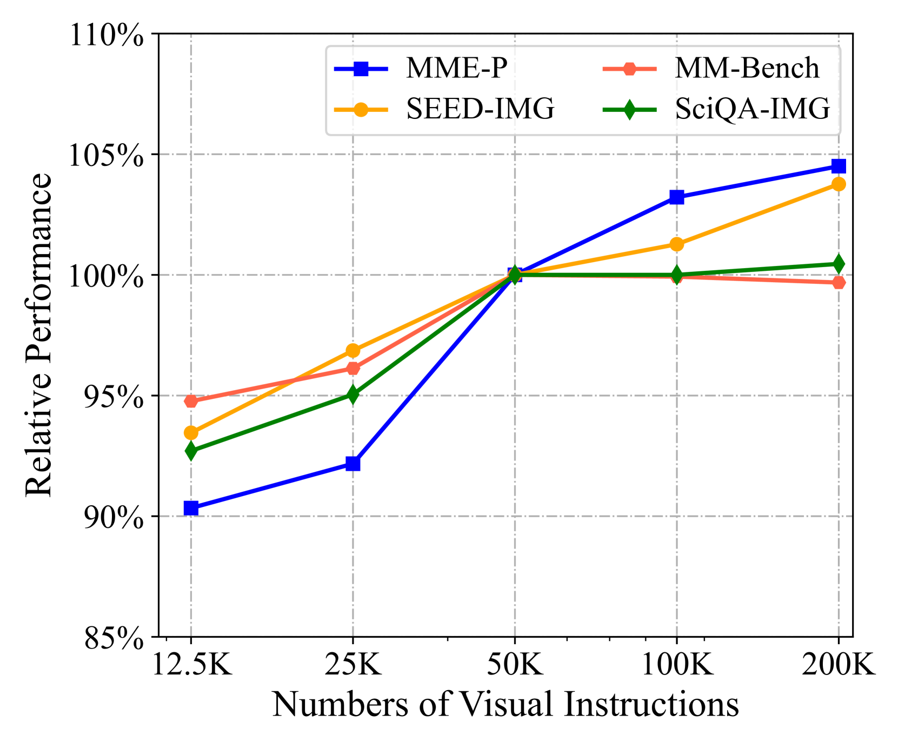
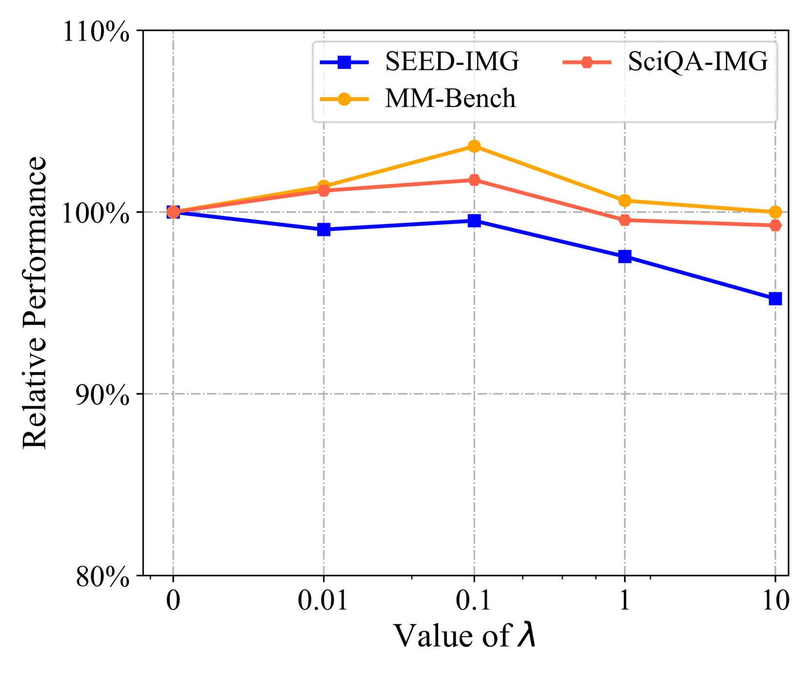
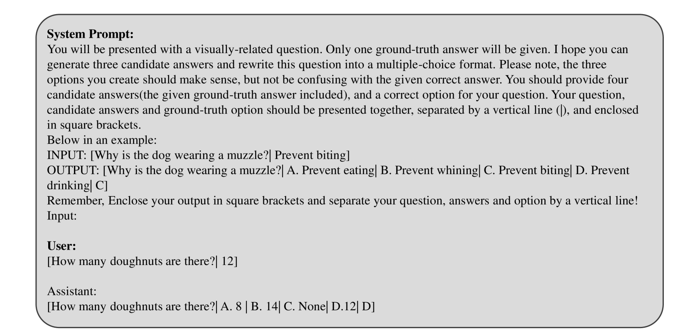
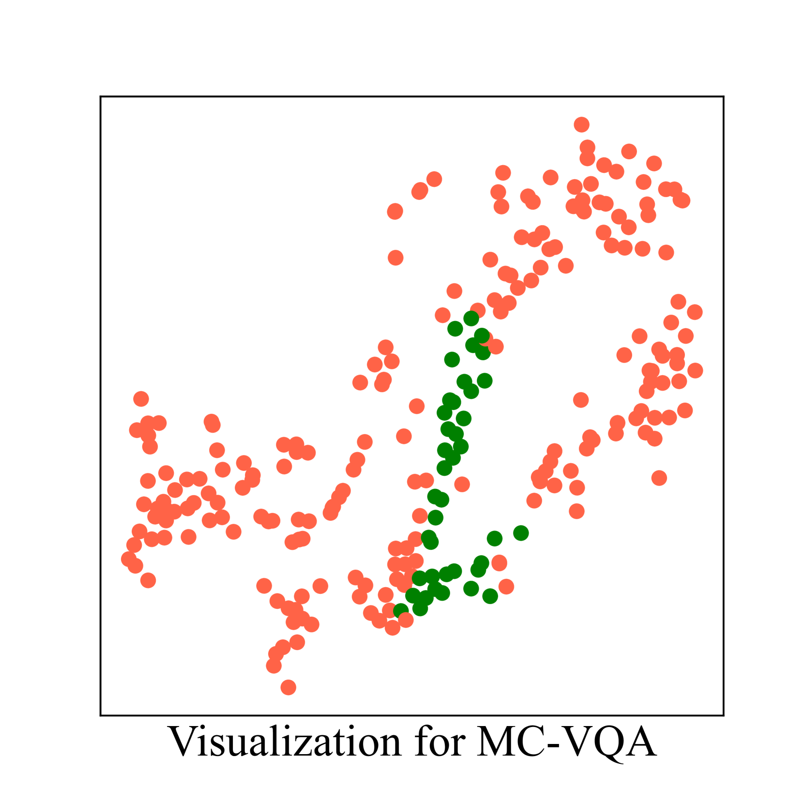
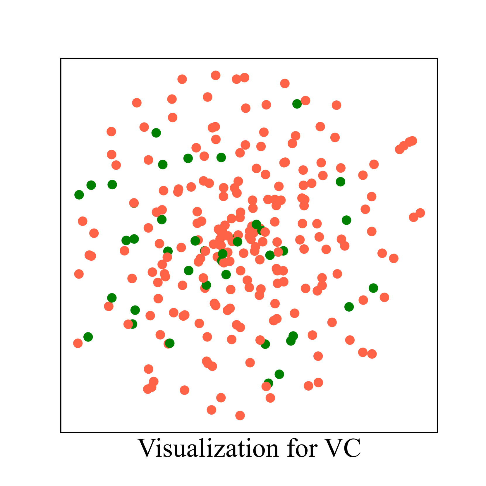

# [在视觉指令微调中，我们提出“少即是多”的理念，专注于对数据价值的精准估算。这项研究旨在探讨和挖掘少量高质量数据在优化视觉指令模型性能方面的重要作用。](https://arxiv.org/abs/2403.09559)

发布时间：2024年03月14日

`LLM应用`

> Less is More: Data Value Estimation for Visual Instruction Tuning

> 视觉指令调优对于提升 LLMS 在视觉理解方面的表现至关重要，而现有 MLLM 通常需融合大量多样化视觉指令数据集进行训练，但这可能导致数据冗余问题。为此，我们通过一系列实证研究揭示了视觉指令数据集内部存在明显冗余，且即使大幅度削减某些指令数据量，也不会对性能造成负面影响。据此，我们创新性地提出了名为 TIVE 的数据筛选方法，以剔除视觉指令中的冗余部分。TIVE 先基于计算得到的梯度评估每条视觉指令在任务层面和实例层面的价值，再根据评估结果调整各任务在视觉指令中的占比，并挑选代表性实例构建一个小规模的训练子集。在 LLaVA-1.5 平台上的实验表明，采用我们方法仅使用约7.5%的数据，就能够在七项标准评测中取得与全量数据微调模型相媲美的效果，甚至在四项评测中超越后者。我们将公开发布的代码及数据资源将助力更多相关研究。

> Visual instruction tuning is the key to building multimodal large language models (MLLMs), which greatly improves the reasoning capabilities of large language models (LLMs) in vision scenario. However, existing MLLMs mostly rely on a mixture of multiple highly diverse visual instruction datasets for training (even more than a million instructions), which may introduce data redundancy. To investigate this issue, we conduct a series of empirical studies, which reveal a significant redundancy within the visual instruction datasets, and show that greatly reducing the amount of several instruction dataset even do not affect the performance. Based on the findings, we propose a new data selection approach TIVE, to eliminate redundancy within visual instruction data. TIVE first estimates the task-level and instance-level value of the visual instructions based on computed gradients. Then, according to the estimated values, TIVE determines the task proportion within the visual instructions, and selects representative instances to compose a smaller visual instruction subset for training. Experiments on LLaVA-1.5 show that our approach using only about 7.5% data can achieve comparable performance as the full-data fine-tuned model across seven benchmarks, even surpassing it on four of the benchmarks. Our code and data will be publicly released.

[Arxiv](https://arxiv.org/abs/2403.09559)