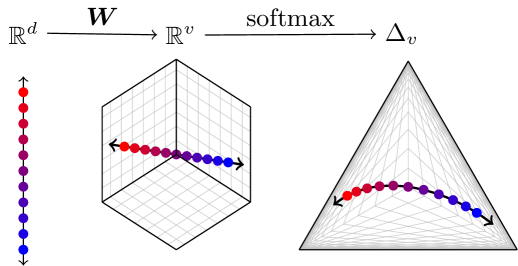
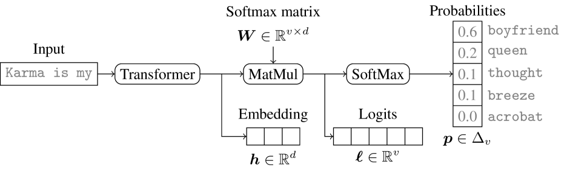
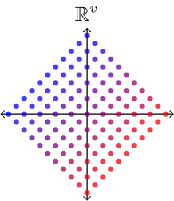
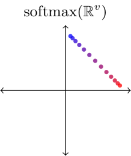
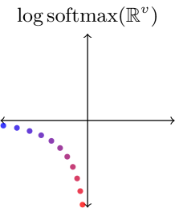
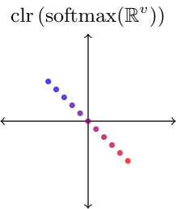
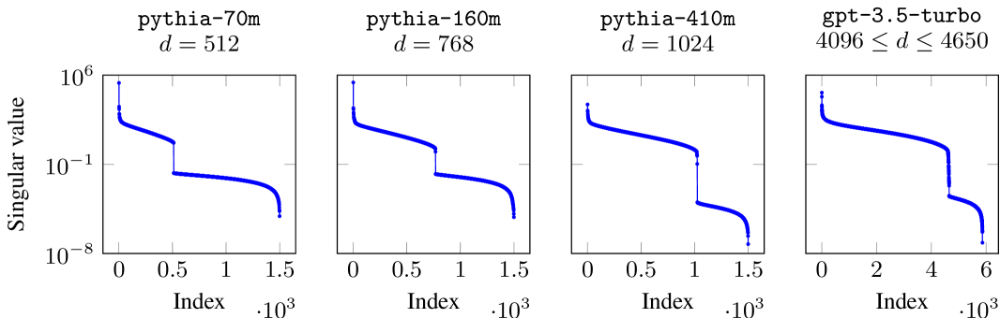
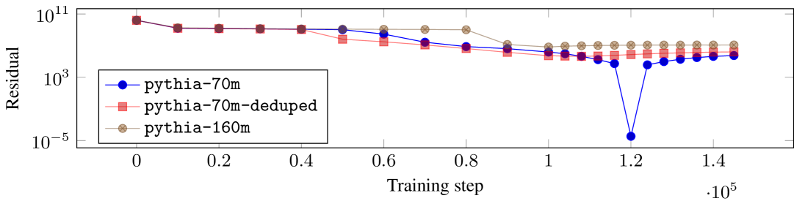
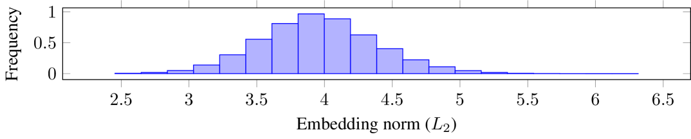

# [研究表明，受 API 保护的大规模语言模型（LLMs）的 logits 输出可能泄露其内部所包含的专有信息。](https://arxiv.org/abs/2403.09539)

发布时间：2024年03月14日

`LLM应用` `安全与隐私保护`

> Logits of API-Protected LLMs Leak Proprietary Information

> 随着LLMs的商业化应用普及，人们通常只能通过高级API接口接触内部的专属模型。然而，在这项工作中，即便在对模型结构保持谨慎假设的前提下，我们发现只需极少量的API调用（比如消耗不足1000美元的成本就能针对OpenAI的gpt-3.5-turbo进行实验）便能揭示出受保护LLM中的大量私密信息。核心洞察在于：当前多数LLM存在softmax瓶颈问题，即其输出局限于整个输出空间的一个线性子空间。这一特性恰恰为构建模型“指纹”或“签名”提供了可能，进而实现经济高效的多项功能：快速探测LLM的隐藏层数量、产出全词汇范围内的输出、辨别与澄清不同模型版本间的差异、依据单一完整LLM输出追踪源头模型，甚至预估输出层参数。实验证明了我们所提出方法的有效性，例如成功推测出OpenAI的gpt-3.5-turbo的嵌入维度约为4096。最后，我们探讨了LLM供应商如何防御这类攻击，并指出把这些能力看作提升透明度和责任追究机制的有益特点（而非缺陷）。

> The commercialization of large language models (LLMs) has led to the common practice of high-level API-only access to proprietary models. In this work, we show that even with a conservative assumption about the model architecture, it is possible to learn a surprisingly large amount of non-public information about an API-protected LLM from a relatively small number of API queries (e.g., costing under $1,000 for OpenAI's gpt-3.5-turbo). Our findings are centered on one key observation: most modern LLMs suffer from a softmax bottleneck, which restricts the model outputs to a linear subspace of the full output space. We show that this lends itself to a model image or a model signature which unlocks several capabilities with affordable cost: efficiently discovering the LLM's hidden size, obtaining full-vocabulary outputs, detecting and disambiguating different model updates, identifying the source LLM given a single full LLM output, and even estimating the output layer parameters. Our empirical investigations show the effectiveness of our methods, which allow us to estimate the embedding size of OpenAI's gpt-3.5-turbo to be about 4,096. Lastly, we discuss ways that LLM providers can guard against these attacks, as well as how these capabilities can be viewed as a feature (rather than a bug) by allowing for greater transparency and accountability.

[Arxiv](https://arxiv.org/abs/2403.09539)