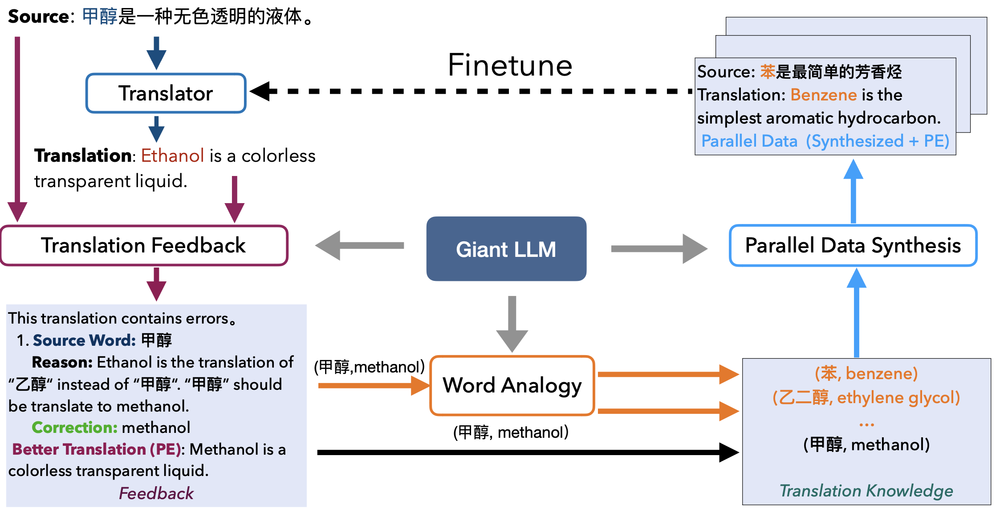
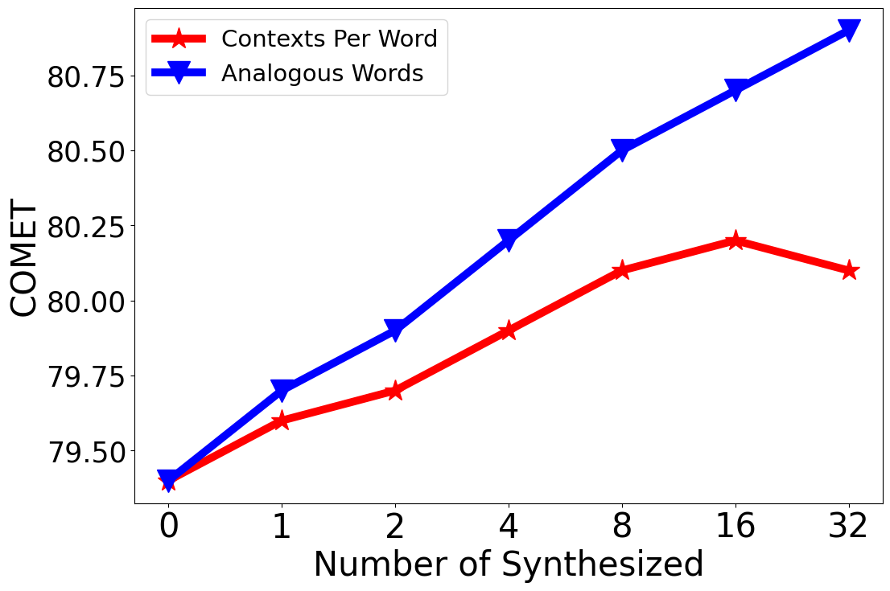
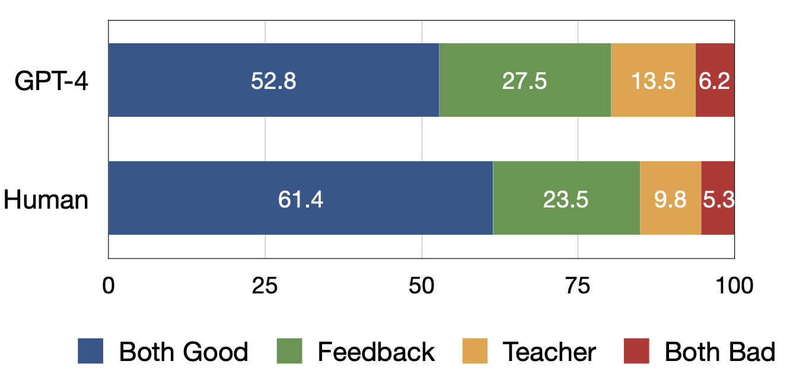
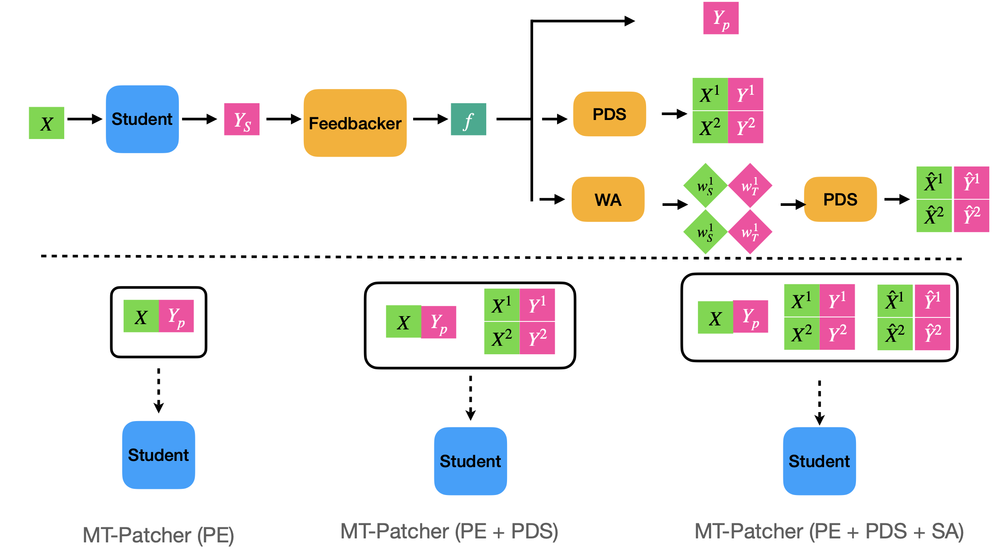
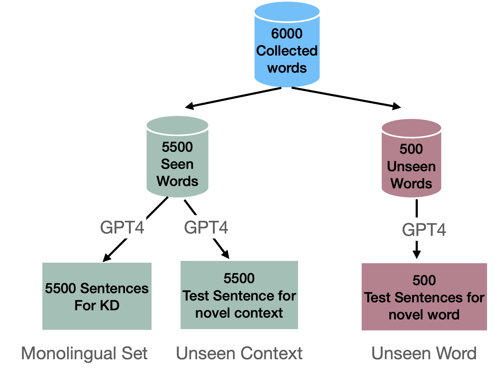

# [MT-PATCHER：针对机器翻译任务，该技术实现了从大型语言模型中进行选择性且可扩展的知识蒸馏，旨在提炼和有效利用大规模模型中的宝贵知识。](https://arxiv.org/abs/2403.09522)

发布时间：2024年03月14日

`LLM应用`

`机器翻译`

`知识蒸馏`

> MT-PATCHER: Selective and Extendable Knowledge Distillation from Large Language Models for Machine Translation

> 尽管LLM在MT任务上表现出色，却受限于高昂的计算成本和延迟问题。为此，将大型LLM中的翻译智慧迁移至中型MT模型成为了颇具潜力的研究路径。但传统知识蒸馏技术忽视了师生模型能力差异，导致对学生模型进行无效重复教学，难以应对新情境和新知识。本文提出的MT-Patcher框架创新性地采用选择性、全面且积极的方式，让LLM向现有MT模型传递知识。根据学生MT模型当前的实际翻译水平，我们专注于发现并修正其翻译错误，而非全盘照搬教师模型的输出。借助LLM出色的语言驾驭力，我们引导LLM教师生成多样的语境样本，并前瞻性地预估学生可能出现的更多错误类型。实验证明，在针对特定语言现象和通用MT基准测试中，只需使用约10%的样例对 student MT 模型进行微调，就可达到与传统知识蒸馏相当的效果；而通过引入合成的潜在错误和多样化的上下文，更能在面对全新语境和词汇时显著提升翻译表现。

> Large Language Models (LLM) have demonstrated their strong ability in the field of machine translation (MT), yet they suffer from high computational cost and latency. Therefore, transferring translation knowledge from giant LLMs to medium-sized machine translation models is a promising research direction. However, traditional knowledge distillation methods do not take the capability of student and teacher models into consideration, therefore repeatedly teaching student models on the knowledge they have learned, and failing to extend to novel contexts and knowledge. In this paper, we propose a framework called MT-Patcher, which transfers knowledge from LLMs to existing MT models in a selective, comprehensive and proactive manner. Considering the current translation ability of student MT models, we only identify and correct their translation errors, instead of distilling the whole translation from the teacher. Leveraging the strong language abilities of LLMs, we instruct LLM teachers to synthesize diverse contexts and anticipate more potential errors for the student. Experiment results on translating both specific language phenomena and general MT benchmarks demonstrate that finetuning the student MT model on about 10% examples can achieve comparable results to the traditional knowledge distillation method, and synthesized potential errors and diverse contexts further improve translation performances on unseen contexts and words.

