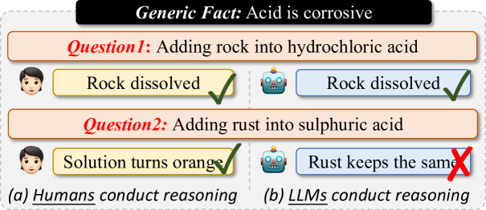
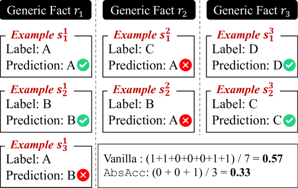
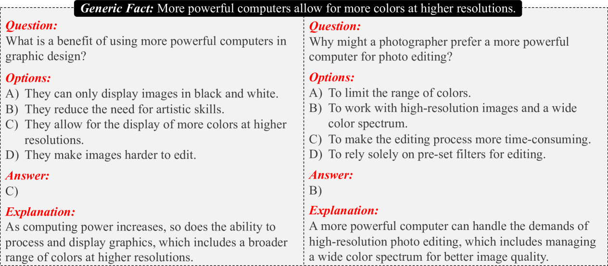
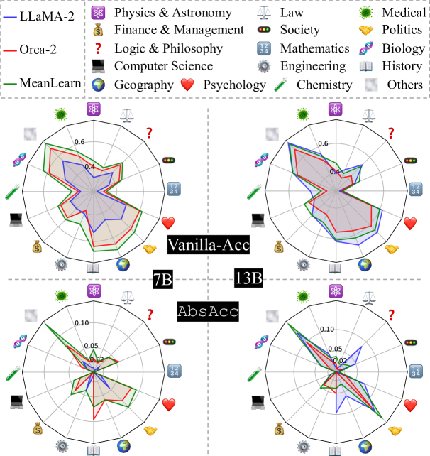

# [借助通用事实引导，促进大型语言模型在抽象推理方面的提升——“有意义学习”崭新探索](https://arxiv.org/abs/2403.09085)

发布时间：2024年03月14日

`LLM理论` `逻辑推理`

> Meaningful Learning: Advancing Abstract Reasoning in Large Language Models via Generic Fact Guidance

> 尽管LLMs在各类推理任务上表现出色且具有较高的可解释性，但当面临基于通用事实的简单问题时，却往往难以给出稳定而准确的回答，暴露出其在抽象推理上的短板。这一问题引发了关于LLMs是否真正具备推理能力抑或只是在机械记忆的热烈探讨。因此，我们发起了一项初步研究，旨在深入测量和剖析当前LLMs的抽象推理能力，并揭示了它们在一般推理与抽象推理之间的明显差距。为了改善这一状况，我们定制了一套抽象推理数据集AbsR及相应的有效学习模式，来教导LLMs如何运用通用事实进行逻辑推理。实验结果显示，这种方法不仅能够提升LLMs在一般推理任务上的表现，还在培养其抽象推理能力方面取得实质性突破，使其不再局限于单纯的记忆或模仿，而是向着对通用事实更深层次的理解和应用迈进。

> Large language models (LLMs) have developed impressive performance and strong explainability across various reasoning scenarios, marking a significant stride towards mimicking human-like intelligence. Despite this, when tasked with simple questions supported by a generic fact, LLMs often fail to provide consistent and precise answers, indicating a deficiency in abstract reasoning abilities. This has sparked a vigorous debate about whether LLMs are genuinely reasoning or merely memorizing. In light of this, we design a preliminary study to quantify and delve into the abstract reasoning abilities of existing LLMs. Our findings reveal a substantial discrepancy between their general reasoning and abstract reasoning performances. To relieve this problem, we tailor an abstract reasoning dataset (AbsR) together with a meaningful learning paradigm to teach LLMs how to leverage generic facts for reasoning purposes. The results show that our approach not only boosts the general reasoning performance of LLMs but also makes considerable strides towards their capacity for abstract reasoning, moving beyond simple memorization or imitation to a more nuanced understanding and application of generic facts.

[Arxiv](https://arxiv.org/abs/2403.09085)