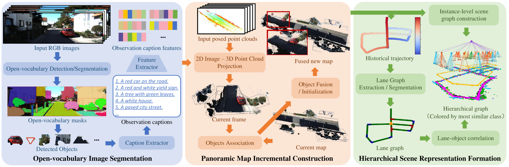
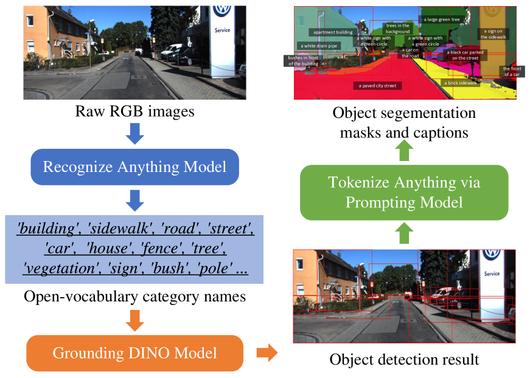
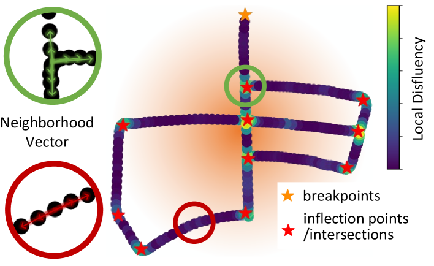
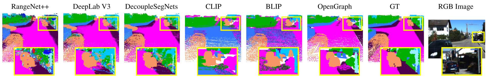
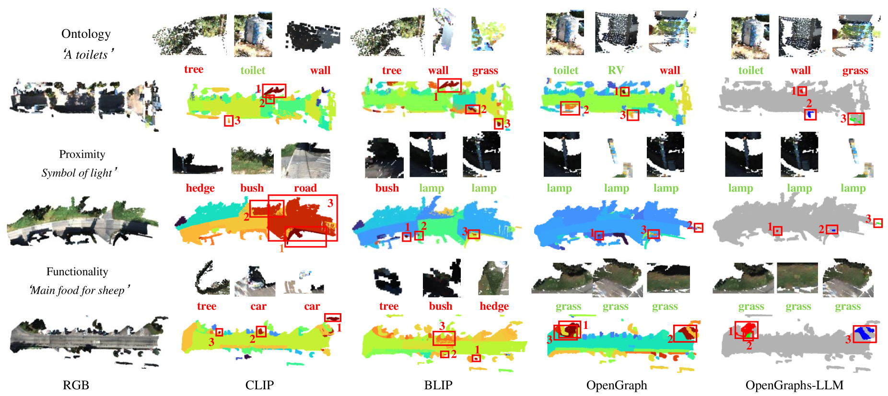
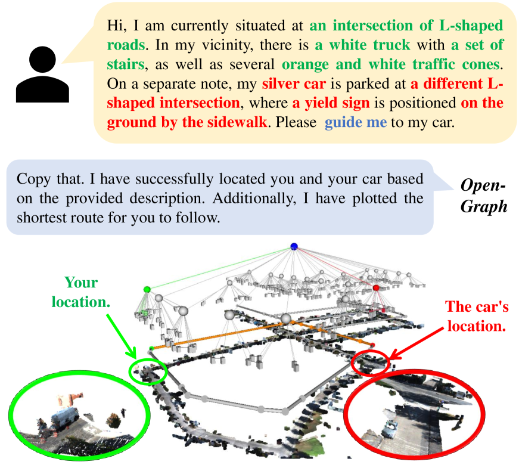
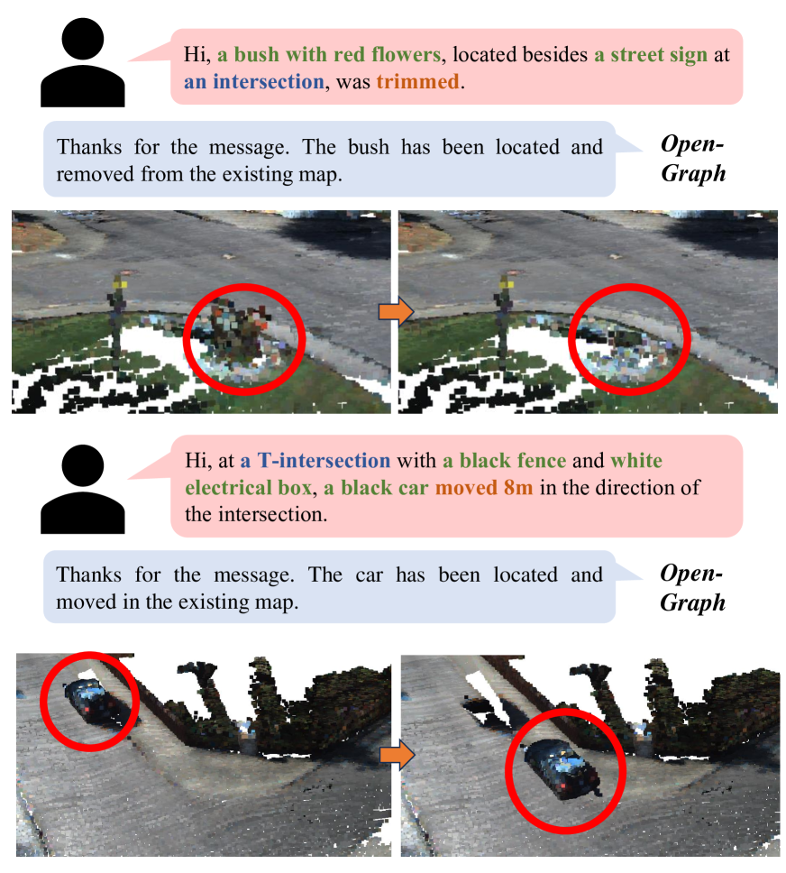

# [OpenGraph是一种在大规模户外环境中实现开放词汇、分层三维图形表达的方法。]

发布时间：2024年03月14日

`Agent` `机器人` `地图构建`

> OpenGraph: Open-Vocabulary Hierarchical 3D Graph Representation in Large-Scale Outdoor Environments

> 为了使机器人与人类顺畅互动并高效完成各项任务，富含精细语义信息的环境地图至关重要。而开放词汇地图借助视觉-语言模型（VLMs），凭借其多模态检索和开放式类别等独特优势崭露头角。但当前的开放词汇地图局限于室内的封闭场景及VLM特性表达，导致其实用性和推理性能受限，且由于缺乏拓扑关联性，查询具体实例时尤为困难。为此，我们创新提出了OpenGraph——一种面向大规模户外环境设计的开放词汇层级图结构表示方案。OpenGraph首先运用二维基础模型从图像中抽取出实例及其描述，并通过特征编码强化文字推理；再通过将图像投射至LiDAR点云实现3D递增全景特征映射；最后，依据车道图连通性对环境进行分段，构建出层级图结构。实际验证结果显示，在未经模型微调的情况下，OpenGraph在真实公开数据集SemanticKITTI上的表现卓越，不仅能成功泛化至新的语义类别，而且在分割和查询精度上均达到最高水平。目前，OpenGraph的源代码已开源，可访问https://github.com/BIT-DYN/OpenGraph获取。

> Environment maps endowed with sophisticated semantics are pivotal for facilitating seamless interaction between robots and humans, enabling them to effectively carry out various tasks. Open-vocabulary maps, powered by Visual-Language models (VLMs), possess inherent advantages, including multimodal retrieval and open-set classes. However, existing open-vocabulary maps are constrained to closed indoor scenarios and VLM features, thereby diminishing their usability and inference capabilities. Moreover, the absence of topological relationships further complicates the accurate querying of specific instances. In this work, we propose OpenGraph, a representation of open-vocabulary hierarchical graph structure designed for large-scale outdoor environments. OpenGraph initially extracts instances and their captions from visual images using 2D foundation models, encoding the captions with features to enhance textual reasoning. Subsequently, 3D incremental panoramic mapping with feature embedding is achieved by projecting images onto LiDAR point clouds. Finally, the environment is segmented based on lane graph connectivity to construct a hierarchical graph. Validation results from real public dataset SemanticKITTI demonstrate that, even without fine-tuning the models, OpenGraph exhibits the ability to generalize to novel semantic classes and achieve the highest segmentation and query accuracy. The source code of OpenGraph is publicly available at https://github.com/BIT-DYN/OpenGraph.

[Arxiv](https://arxiv.org/abs/2403.09412)