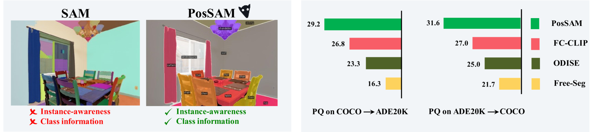
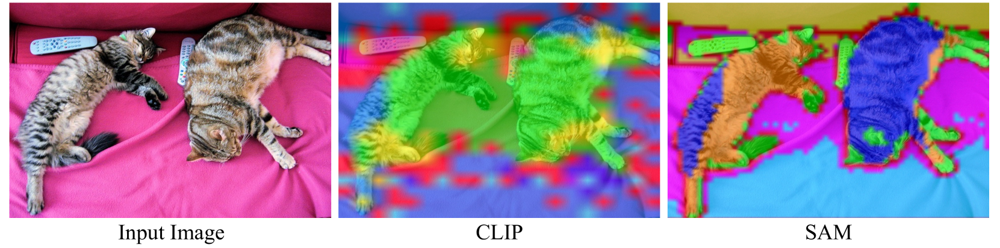
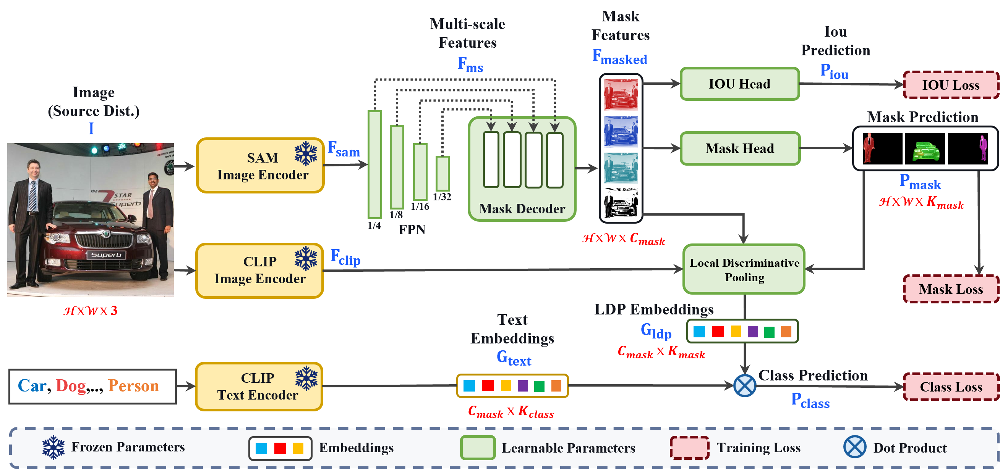
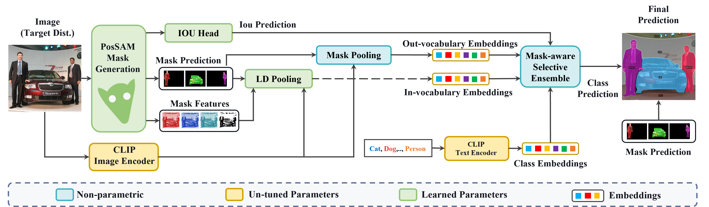
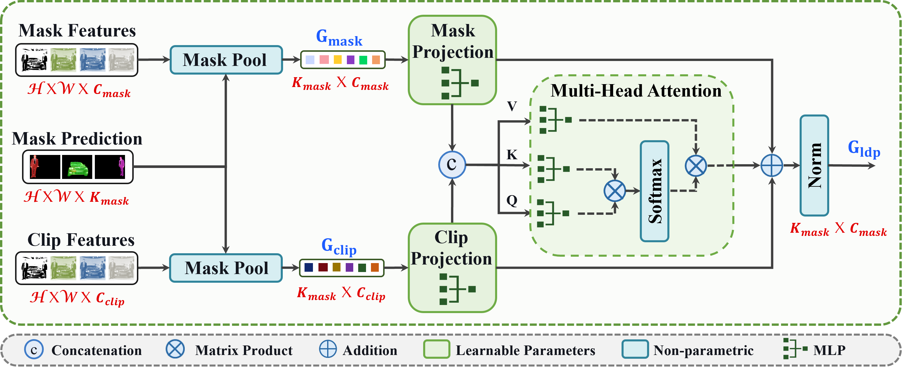
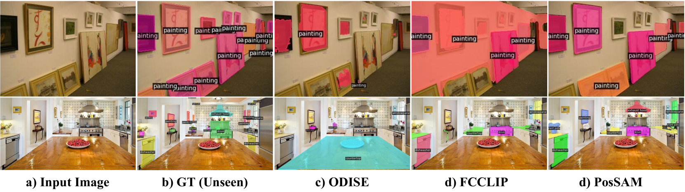

# [PosSAM：一款能够对任意目标进行泛视觉、开词汇表的全方位分割技术](https://arxiv.org/abs/2403.09620)

发布时间：2024年03月14日

`Agent` `计算机视觉`

> PosSAM: Panoptic Open-vocabulary Segment Anything

> 本研究推出一款创新的开放式词汇全景分割模型，它巧妙地融合了SAM模型的空间敏锐度与CLIP视觉-语言模型的优点，构建了一个完整的解决方案。虽然SAM擅长生成精细的空间感知掩模，但在没有额外指导的情况下，其解码器在识别物体类别信息时显得力不从心，易产生过度分割现象。传统方法通常通过多阶段技术和独立模型生成类别提示（如边界框或分割掩模）来克服这一问题。而我们提出的PosSAM模型，以其一体化设计，充分利用SAM的高精度空间特征生成实例级感知的掩模，并依靠CLIP强大的语义区分能力实现精准的实例分类。为了改进SAM模型的局限性，我们特别设计了一个新颖的局部判别池化（LDP）模块，结合类别无关的SAM特征与类别相关的CLIP特征，以确保公正、准确的开放式词汇分类。更进一步，我们创新性地提出了Mask-Aware Selective Ensembling（MASE）算法，能够在推理过程中动态优化生成掩模的质量，并显著提升开放式词汇分类的表现。经过广泛的实验验证，我们的方法展现出卓越的跨多个数据集的泛化能力，并在开放式词汇全景分割任务上取得了破纪录的顶级性能。无论是在COCO转至ADE20K还是ADE20K转至COCO的场景中，PosSAM都以大幅度的优势（分别提高了2.4 PQ和4.6 PQ）超越了现有的最先进方法。项目网址为：https://vibashan.github.io/possam-web/。

> In this paper, we introduce an open-vocabulary panoptic segmentation model that effectively unifies the strengths of the Segment Anything Model (SAM) with the vision-language CLIP model in an end-to-end framework. While SAM excels in generating spatially-aware masks, it's decoder falls short in recognizing object class information and tends to oversegment without additional guidance. Existing approaches address this limitation by using multi-stage techniques and employing separate models to generate class-aware prompts, such as bounding boxes or segmentation masks. Our proposed method, PosSAM is an end-to-end model which leverages SAM's spatially rich features to produce instance-aware masks and harnesses CLIP's semantically discriminative features for effective instance classification. Specifically, we address the limitations of SAM and propose a novel Local Discriminative Pooling (LDP) module leveraging class-agnostic SAM and class-aware CLIP features for unbiased open-vocabulary classification. Furthermore, we introduce a Mask-Aware Selective Ensembling (MASE) algorithm that adaptively enhances the quality of generated masks and boosts the performance of open-vocabulary classification during inference for each image. We conducted extensive experiments to demonstrate our methods strong generalization properties across multiple datasets, achieving state-of-the-art performance with substantial improvements over SOTA open-vocabulary panoptic segmentation methods. In both COCO to ADE20K and ADE20K to COCO settings, PosSAM outperforms the previous state-of-the-art methods by a large margin, 2.4 PQ and 4.6 PQ, respectively. Project Website: https://vibashan.github.io/possam-web/.

[Arxiv](https://arxiv.org/abs/2403.09620)