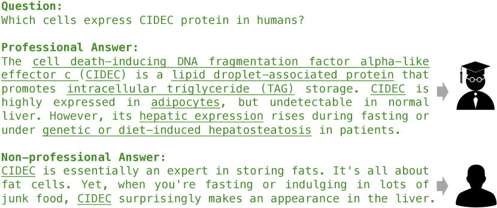
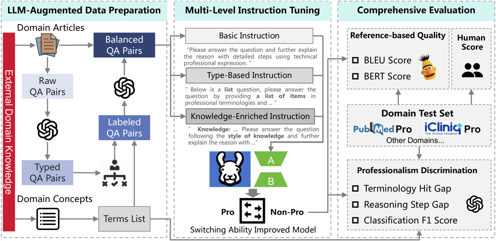
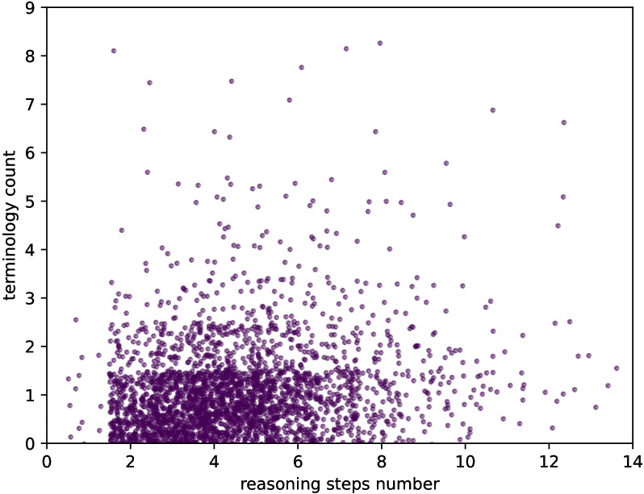

# [ProSwitch 是一种创新方法，它借助知识引导对语言模型进行精调，旨在适应性地生成兼具专业与非专业写作风格的文本内容。](https://arxiv.org/abs/2403.09131)

发布时间：2024年03月14日

`LLM应用`

`文本生成`

`语言模型`

> ProSwitch: Knowledge-Guided Language Model Fine-Tuning to Generate Professional and Non-Professional Styled Text

> LLMs已在多个语言应用场景如文本摘要和可控文本生成中展现实力，但关于其通过微调灵活转换写作风格的研究尚不深入。本研究聚焦于文本专业性，创新性地提出了ProSwitch方法，利用知识导向的指令调优赋予语言模型生成专业及非专业回应的能力。这一过程历经三个关键步骤：首先，为获取领域知识和构建训练数据集进行数据预处理；其次，通过多层级指令格式对语言模型进行精细化指令调优；最后，进行全面评估，以衡量生成文本的专业区分度及其对照参考文本的质量。对比研究表明，在专业与非专业文本生成间的切换表现上，ProSwitch方法相较于通用和专门的语言模型都取得了显著优势。

> Large Language Models (LLMs) have demonstrated efficacy in various linguistic applications, including text summarization and controlled text generation. However, studies into their capacity of switching between styles via fine-tuning remain underexplored. This study concentrates on textual professionalism and introduces a novel methodology, named ProSwitch, which equips a language model with the ability to produce both professional and non-professional responses through knowledge-guided instruction tuning. ProSwitch unfolds across three phases: data preparation for gathering domain knowledge and training corpus; instruction tuning for optimizing language models with multiple levels of instruction formats; and comprehensive evaluation for assessing the professionalism discrimination and reference-based quality of generated text. Comparative analysis of ProSwitch against both general and specialized language models reveals that our approach outperforms baselines in switching between professional and non-professional text generation.

