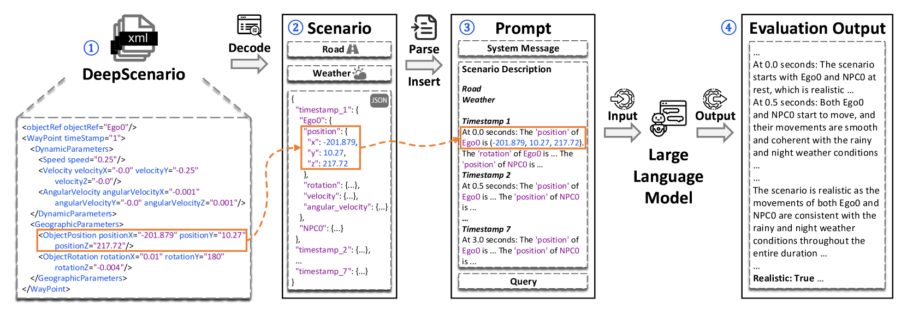
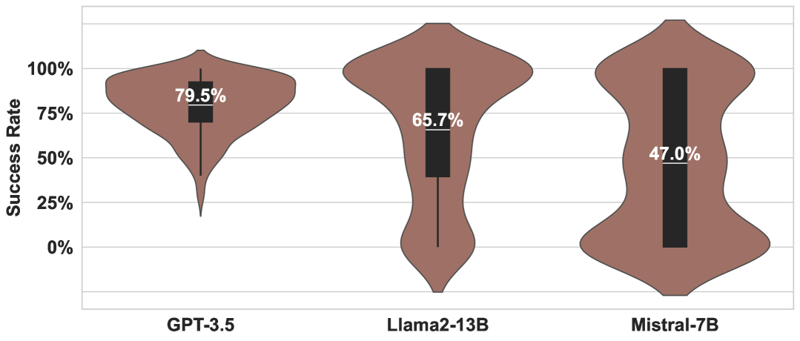
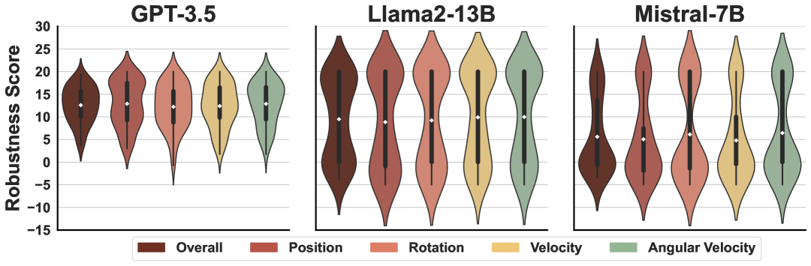
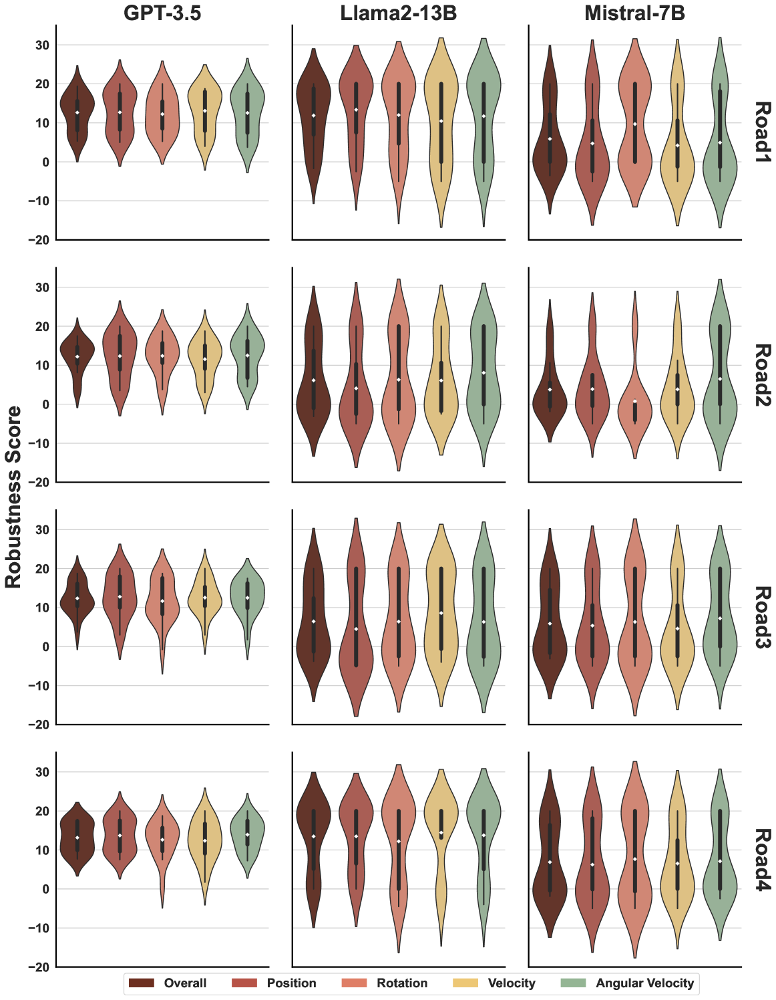
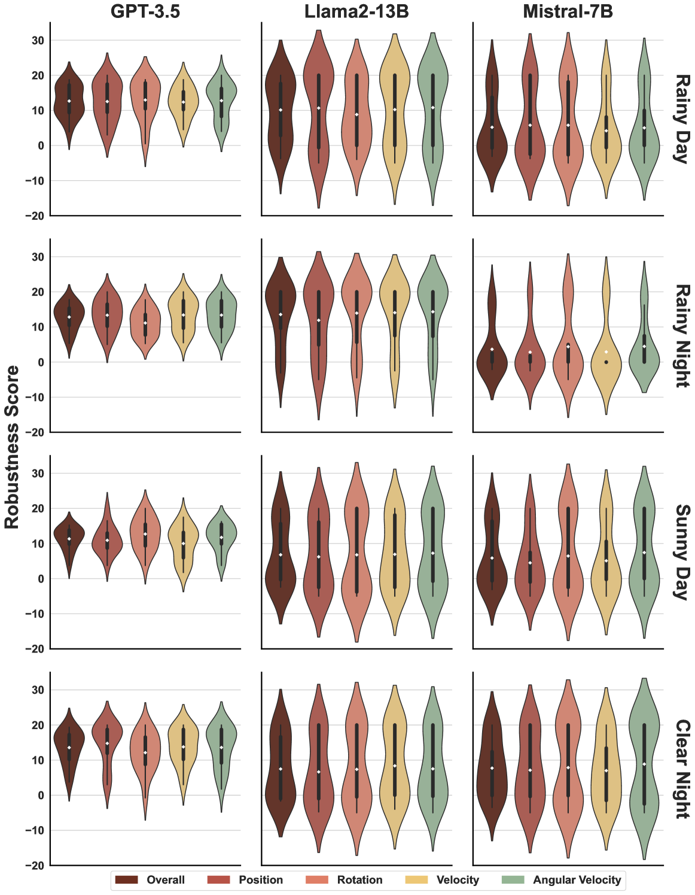

# 面对现实：借助大型语言模型深入探究驾驶场景的真实程度

发布时间：2024年03月14日

`LLM应用` `自动驾驶`

> Reality Bites: Assessing the Realism of Driving Scenarios with Large Language Models

> LLMs在处理文本生成、摘要和分类等任务时展现出非凡实力，由于它们基于庞大的在线知识库训练，我们设想这些模型有能力判断由自动驾驶测试技术生成的驾驶场景是否符合现实生活中的驾驶条件。为了证实这一设想，我们开展了一项实证研究，探究LLMs在执行这项任务时的效能与稳定性，这对于研发基于LLM的自动驾驶测试技术至关重要。实验选用了一个开放驾驶场景数据集——“\deepscenario”，从中精选了64个真实场景，并通过对这些场景做细微调整，衍生出另外512个真实场景，形成一个包含576个场景的综合数据集。在这个数据集基础上，我们评估了三种不同的LLMs——\gpt、\llama和\mistral，在评估驾驶场景真实度方面的稳定表现。研究结果显示：(1)\gpt整体上在几乎全部场景、路况及气候条件下均较\llama和\mistral展现出更强的稳定性；(2)\mistral表现最为逊色且保持稳定；(3)\llama在某些特定情况下表现不俗；(4)道路状况和天气因素确实会左右LLMs的稳定性表现。

> Large Language Models (LLMs) are demonstrating outstanding potential for tasks such as text generation, summarization, and classification. Given that such models are trained on a humongous amount of online knowledge, we hypothesize that LLMs can assess whether driving scenarios generated by autonomous driving testing techniques are realistic, i.e., being aligned with real-world driving conditions. To test this hypothesis, we conducted an empirical evaluation to assess whether LLMs are effective and robust in performing the task. This reality check is an important step towards devising LLM-based autonomous driving testing techniques. For our empirical evaluation, we selected 64 realistic scenarios from \deepscenario--an open driving scenario dataset. Next, by introducing minor changes to them, we created 512 additional realistic scenarios, to form an overall dataset of 576 scenarios. With this dataset, we evaluated three LLMs (\gpt, \llama, and \mistral) to assess their robustness in assessing the realism of driving scenarios. Our results show that: (1) Overall, \gpt achieved the highest robustness compared to \llama and \mistral, consistently throughout almost all scenarios, roads, and weather conditions; (2) \mistral performed the worst consistently; (3) \llama achieved good results under certain conditions; and (4) roads and weather conditions do influence the robustness of the LLMs.

[Arxiv](https://arxiv.org/abs/2403.09906)