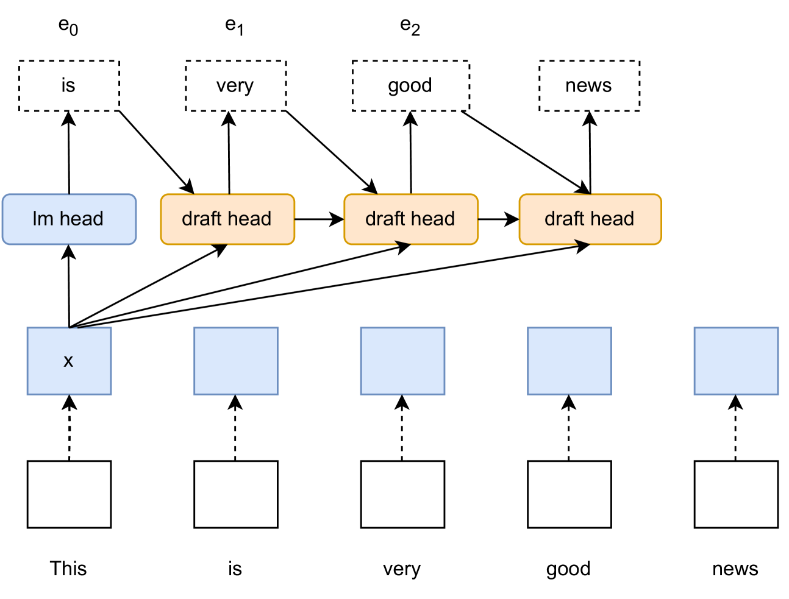
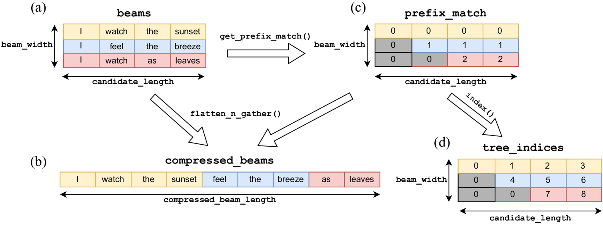
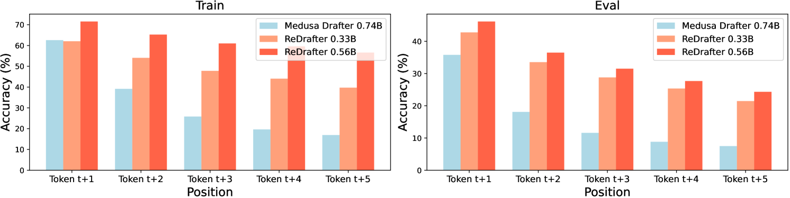
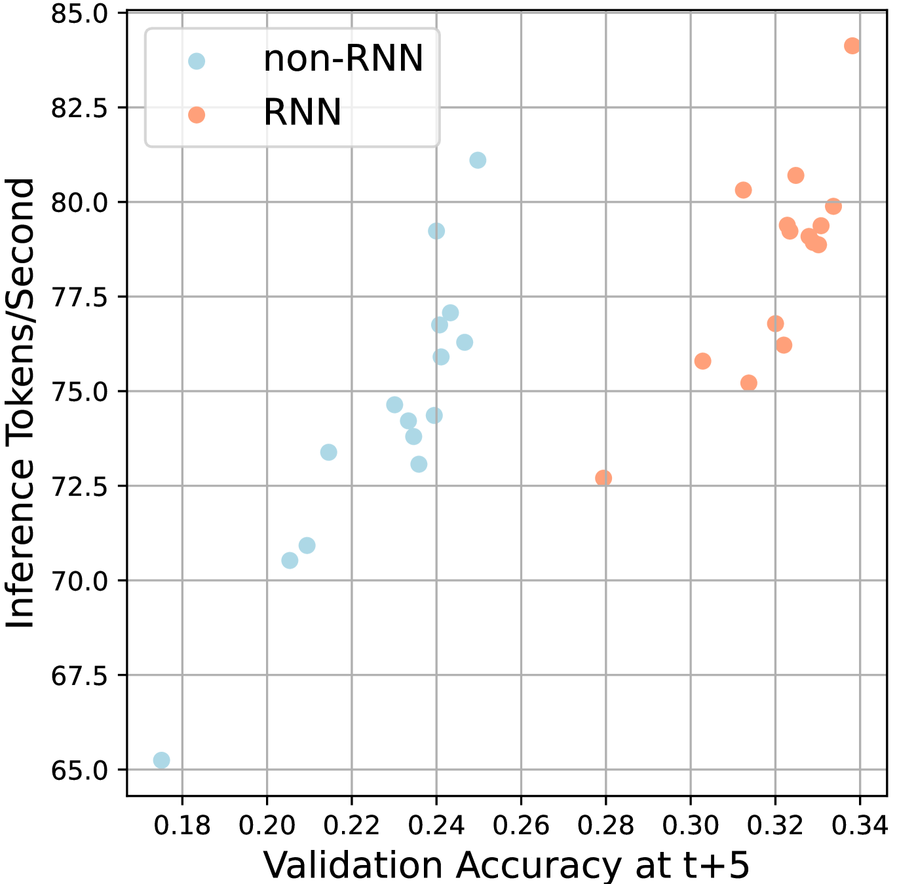
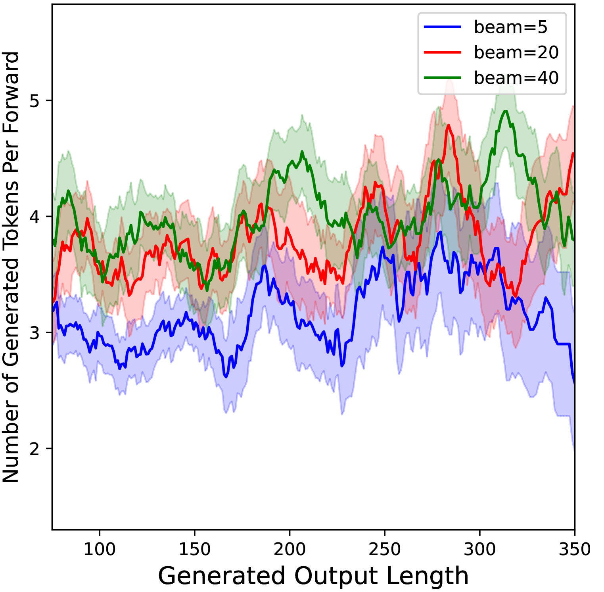
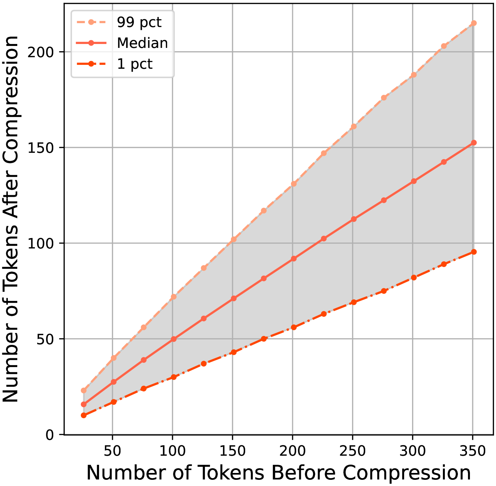
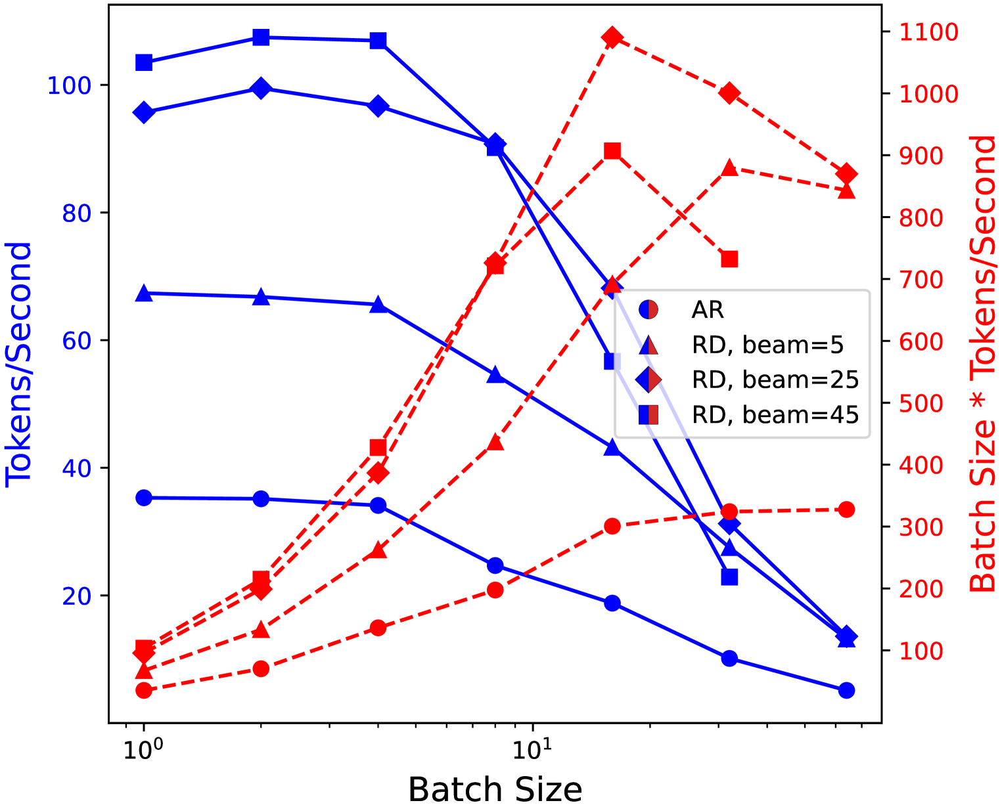
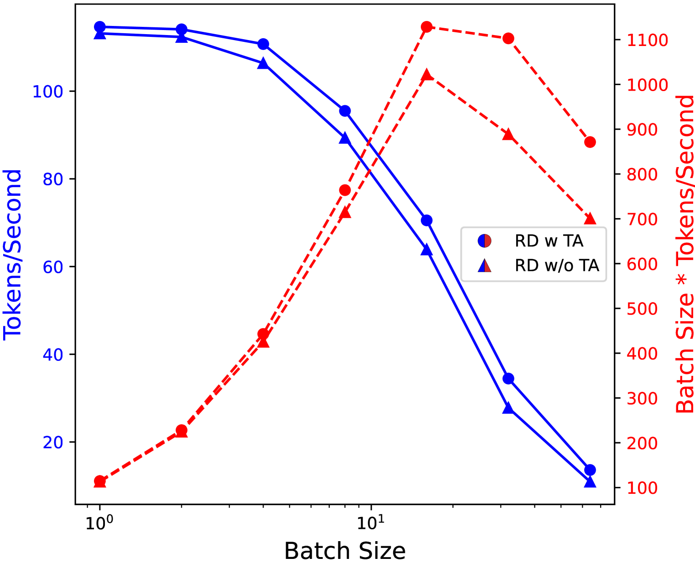

# 针对大型语言模型，一种名为“循环草稿器”的技术被应用于快速推测性解码过程。

发布时间：2024年03月14日

`Agent` `模型优化`

> Recurrent Drafter for Fast Speculative Decoding in Large Language Models

> 本文介绍了一种改良的推测解码方案，致力于提升大型语言模型服务效率。我们巧妙地融合了双模型推测解码的经典思路与单模型方法 Medusa 的创新理念，借鉴 Medusa 单模型策略的同时，独创性地运用了一个带有循环依赖设计的轻巧草稿头，其本质类似于传统推测解码中的小型简化模型，却无需完整的Transformer架构复杂度。这一循环依赖特性使得我们能够运用束搜索高效筛选掉草稿头标记出的不合格候选结果。由此产生的新方法既保留了单模型设计的简洁性，又免去了为Medusa推理阶段单独构建数据依赖型树状注意力结构的繁琐。我们通过大量实证实验，对多个知名开源语言模型应用此方法并进行全面权衡分析，有力证明了该方法的有效性。

> In this paper, we introduce an improved approach of speculative decoding aimed at enhancing the efficiency of serving large language models. Our method capitalizes on the strengths of two established techniques: the classic two-model speculative decoding approach, and the more recent single-model approach, Medusa. Drawing inspiration from Medusa, our approach adopts a single-model strategy for speculative decoding. However, our method distinguishes itself by employing a single, lightweight draft head with a recurrent dependency design, akin in essence to the small, draft model uses in classic speculative decoding, but without the complexities of the full transformer architecture. And because of the recurrent dependency, we can use beam search to swiftly filter out undesired candidates with the draft head. The outcome is a method that combines the simplicity of single-model design and avoids the need to create a data-dependent tree attention structure only for inference in Medusa. We empirically demonstrate the effectiveness of the proposed method on several popular open source language models, along with a comprehensive analysis of the trade-offs involved in adopting this approach.

[Arxiv](https://arxiv.org/abs/2403.09919)