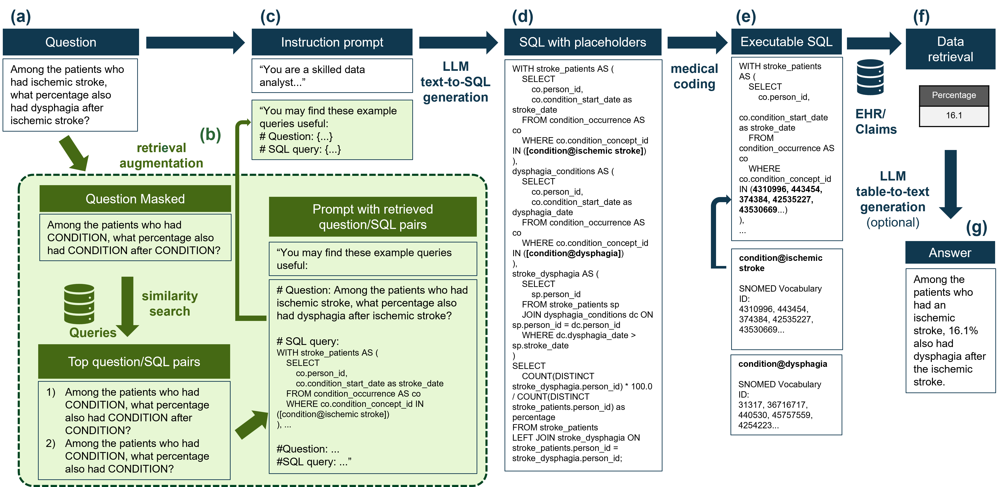

# [本研究专注于利用电子健康记录，通过增强检索技术改进文本转SQL生成方法，应用于流行病学问题解答。](https://arxiv.org/abs/2403.09226)

发布时间：2024年03月14日

`RAG` `流行病学`

> Retrieval augmented text-to-SQL generation for epidemiological question answering using electronic health records

> EHR和索赔数据蕴含丰富的现实医疗信息，然而，由于医学术语复杂且需要编写复杂的SQL查询，在这些数据库中寻找流行病学问题的答案颇具挑战。为此，我们提出一种创新的端到端解决方案，它融合了文本到SQL生成技术与检索增强生成（RAG）手段，从而利用EHR和索赔数据解答流行病学问题。我们发现，通过在文本到SQL转换过程中融入医学编码环节，这种方法能够显著超越常规提示输入，有效提升了表现力。虽然目前的语言模型在无监督环境下精准度仍不理想，但实证研究表明，RAG在真实行业背景下的应用展现出巨大的潜力，有望显著提升语言模型的功能性。

> Electronic health records (EHR) and claims data are rich sources of real-world data that reflect patient health status and healthcare utilization. Querying these databases to answer epidemiological questions is challenging due to the intricacy of medical terminology and the need for complex SQL queries. Here, we introduce an end-to-end methodology that combines text-to-SQL generation with retrieval augmented generation (RAG) to answer epidemiological questions using EHR and claims data. We show that our approach, which integrates a medical coding step into the text-to-SQL process, significantly improves the performance over simple prompting. Our findings indicate that although current language models are not yet sufficiently accurate for unsupervised use, RAG offers a promising direction for improving their capabilities, as shown in a realistic industry setting.

[Arxiv](https://arxiv.org/abs/2403.09226)