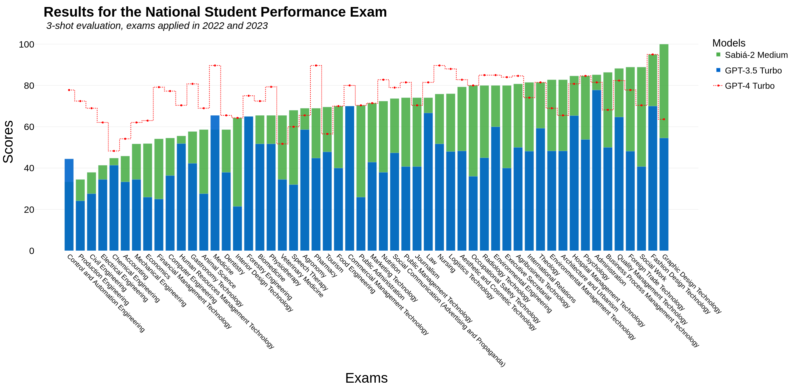
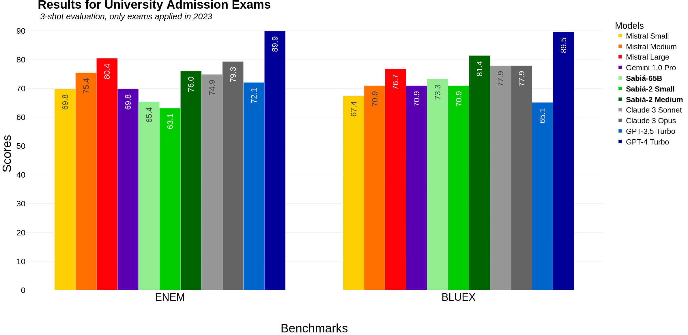
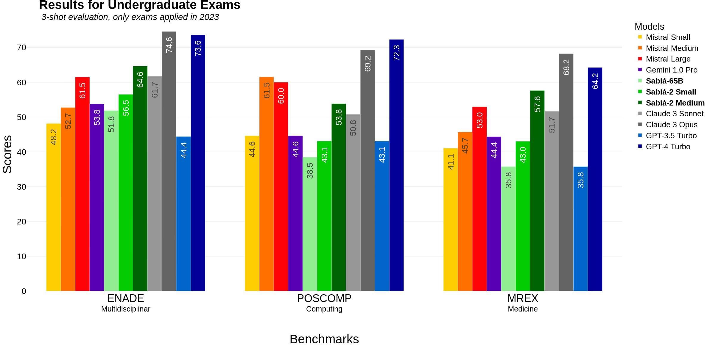
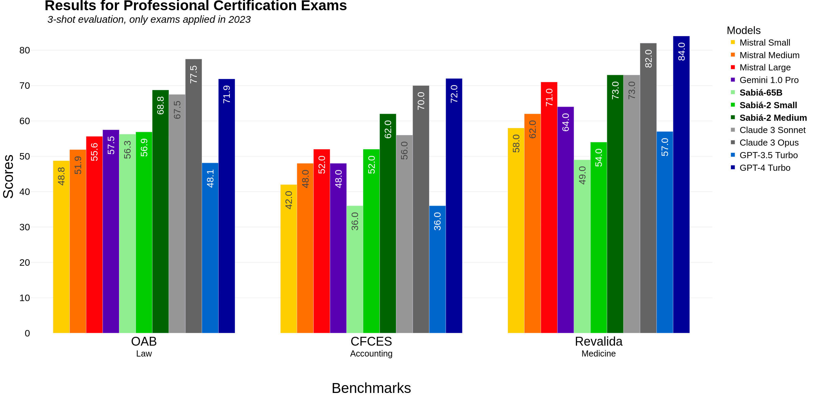
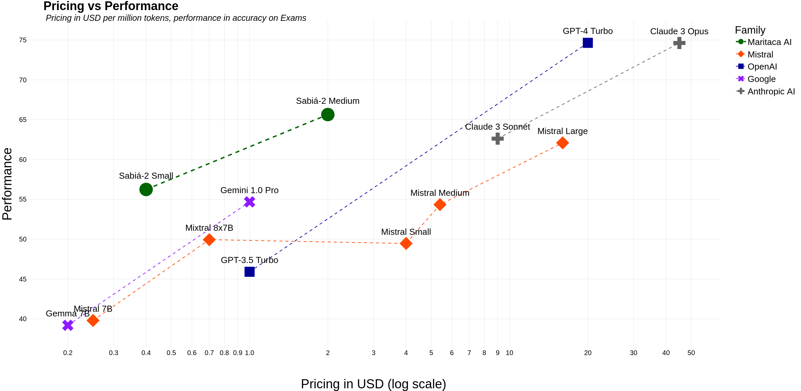
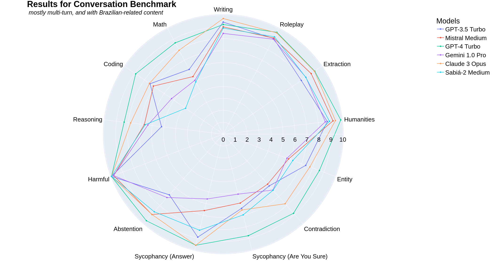

# [Sabiá-2：引领潮流的全新一代葡萄牙大型语言模型](https://arxiv.org/abs/2403.09887)

发布时间：2024年03月14日

`Agent` `` ``

> Sabiá-2: A New Generation of Portuguese Large Language Models

> 我们推出的 Sabiá-2 系列大型语言模型，专注于葡萄牙语文本训练，并在广泛多样的考试中进行评测，包括巴西高校入学考、职业资格认证以及会计、经济、工程、法律和医学等多个学科的研究生水平考试。目前最优模型 Sabiá-2 Medium 表现出色，其在64项考试中，有23项与GPT-4旗鼓相当甚至超越，在58项考试中更是胜过了GPT-3.5。令人欣喜的是，通过专业化训练，无需增大模型规模即可显著提升模型表现，使得Sabí-a-2 Medium以远低于GPT-4 10倍的单个令牌价格提供服务。最终，我们发现数学和编码能力是该模型有待提升的重要方向。

> We introduce Sabiá-2, a family of large language models trained on Portuguese texts. The models are evaluated on a diverse range of exams, including entry-level tests for Brazilian universities, professional certification exams, and graduate-level exams for various disciplines such as accounting, economics, engineering, law and medicine. Our results reveal that our best model so far, Sabiá-2 Medium, matches or surpasses GPT-4's performance in 23 out of 64 exams and outperforms GPT-3.5 in 58 out of 64 exams. Notably, specialization has a significant impact on a model's performance without the need to increase its size, allowing us to offer Sabiá-2 Medium at a price per token that is 10 times cheaper than GPT-4. Finally, we identified that math and coding are key abilities that need improvement.

[Arxiv](https://arxiv.org/abs/2403.09887)