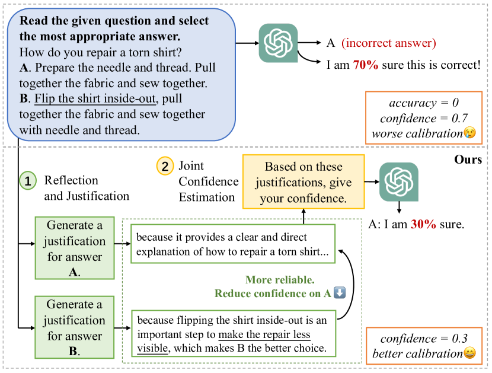
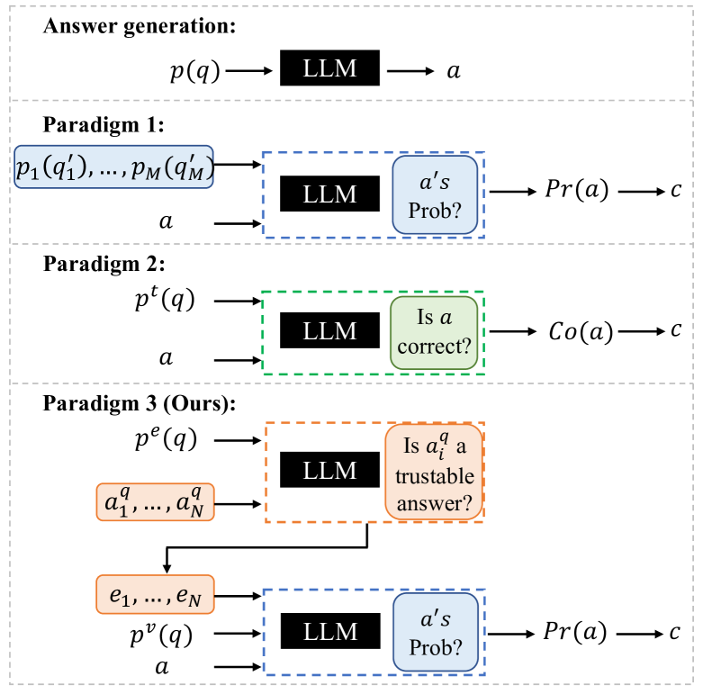
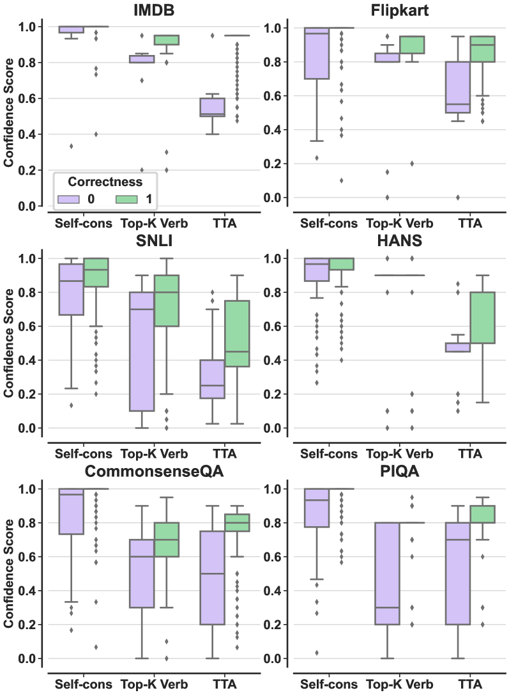
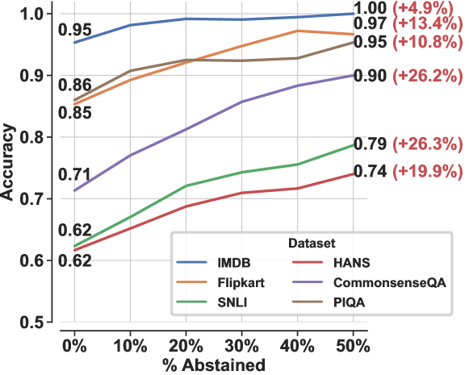
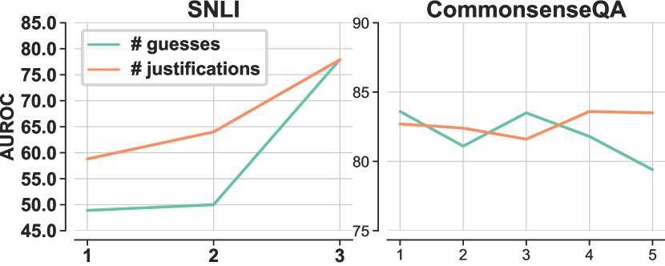

# [面对大型语言模型，请审慎决策，我们提出了一种方法，通过对多个答案的反思实现对模型输出的信心度评估。]

发布时间：2024年03月14日

`LLM应用` `模型信任度评估`

> Think Twice Before Assure: Confidence Estimation for Large Language Models through Reflection on Multiple Answers

> 针对大型语言模型（尤其是黑盒模型）输出的信任度评估是至关重要的，然而现存的信心估计方法往往因模型对错误答案过于自信而无法准确校准。为此，我们创新性地提出一种新范式，它能全面考量多个候选答案的可信度，有效缓解对不正确答案的过度自信问题。在此基础上，我们设计了一个分两步走的框架：首先引导LLM为每个答案提供反思和依据，继而汇总这些依据以进行全面的信心评估。这个框架能够与现有信心估计方法整合，提升整体校准性能。实验证明，在涵盖三个任务、六个数据集的结果中，该框架展现出合理性及有效性。

> Confidence estimation aiming to evaluate output trustability is crucial for the application of large language models (LLM), especially the black-box ones. Existing confidence estimation of LLM is typically not calibrated due to the overconfidence of LLM on its generated incorrect answers. Existing approaches addressing the overconfidence issue are hindered by a significant limitation that they merely consider the confidence of one answer generated by LLM. To tackle this limitation, we propose a novel paradigm that thoroughly evaluates the trustability of multiple candidate answers to mitigate the overconfidence on incorrect answers. Building upon this paradigm, we introduce a two-step framework, which firstly instructs LLM to reflect and provide justifications for each answer, and then aggregates the justifications for comprehensive confidence estimation. This framework can be integrated with existing confidence estimation approaches for superior calibration. Experimental results on six datasets of three tasks demonstrate the rationality and effectiveness of the proposed framework.

[Arxiv](https://arxiv.org/abs/2403.09972)