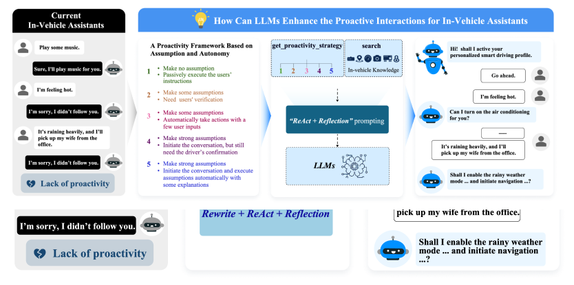
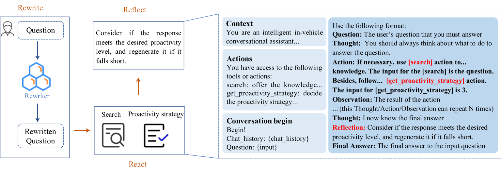
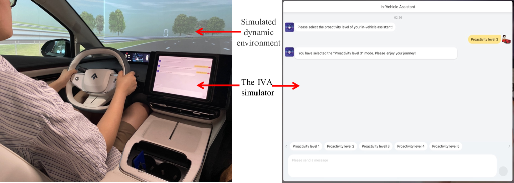
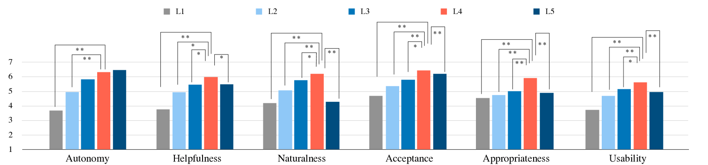
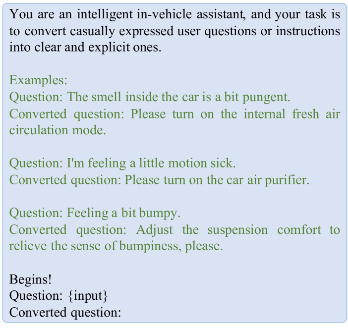

# 本研究致力于借助大型语言模型，开发能够主动发起互动的车载对话助手，提升车内交互体验。

发布时间：2024年03月14日

`Agent` `智能汽车` `人机交互`

> Towards Proactive Interactions for In-Vehicle Conversational Assistants Utilizing Large Language Models

> 研究表明，IVCA的主动性有助于降低驾驶过程中的分心因素，提升行车安全，更贴合用户的认知需求。然而，当前IVCA在理解用户意图和捕捉上下文情境上存在问题，导致其主动交互不尽人意。尽管LLM已展现出凭借提示就能应对多样任务的能力，但将其应用于IVCA及探索主动交互的潜力仍未得到充分开发。这引发了一系列问题，比如LLM如何优化IVCA的主动交互体验，又会对用户感知产生何种影响。因此，我们构建了一套涵盖假设性和自主性两个维度、细分为五个主动层次的IVCA框架体系。基于此框架，我们创新性地提出“重写+反应+反思”策略，目标在于让LLM在与用户互动时能精准适应各主动层次的需求。我们进行了实际操作和技术主观评价两方面的实验，结果显示LLM在成功率上明显优于现有最先进模型，并在各个主动层次上都获得了良好反馈。共有40名参与者参与的主观实验进一步证实了我们所提出的框架的有效性，揭示出具备较强假设前提和用户确认机制的主动层次尤为恰当。

> Research demonstrates that the proactivity of in-vehicle conversational assistants (IVCAs) can help to reduce distractions and enhance driving safety, better meeting users' cognitive needs. However, existing IVCAs struggle with user intent recognition and context awareness, which leads to suboptimal proactive interactions. Large language models (LLMs) have shown potential for generalizing to various tasks with prompts, but their application in IVCAs and exploration of proactive interaction remain under-explored. These raise questions about how LLMs improve proactive interactions for IVCAs and influence user perception. To investigate these questions systematically, we establish a framework with five proactivity levels across two dimensions-assumption and autonomy-for IVCAs. According to the framework, we propose a "Rewrite + ReAct + Reflect" strategy, aiming to empower LLMs to fulfill the specific demands of each proactivity level when interacting with users. Both feasibility and subjective experiments are conducted. The LLM outperforms the state-of-the-art model in success rate and achieves satisfactory results for each proactivity level. Subjective experiments with 40 participants validate the effectiveness of our framework and show the proactive level with strong assumptions and user confirmation is most appropriate.

[Arxiv](https://arxiv.org/abs/2403.09135)