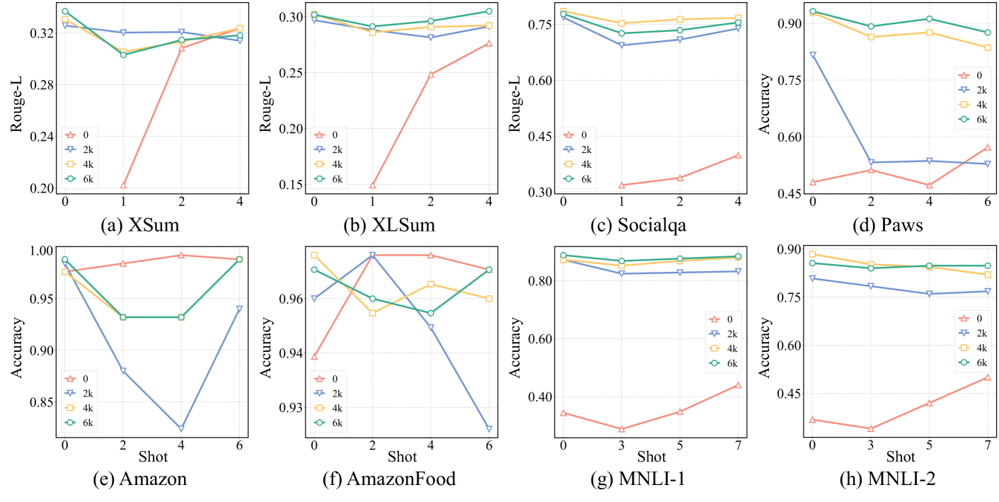
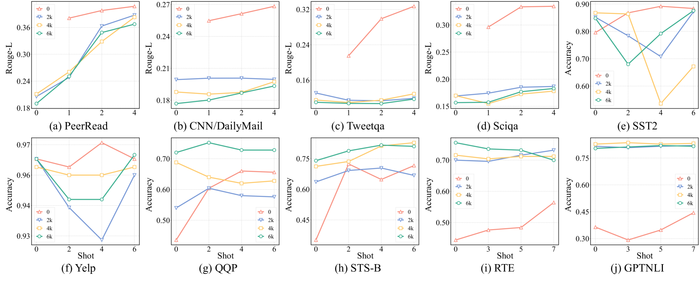
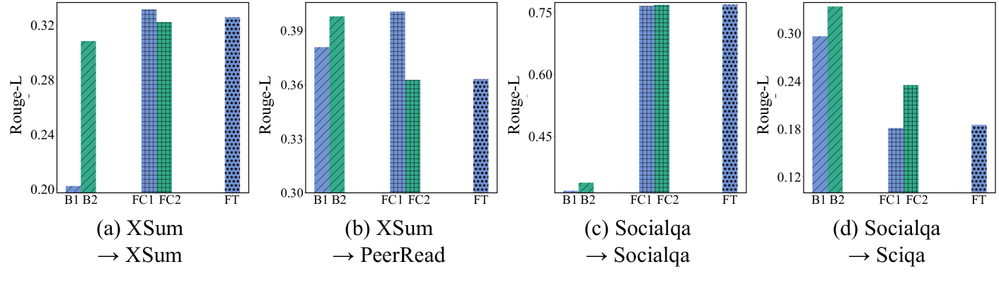
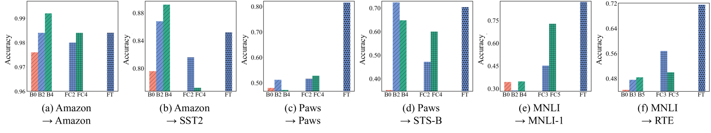
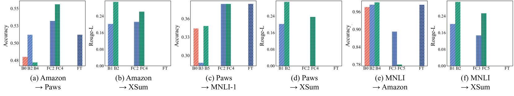

# [探究微调后大型语言模型的普遍适用性力量](https://arxiv.org/abs/2403.09162)

发布时间：2024年03月14日

`LLM理论` `模型微调`

> Unveiling the Generalization Power of Fine-Tuned Large Language Models

> LLMs虽然在处理多种任务时展现出非凡实力，但要在特定领域的下游数据集上微调以超越未微调模型的测试集表现，往往是不可或缺的步骤。然而，微调对LLMs整体泛化能力的影响机制尚不明朗。本论文针对未经改动的基础LLMs与经过微调的版本之间的区别展开深入探究，核心问题是微调是否会改变LLMs内在的泛化性能。为此，我们在多个数据集上的五项迥异语言任务上开展了大规模实验。主要研究成果揭示，针对生成和分类任务微调后的模型，在应对不同领域和任务的泛化表现上呈现出各异的特点。尤为引人注意的是，我们在生成任务微调阶段融入上下文学习策略，能够有效提升模型的泛化能力。此番系统性研究旨在为LLMs微调方法的演变提供宝贵的洞见。

> While Large Language Models (LLMs) have demonstrated exceptional multitasking abilities, fine-tuning these models on downstream, domain-specific datasets is often necessary to yield superior performance on test sets compared to their counterparts without fine-tuning. However, the comprehensive effects of fine-tuning on the LLMs' generalization ability are not fully understood. This paper delves into the differences between original, unmodified LLMs and their fine-tuned variants. Our primary investigation centers on whether fine-tuning affects the generalization ability intrinsic to LLMs. To elaborate on this, we conduct extensive experiments across five distinct language tasks on various datasets. Our main findings reveal that models fine-tuned on generation and classification tasks exhibit dissimilar behaviors in generalizing to different domains and tasks. Intriguingly, we observe that integrating the in-context learning strategy during fine-tuning on generation tasks can enhance the model's generalization ability. Through this systematic investigation, we aim to contribute valuable insights into the evolving landscape of fine-tuning practices for LLMs.

[Arxiv](https://arxiv.org/abs/2403.09162)