# [VIVID项目致力于实现人机协同，从讲座视频中共同创作生动、体验式的对话内容。](https://arxiv.org/abs/2403.09168)

发布时间：2024年03月14日

`LLM应用`

`在线教育`

`对话式教学`

> VIVID: Human-AI Collaborative Authoring of Vicarious Dialogues from Lecture Videos

> 长时间的独白式网络授课易导致学生注意力流失，而采用“模拟对话”模式则能更有效地激活学生的思维。然而，教师们苦于如何根据不同学生需求设计互动对话式的线上课程。因此，我们携手八位教育专家及七位一线教师开展了一场设计工作坊，提出一系列关键设计指导原则，并探索运用大型语言模型（LLM）将传统的独白式讲稿转化为富有教学价值的对话。基于这些原则，我们研发出VIVID工具，让教师能够与LLM协同合作，便捷地设计、评估和调整教学对话。通过一项对12位教师的内部实验，我们发现VIVID有效帮助教师高效筛选并改进对话内容，有力支持了高品质对话教学材料的创作。这项研究进一步印证了LLM在协助教师跨越各学习阶段打造高质量教育对话方面的巨大潜力。

> The lengthy monologue-style online lectures cause learners to lose engagement easily. Designing lectures in a "vicarious dialogue" format can foster learners' cognitive activities more than monologue-style. However, designing online lectures in a dialogue style catered to the diverse needs of learners is laborious for instructors. We conducted a design workshop with eight educational experts and seven instructors to present key guidelines and the potential use of large language models (LLM) to transform a monologue lecture script into pedagogically meaningful dialogue. Applying these design guidelines, we created VIVID which allows instructors to collaborate with LLMs to design, evaluate, and modify pedagogical dialogues. In a within-subjects study with instructors (N=12), we show that VIVID helped instructors select and revise dialogues efficiently, thereby supporting the authoring of quality dialogues. Our findings demonstrate the potential of LLMs to assist instructors with creating high-quality educational dialogues across various learning stages.

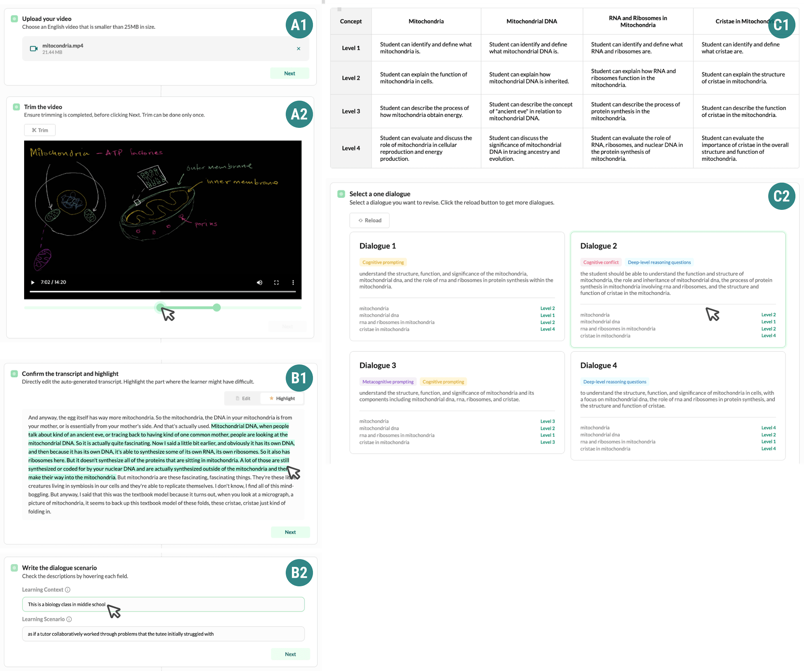

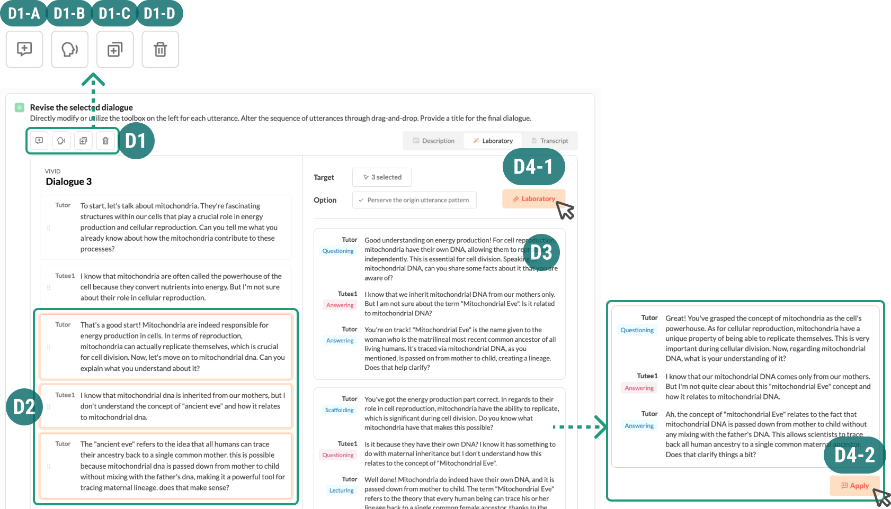

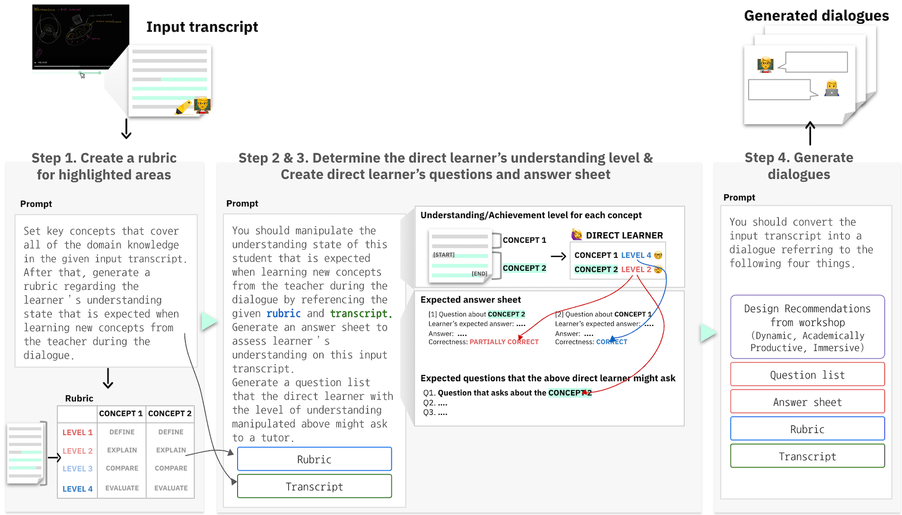

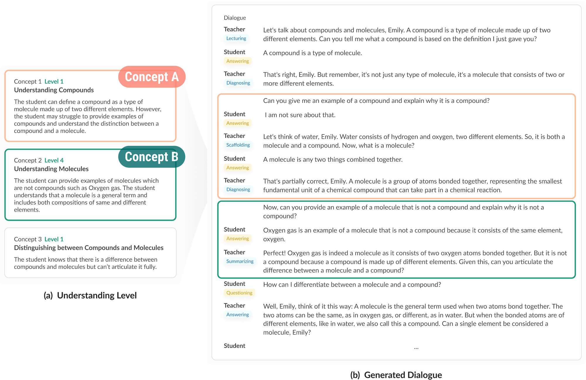

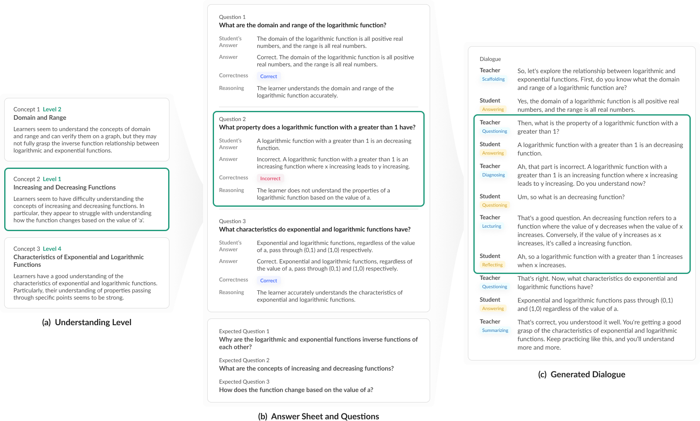

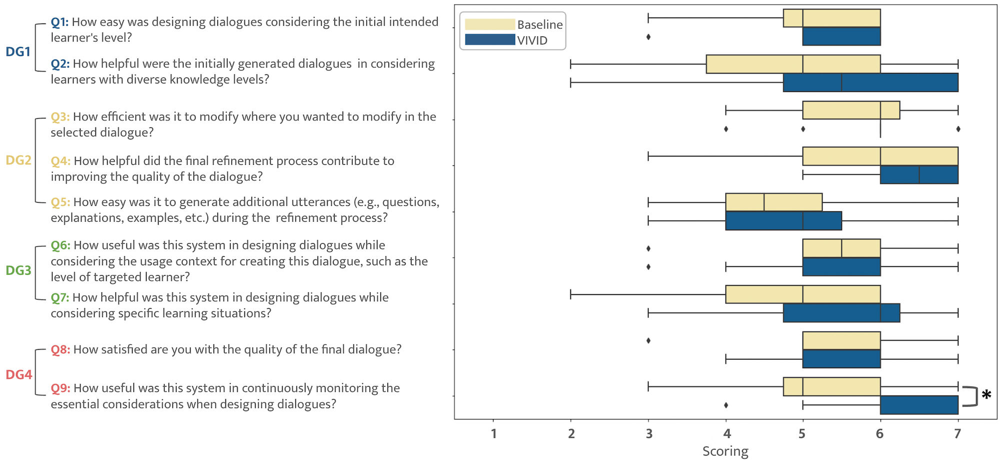

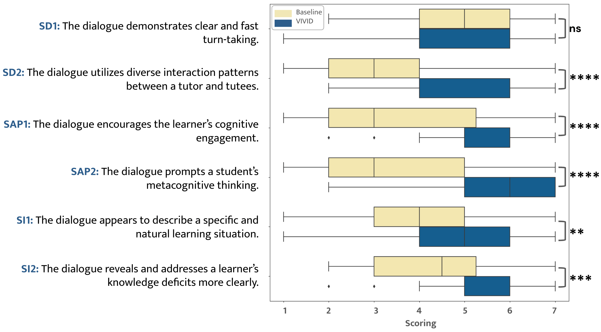

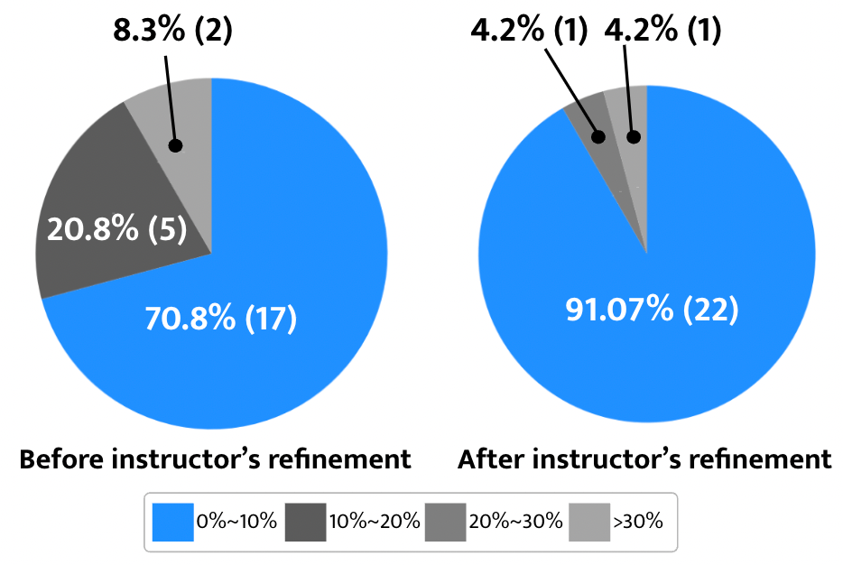

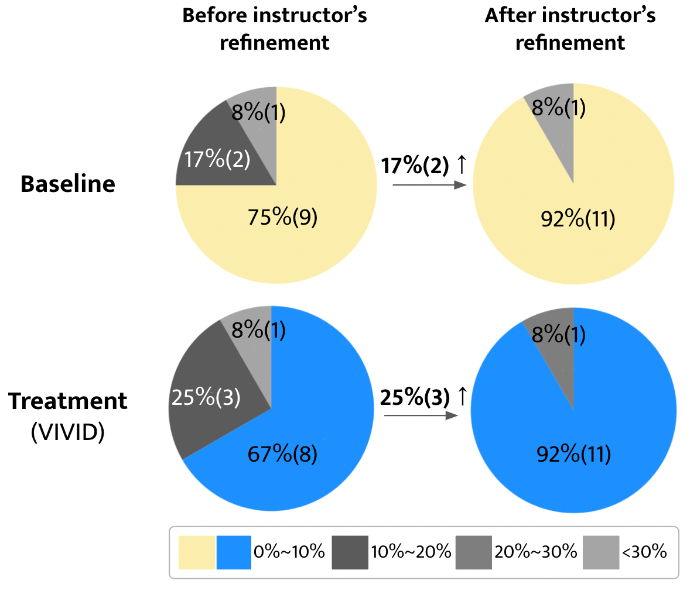

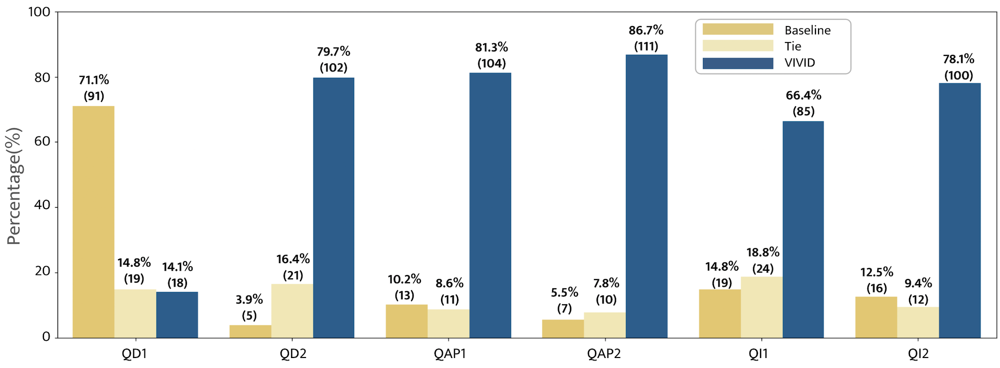

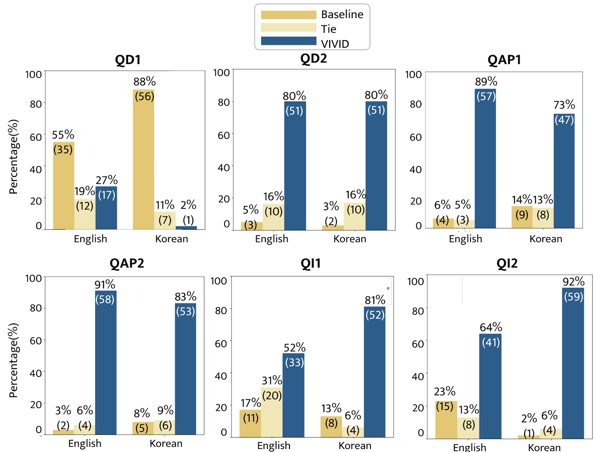

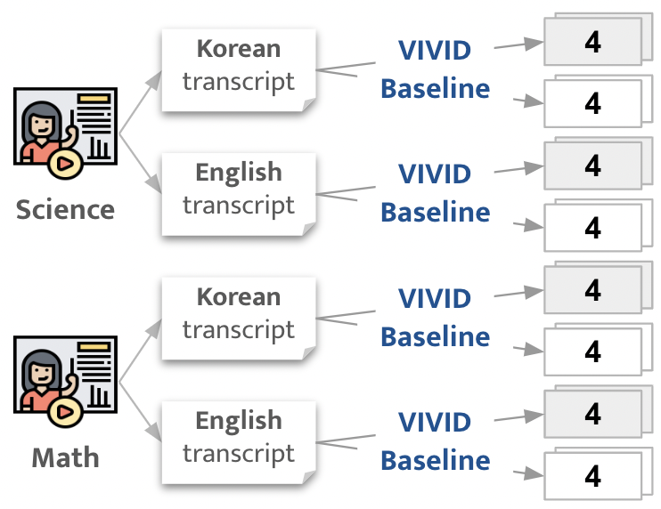

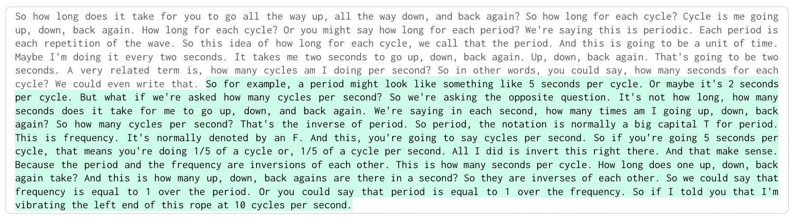

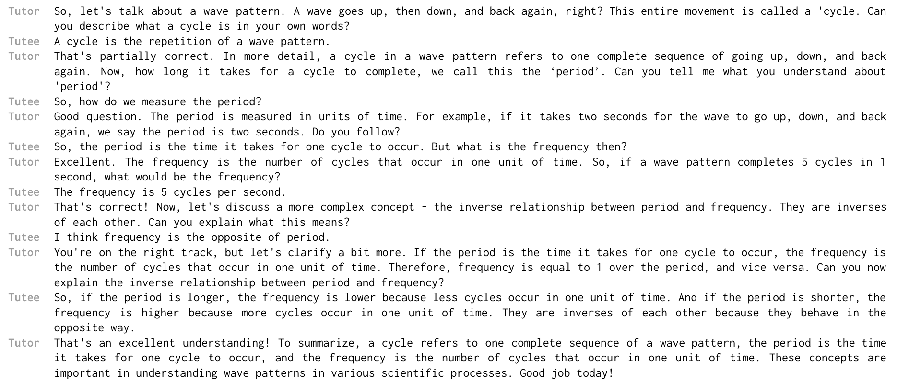

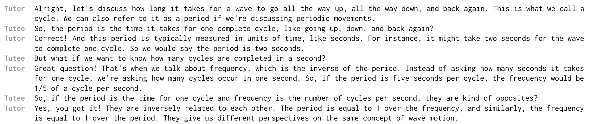

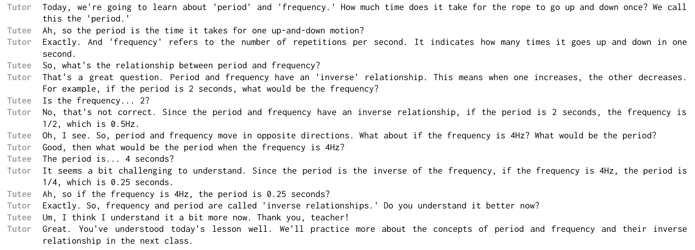

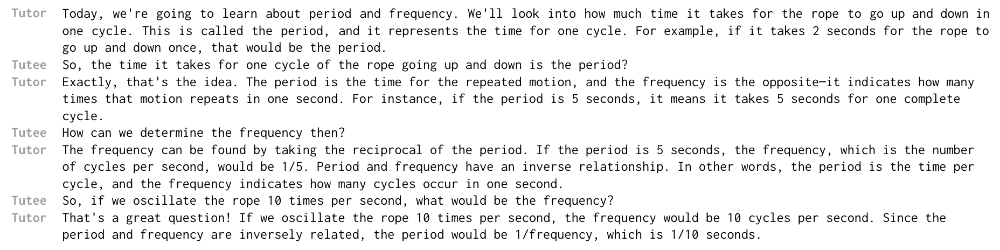