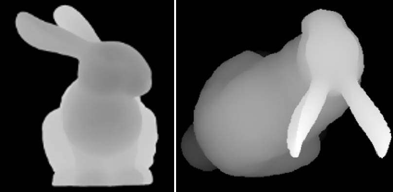
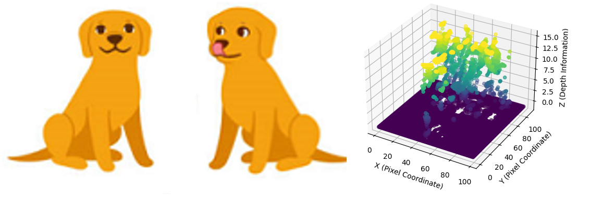
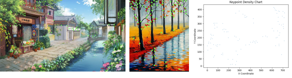
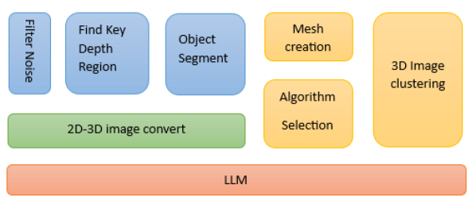
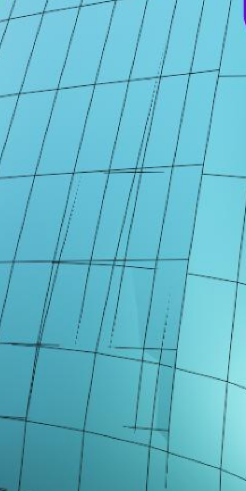

# [VisionGPT-3D：一款强大而全面的多模态智能体，旨在提升三维视觉理解能力](https://arxiv.org/abs/2403.09530)

发布时间：2024年03月14日

`Agent`

`计算机视觉`

`多模态`

> VisionGPT-3D: A Generalized Multimodal Agent for Enhanced 3D Vision Understanding

> 文本到视觉技术的发展极大地方便了日常生活，如依据文本生成图像和视频，以及在图片中精准定位目标元素。以往的计算机视觉模型聚焦于明确物体的检测和分类，而大型语言模型（LLMs）如 OpenAI GPT-4 则开启了自然语言向视觉对象转化的新篇章，为文本内容构建了可视化布局。尽管 CV 领域拥有多项尖端技术能将二维图像转为三维表现形式，但算法与实际问题间的错配仍可能产生不佳效果。为此，我们创新性地提出了 VisionGPT-3D 统一框架，汇聚当前最前沿的视觉模型，助力视觉导向型 AI 的开发。VisionGPT-3D 构建在一个强大的多模态基础模型之上，形成一个适应性强且集成度高的多模态框架，不仅无缝融合各类顶级视觉模型，还能自动筛选适用的3D网格生成算法对应2D深度图解析，并依据包括文本提示在内的多种多模态输入生成最佳结果。  关键词：VisionGPT-3D、三维视觉理解、多模态智能体

> The evolution of text to visual components facilitates people's daily lives, such as generating image, videos from text and identifying the desired elements within the images. Computer vision models involving the multimodal abilities in the previous days are focused on image detection, classification based on well-defined objects. Large language models (LLMs) introduces the transformation from nature language to visual objects, which present the visual layout for text contexts. OpenAI GPT-4 has emerged as the pinnacle in LLMs, while the computer vision (CV) domain boasts a plethora of state-of-the-art (SOTA) models and algorithms to convert 2D images to their 3D representations. However, the mismatching between the algorithms with the problem could lead to undesired results. In response to this challenge, we propose an unified VisionGPT-3D framework to consolidate the state-of-the-art vision models, thereby facilitating the development of vision-oriented AI. VisionGPT-3D provides a versatile multimodal framework building upon the strengths of multimodal foundation models. It seamlessly integrates various SOTA vision models and brings the automation in the selection of SOTA vision models, identifies the suitable 3D mesh creation algorithms corresponding to 2D depth maps analysis, generates optimal results based on diverse multimodal inputs such as text prompts.
  Keywords: VisionGPT-3D, 3D vision understanding, Multimodal agent

