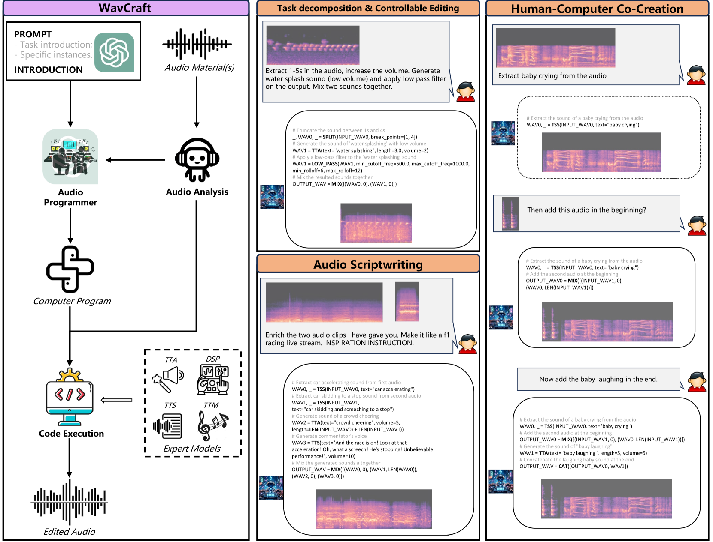
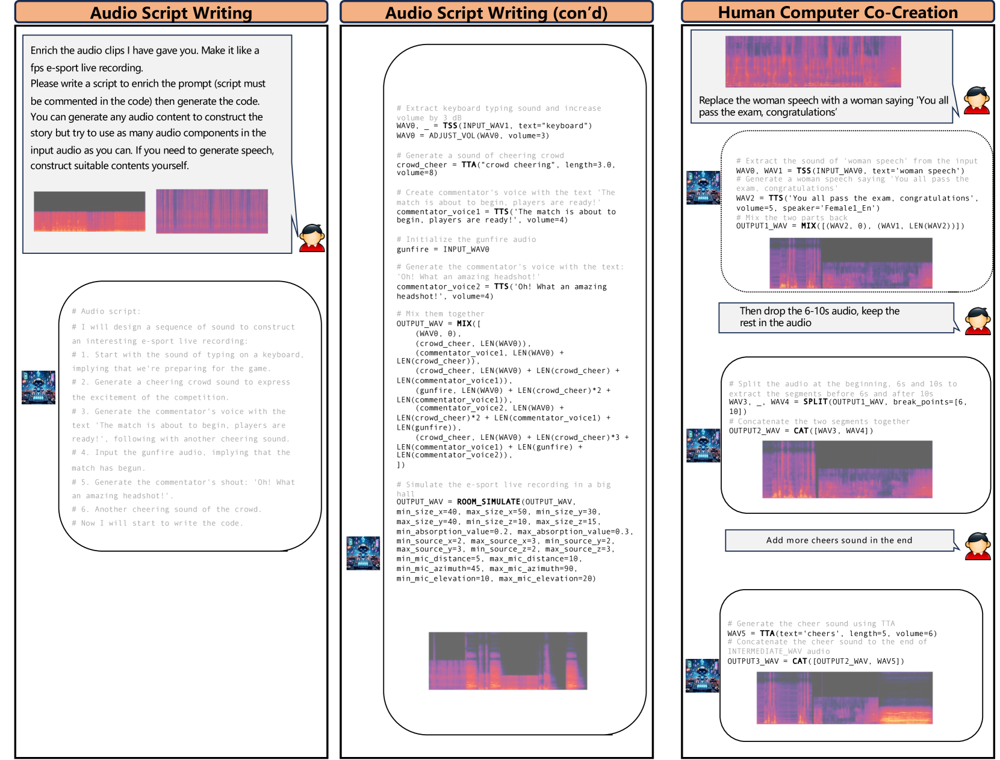

# WavCraft——通过自然语言指令实现音频编辑与生成

发布时间：2024年03月14日

`LLM应用` `音频处理`

> WavCraft: Audio Editing and Generation with Natural Language Prompts

> 我们推出了 WavCraft 系统，它巧妙结合大型语言模型（LLMs），联动各类专用于音频创作与编辑的任务模型。WavCraft 采用自然语言描绘原始音频素材内容，并基于音频描述及用户需求向 LLM 提供条件性提示。借助 LLM 的强大上下文学习能力，WavCraft 将用户的指令拆解成若干子任务，携手音频专家模块逐一攻克。通过一套任务针对性模型实现任务细分，WavCraft 能够精准响应输入指示，细致入微地创制和编辑音频内容，赋予用户更强掌控力。不仅如此，WavCraft 还能通过对话互动方式与用户默契配合，即使无明确指令也能自动生成音频内容。实验证明，WavCraft 在调整音频片段局部区域等方面表现更胜一筹，并且能够依照复杂的指令，在已有录音基础上灵活编辑乃至创新音频内容，为音频制作人在更多应用场景下提供有力支持。我们的代码实现和演示已发布于 https://github.com/JinhuaLiang/WavCraft。

> We introduce WavCraft, a collective system that leverages large language models (LLMs) to connect diverse task-specific models for audio content creation and editing. Specifically, WavCraft describes the content of raw sound materials in natural language and prompts the LLM conditioned on audio descriptions and users' requests. WavCraft leverages the in-context learning ability of the LLM to decomposes users' instructions into several tasks and tackle each task collaboratively with audio expert modules. Through task decomposition along with a set of task-specific models, WavCraft follows the input instruction to create or edit audio content with more details and rationales, facilitating users' control. In addition, WavCraft is able to cooperate with users via dialogue interaction and even produce the audio content without explicit user commands. Experiments demonstrate that WavCraft yields a better performance than existing methods, especially when adjusting the local regions of audio clips. Moreover, WavCraft can follow complex instructions to edit and even create audio content on the top of input recordings, facilitating audio producers in a broader range of applications. Our implementation and demos are available at https://github.com/JinhuaLiang/WavCraft.

[Arxiv](https://arxiv.org/abs/2403.09527)