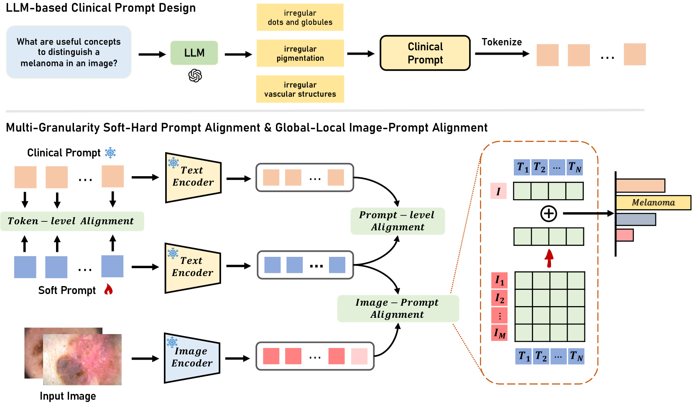
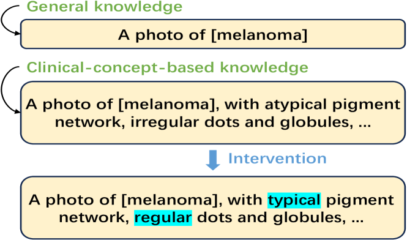
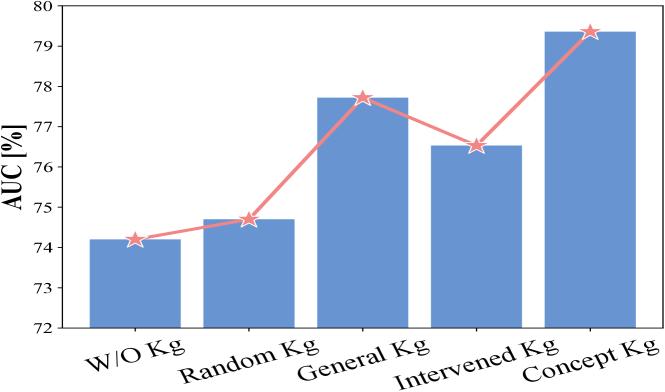
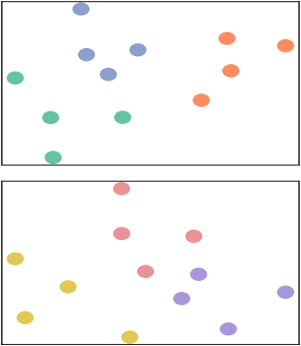

# [XCoOp：借助于概念指导下的上下文优化技术，实现对计算机辅助诊断任务具有可解释性的提示学习。](https://arxiv.org/abs/2403.09410)

发布时间：2024年03月14日

`LLM应用` `可解释人工智能`

> XCoOp: Explainable Prompt Learning for Computer-Aided Diagnosis via Concept-guided Context Optimization

> 随着大型视觉-语言模型(VLMs)的强大力量被用于解决多种下游任务，其中软提示学习作为一种高效调整方法（如应用于CLIP进行图像分类）引起了广泛关注。然而，在医疗保健等高风险场景下，当前主流的提示学习技术往往生成难以解释的文本标记，这与可解释人工智能(XAI)的严苛要求并不相符。为此，我们创新性地提出一个可解释的提示学习框架，它巧妙地结合多层级图像语义、可学习提示及基于临床概念的提示，并融入医学专业知识以增强其可解释性。而且，针对高质量概念标注稀缺的问题，我们借助大规模语言模型抽取知识，为提示提供直观的视觉和文本双重解释。在一系列包含或不包含概念标签的数据集上的大量实验与可解释性分析证实，我们的方法在保持优秀诊断性能的同时，兼顾灵活性与可解释性，从而有力展示了基础模型在推动XAI发展中的重要作用。该代码将面向公众开放获取。

> Utilizing potent representations of the large vision-language models (VLMs) to accomplish various downstream tasks has attracted increasing attention. Within this research field, soft prompt learning has become a representative approach for efficiently adapting VLMs such as CLIP, to tasks like image classification. However, most existing prompt learning methods learn text tokens that are unexplainable, which cannot satisfy the stringent interpretability requirements of Explainable Artificial Intelligence (XAI) in high-stakes scenarios like healthcare. To address this issue, we propose a novel explainable prompt learning framework that leverages medical knowledge by aligning the semantics of images, learnable prompts, and clinical concept-driven prompts at multiple granularities. Moreover, our framework addresses the lack of valuable concept annotations by eliciting knowledge from large language models and offers both visual and textual explanations for the prompts. Extensive experiments and explainability analyses conducted on various datasets, with and without concept labels, demonstrate that our method simultaneously achieves superior diagnostic performance, flexibility, and interpretability, shedding light on the effectiveness of foundation models in facilitating XAI. The code will be made publically available.

[Arxiv](https://arxiv.org/abs/2403.09410)