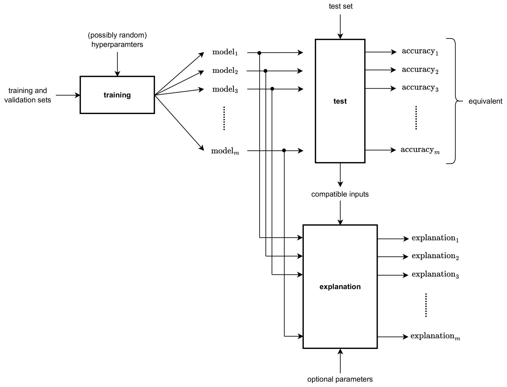
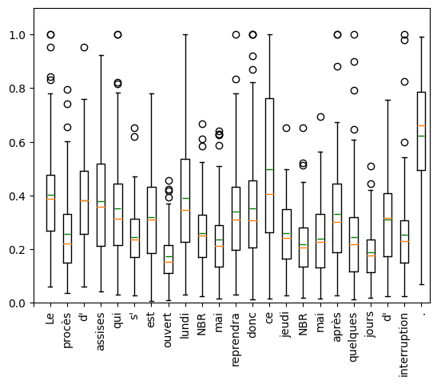
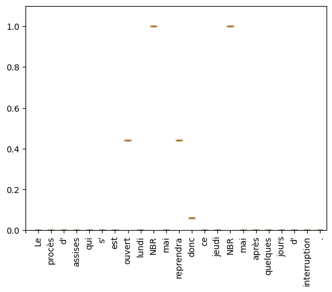
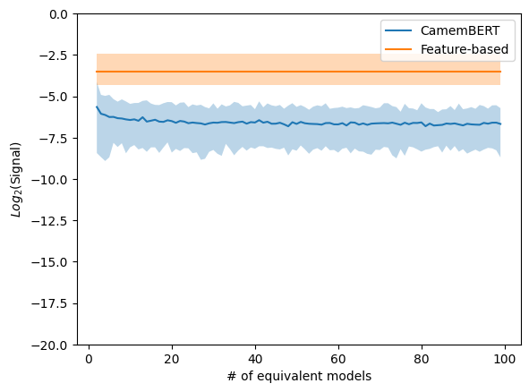
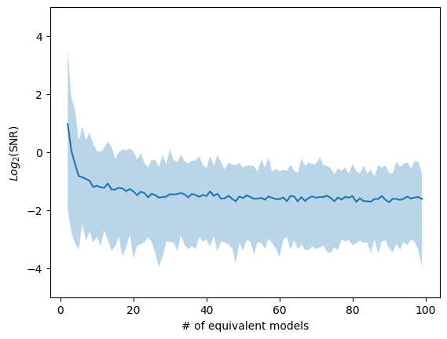
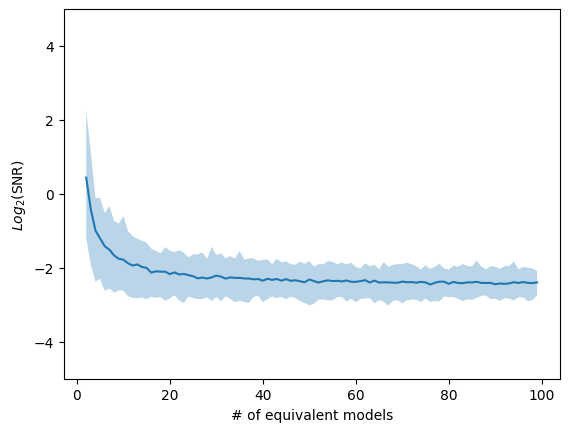
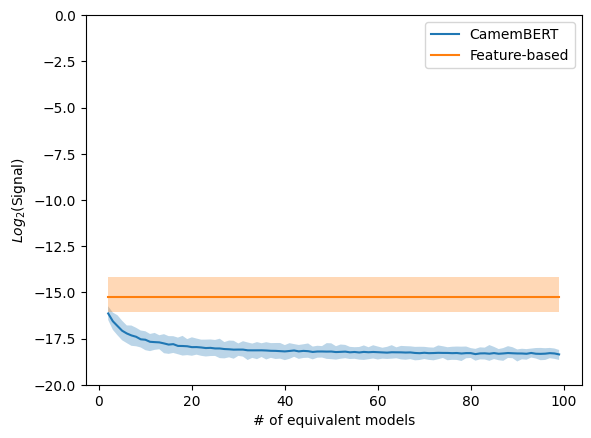
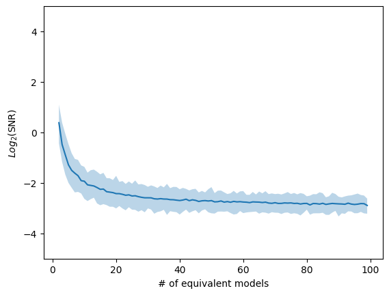

# 探究大型语言模型的可解释性难题，及其涉及词级别的单变量一阶合理性假设

发布时间：2024年03月15日

`LLM理论` `模型解释`

> A Question on the Explainability of Large Language Models and the Word-Level Univariate First-Order Plausibility Assumption

# 摘要

> 近期研究表明，大型语言模型解释易受训练过程中的随机性影响，对此现象亟需深入探究。本文提出了一个新视角，挑战能否为这类模型提供既简洁又富含信息的解释。我们首先给出了解释信号、噪声及其信噪比的统计学界定。在一个典型的案例研究中，当运用一阶统计工具分析词级单变量解释时，基于简单特征的模型解释相比Transformer模型，其信号更为突出，噪声更低。随后，我们探讨了如何借助能捕捉更复杂解释和分析手段的信号与噪声新定义来提升这一结论，并在此过程中审视其与解释对读者的可理解性之间的平衡取舍。

> The explanations of large language models have recently been shown to be sensitive to the randomness used for their training, creating a need to characterize this sensitivity. In this paper, we propose a characterization that questions the possibility to provide simple and informative explanations for such models. To this end, we give statistical definitions for the explanations' signal, noise and signal-to-noise ratio. We highlight that, in a typical case study where word-level univariate explanations are analyzed with first-order statistical tools, the explanations of simple feature-based models carry more signal and less noise than those of transformer ones. We then discuss the possibility to improve these results with alternative definitions of signal and noise that would capture more complex explanations and analysis methods, while also questioning the tradeoff with their plausibility for readers.

[Arxiv](https://arxiv.org/abs/2403.10275)