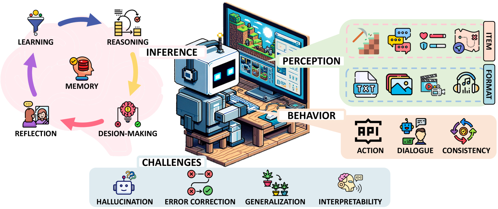
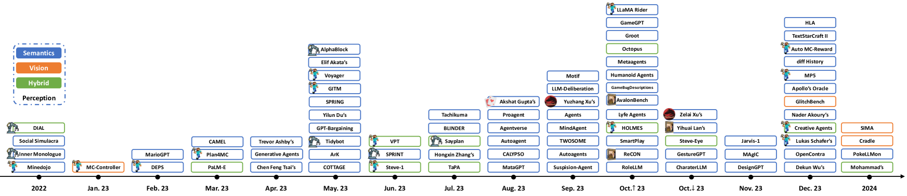

# [本研究综述了游戏智能体和大型模型的研究进展，探讨了各类方法、应用场景以及面临的挑战。](https://arxiv.org/abs/2403.10249)

发布时间：2024年03月15日

`Agent` `人工智能`

> A Survey on Game Playing Agents and Large Models: Methods, Applications, and Challenges

> 随着大规模模型（涵盖语言与多模态）的迅猛发展，学界和业界的目光纷纷聚焦于此。然而，尽管这一领域的热度不断攀升，但对于其在各具影响力的场景中能力与潜力的系统性梳理尚显不足。本论文旨在弥合这一认知鸿沟，深度剖析大型语言模型在复杂游戏情境下的应用现状及待解难题。我们系统性回顾了基于LMs构建的游戏智能体的各种架构，提炼出它们的共同特点、挑战以及相关洞见。同时，我们前瞻性地展望了LMs在游戏领域未来研究的发展路径，以期为研究者提供对该领域的清晰认识，进一步激发他们对此高影响力研究方向的热情。我们的GitHub仓库将实时更新与此相关的资源信息。

> The swift evolution of Large-scale Models (LMs), either language-focused or multi-modal, has garnered extensive attention in both academy and industry. But despite the surge in interest in this rapidly evolving area, there are scarce systematic reviews on their capabilities and potential in distinct impactful scenarios. This paper endeavours to help bridge this gap, offering a thorough examination of the current landscape of LM usage in regards to complex game playing scenarios and the challenges still open. Here, we seek to systematically review the existing architectures of LM-based Agents (LMAs) for games and summarize their commonalities, challenges, and any other insights. Furthermore, we present our perspective on promising future research avenues for the advancement of LMs in games. We hope to assist researchers in gaining a clear understanding of the field and to generate more interest in this highly impactful research direction. A corresponding resource, continuously updated, can be found in our GitHub repository.

[Arxiv](https://arxiv.org/abs/2403.10249)