# ChatPattern 是一项创新技术，允许用户借助自然语言轻松自定义布局模式。这项技术使得用户能够以更加直观和灵活的方式调整界面布局，只需通过简单的语言指令即可实现个性化定制。

发布时间：2024年03月15日

`Agent` `图形设计`

> ChatPattern: Layout Pattern Customization via Natural Language

# 摘要

> 当前研究集中于固定尺寸布局模式的设计，但更实用的自由尺寸布局模式却鲜受重视。本文提出了一项创新方案——ChatPattern，它是一个依托大型语言模型（LLM）的弹性模式定制框架。该框架包含两个关键组件：一个能解读自然语言需求并操控设计工具满足个性化需求的LLM专家代理，以及一个在条件布局生成、模式调整及高效扩展内存友好型模式等方面表现出色的布局生成器。在复杂模式生成场景的实验验证了ChatPattern能够高效创作出高质量的大规模布局模式。

> Existing works focus on fixed-size layout pattern generation, while the more practical free-size pattern generation receives limited attention. In this paper, we propose ChatPattern, a novel Large-Language-Model (LLM) powered framework for flexible pattern customization. ChatPattern utilizes a two-part system featuring an expert LLM agent and a highly controllable layout pattern generator. The LLM agent can interpret natural language requirements and operate design tools to meet specified needs, while the generator excels in conditional layout generation, pattern modification, and memory-friendly patterns extension. Experiments on challenging pattern generation setting shows the ability of ChatPattern to synthesize high-quality large-scale patterns.

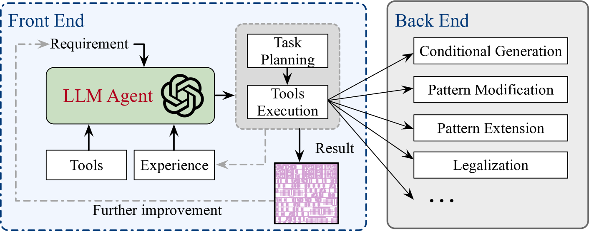

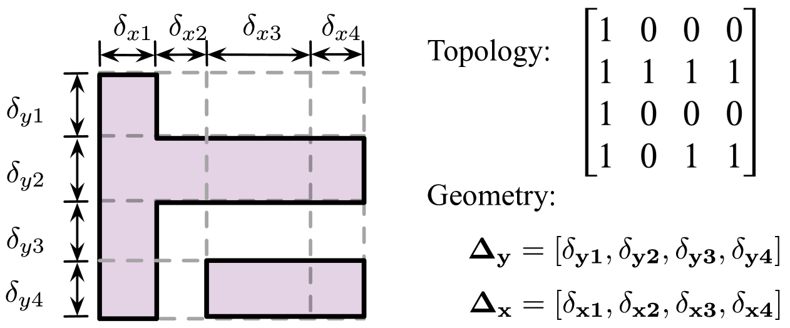

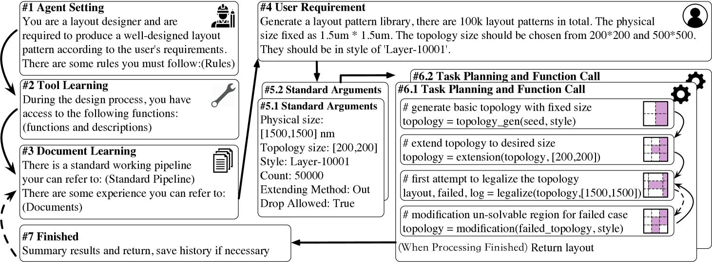

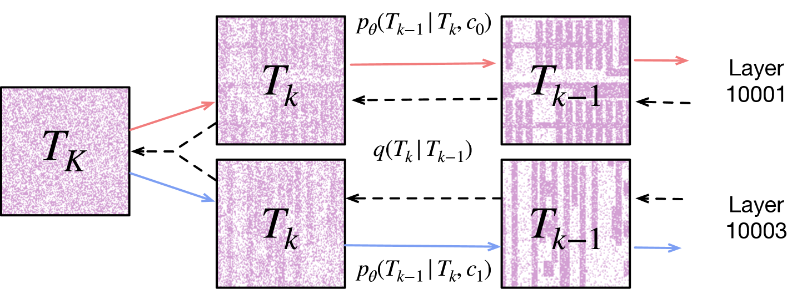

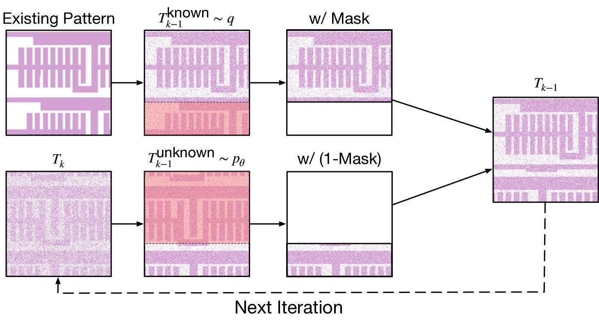

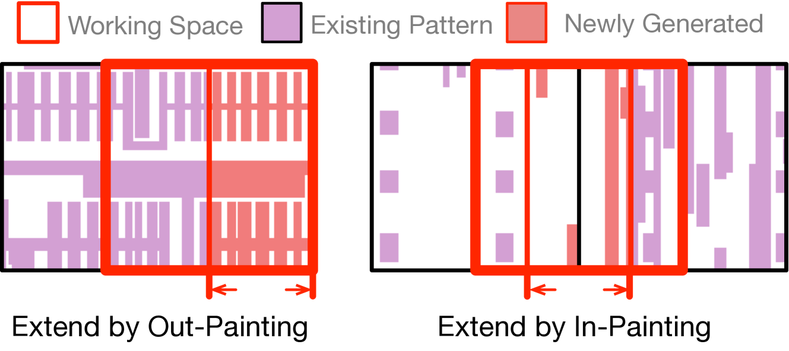

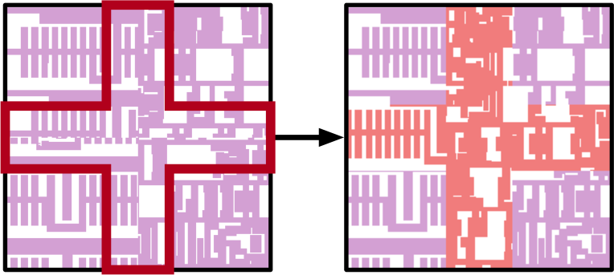

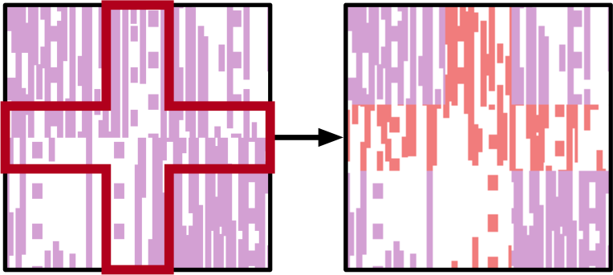

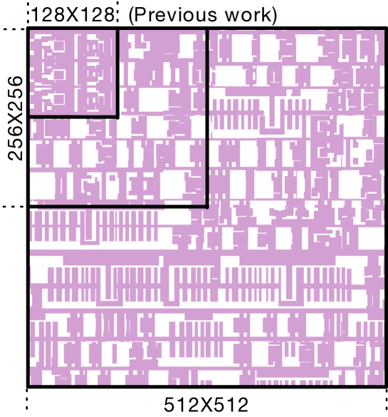

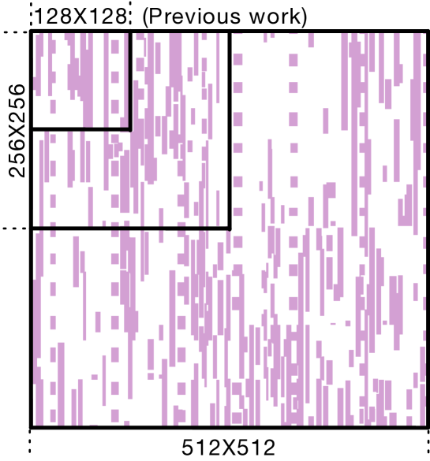

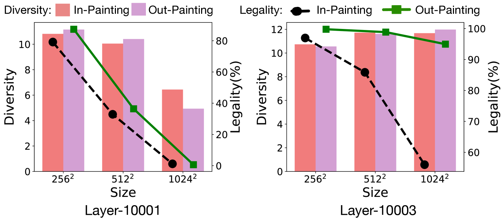

[Arxiv](https://arxiv.org/abs/2403.15434)