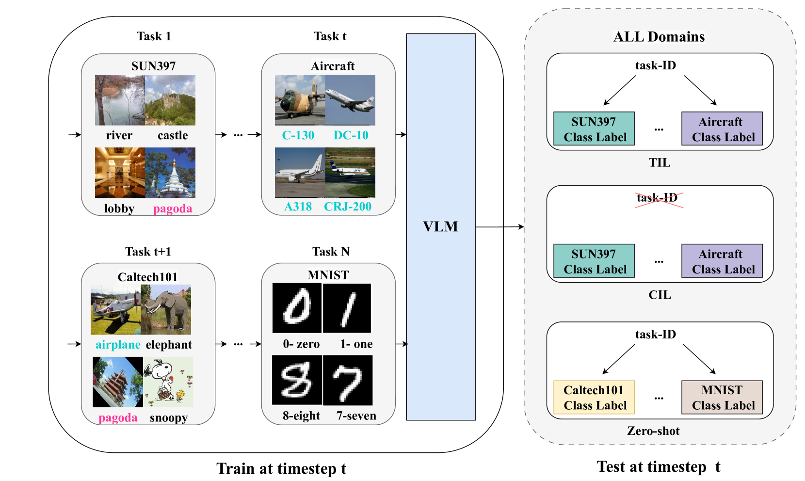
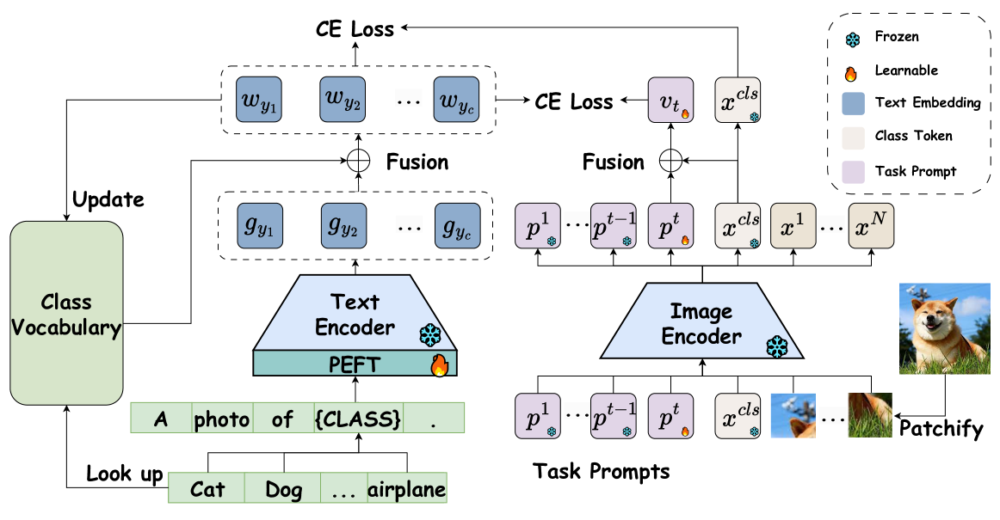

# [CoLeCLIP 是一种创新方法，通过结合任务提示与词汇学习技术，在开放领域内实现持续学习能力。](https://arxiv.org/abs/2403.10245)

发布时间：2024年03月15日

`Agent` `视觉识别`

> CoLeCLIP: Open-Domain Continual Learning via Joint Task Prompt and Vocabulary Learning

> 本文聚焦于开放领域内视觉-语言模型处理连续学习难题，面对包含新颖类别的多样化领域数据流，模型需不断更新与推理。这一能力对AI助手、自动驾驶等开放环境下的应用具有关键意义。目前的CL研究多集中于单一领域且类别已知的封闭集场景，尽管CLIP这类大规模预训练VLM展现了出色的零样本识别性能，并有研究借此减轻CL过程中的灾难性遗忘，但这仅限于单一领域内的封闭集CL。而开放领域内大型VLM的CL挑战重重，原因包括跨数据集间的大类别关联与领域鸿沟，以及预训练模型在吸收新数据集知识的同时丧失零样本知识。为此，我们创新性地提出了CoLeCLIP方法，以CLIP为基础构建开放领域CL模型，通过协同学习任务提示集合及跨领域类别词汇表应对上述挑战。在11个不同领域的数据集上开展的深入实验验证了CoLeCLIP在任务增量学习和类别增量学习两种设置下，均能超越现有最优方法，展现出卓越的开放领域CL性能。

> This paper explores the problem of continual learning (CL) of vision-language models (VLMs) in open domains, where the models need to perform continual updating and inference on a streaming of datasets from diverse seen and unseen domains with novel classes. Such a capability is crucial for various applications in open environments, e.g., AI assistants, autonomous driving systems, and robotics. Current CL studies mostly focus on closed-set scenarios in a single domain with known classes. Large pre-trained VLMs like CLIP have demonstrated superior zero-shot recognition ability, and a number of recent studies leverage this ability to mitigate catastrophic forgetting in CL, but they focus on closed-set CL in a single domain dataset. Open-domain CL of large VLMs is significantly more challenging due to 1) large class correlations and domain gaps across the datasets and 2) the forgetting of zero-shot knowledge in the pre-trained VLMs in addition to the knowledge learned from the newly adapted datasets. In this work we introduce a novel approach, termed CoLeCLIP, that learns an open-domain CL model based on CLIP. It addresses these challenges by a joint learning of a set of task prompts and a cross-domain class vocabulary. Extensive experiments on 11 domain datasets show that CoLeCLIP outperforms state-of-the-art methods for open-domain CL under both task- and class-incremental learning settings.

[Arxiv](https://arxiv.org/abs/2403.10245)