# [在向量量化图像模型中，我们引入了一种结合词性标签进行码本迁移的方法。这一技术旨在优化码本在不同场景下的表现，特别是在向量量化图像建模任务中。](https://arxiv.org/abs/2403.10071)

发布时间：2024年03月15日

`Agent`

`图像处理`

`机器学习`

> Codebook Transfer with Part-of-Speech for Vector-Quantized Image Modeling

> 在图像合成领域，VQIM技术致力于以离散符号序列描绘图像，而现有研究通过从头独立构建离散码本来有效解决这一问题。尽管如此，由于码本学习过程极具挑战，尤其是忽视了码与优质码本先验之间的关联，可能导致码本坍塌现象，即某些码向量无法得到有效优化。受预训练语言模型启示，我们发现它们已通过大量文本数据集悄然预训练出卓越的码本，而此类信息在VQIM中尚未得到充分利用。因此，我们创新性地提出了名为VQCT的基于词性部分的码本迁移框架，旨在将预训练语言模型中的成熟码本迁移到VQIM中，助力稳健的码本学习。具体操作包括：首先，汲取语言模型及词性知识中的预训练码本作为有益先验；其次，利用这些先验构建与视觉紧密相关的码本以完成码本迁移；最后，精心设计一种新型码本迁移网络，挖掘预训练码本中蕴含的丰富码间语义联系，从而增强VQIM的码本学习能力。实验结果证实，在四个数据集上，我们的VQCT方法相较于当前最先进方法，显著提升了VQIM的表现水平。

> Vector-Quantized Image Modeling (VQIM) is a fundamental research problem in image synthesis, which aims to represent an image with a discrete token sequence. Existing studies effectively address this problem by learning a discrete codebook from scratch and in a code-independent manner to quantize continuous representations into discrete tokens. However, learning a codebook from scratch and in a code-independent manner is highly challenging, which may be a key reason causing codebook collapse, i.e., some code vectors can rarely be optimized without regard to the relationship between codes and good codebook priors such that die off finally. In this paper, inspired by pretrained language models, we find that these language models have actually pretrained a superior codebook via a large number of text corpus, but such information is rarely exploited in VQIM. To this end, we propose a novel codebook transfer framework with part-of-speech, called VQCT, which aims to transfer a well-trained codebook from pretrained language models to VQIM for robust codebook learning. Specifically, we first introduce a pretrained codebook from language models and part-of-speech knowledge as priors. Then, we construct a vision-related codebook with these priors for achieving codebook transfer. Finally, a novel codebook transfer network is designed to exploit abundant semantic relationships between codes contained in pretrained codebooks for robust VQIM codebook learning. Experimental results on four datasets show that our VQCT method achieves superior VQIM performance over previous state-of-the-art methods.

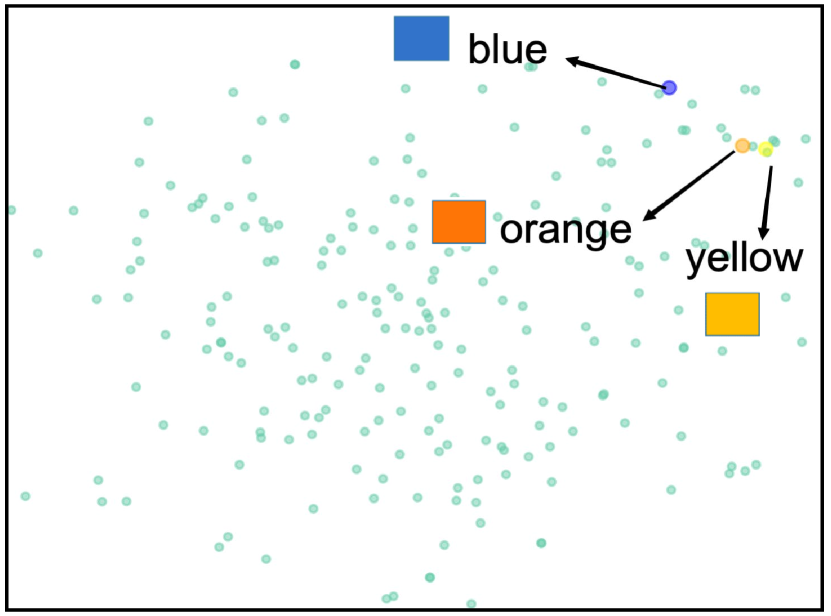

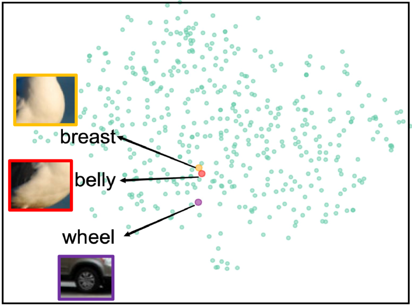

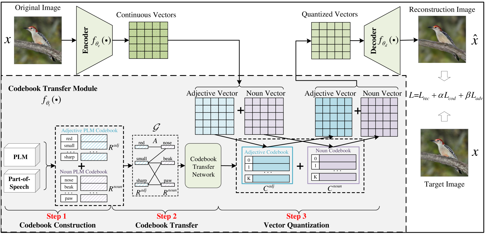

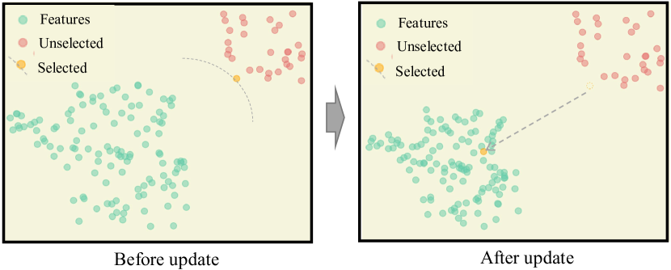

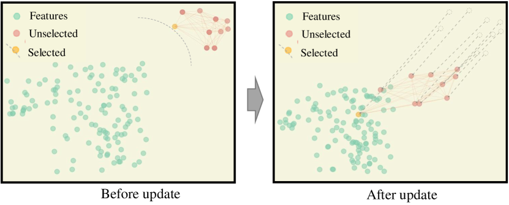

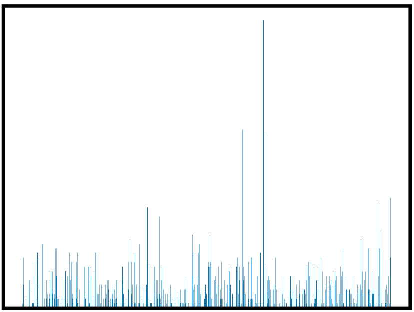

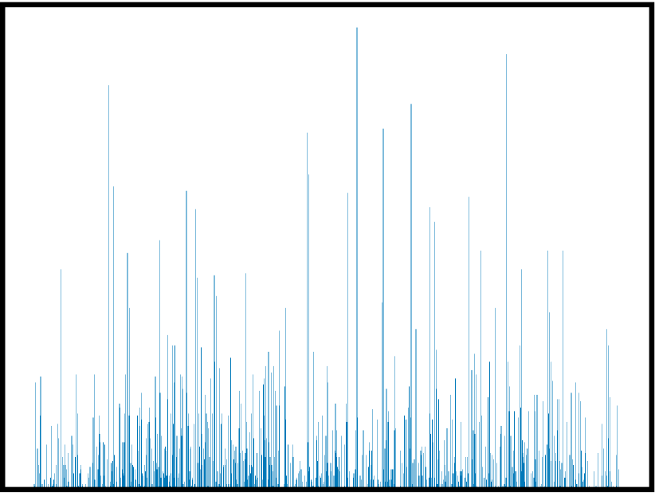

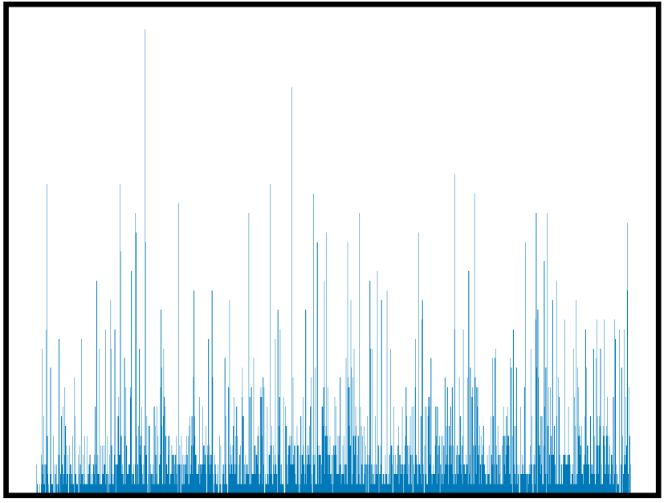

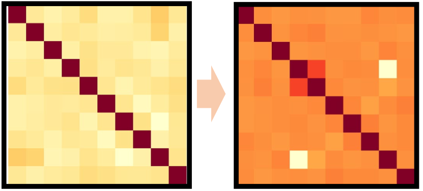

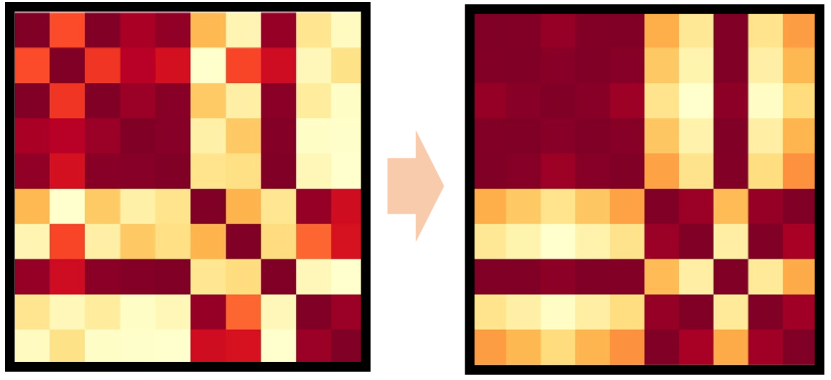

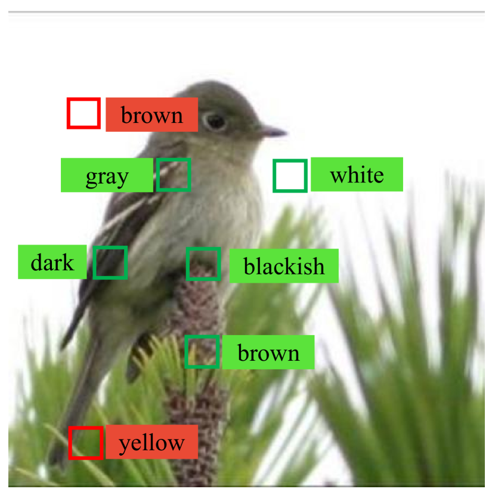

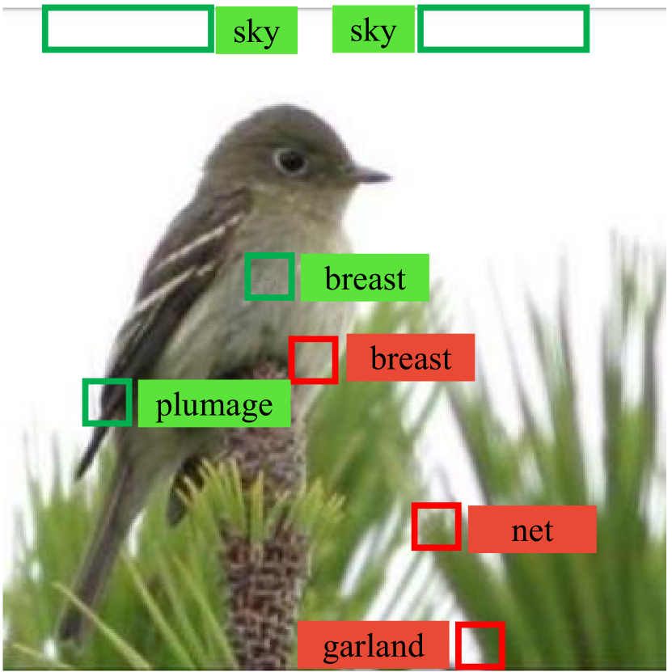

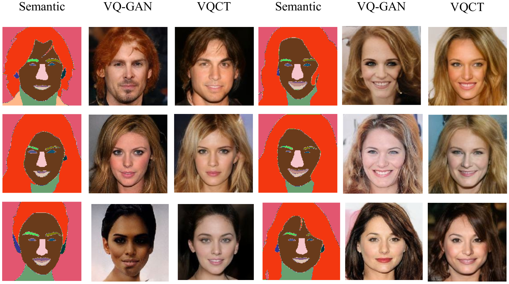