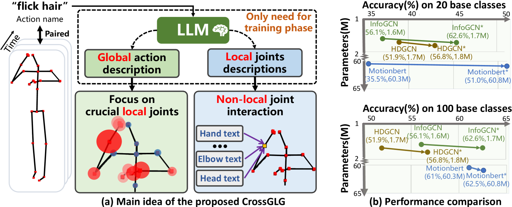
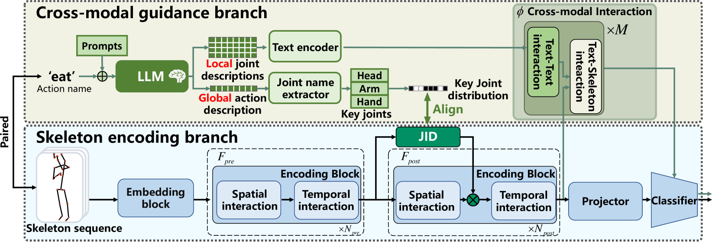
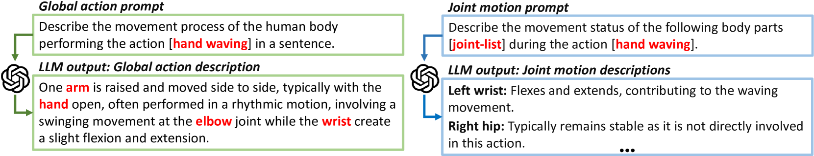
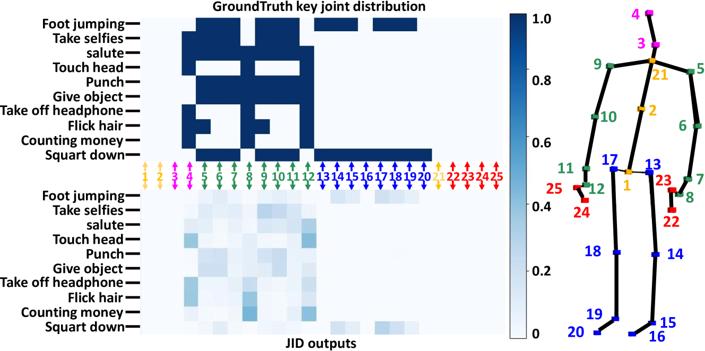
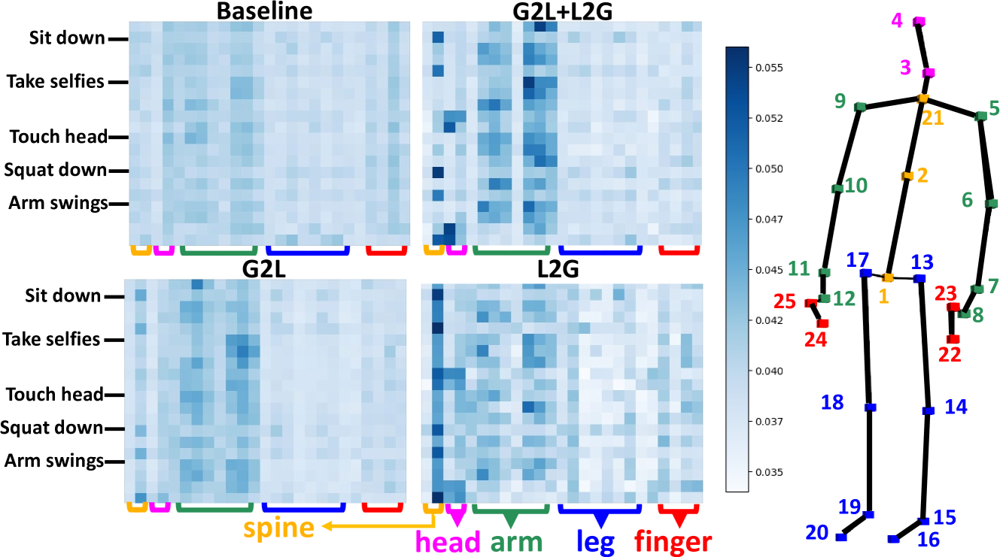
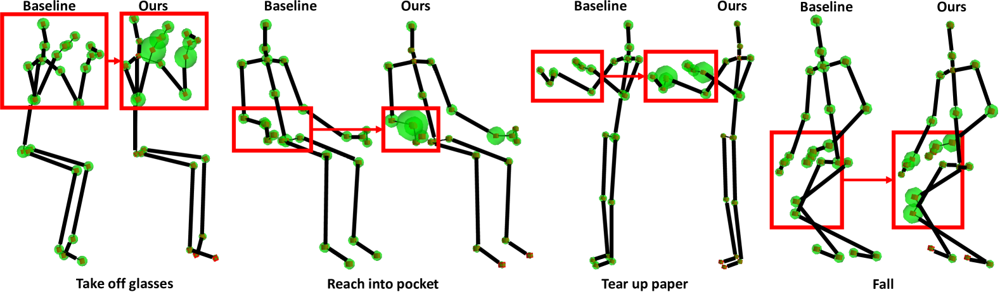
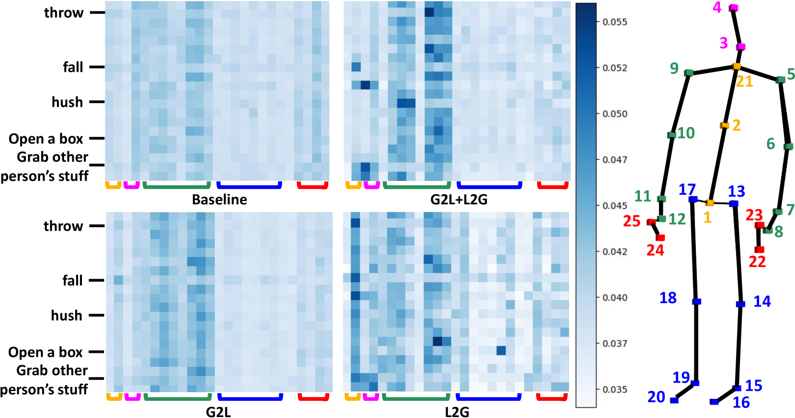

# [CrossGLG 是一种创新方法，利用大型语言模型（LLM）以跨层次的方式实现仅通过一次示例就能指导基于骨架的3D动作识别。](https://arxiv.org/abs/2403.10082)

发布时间：2024年03月15日

`LLM应用` `动作识别` `骨架编码`

> CrossGLG: LLM Guides One-shot Skeleton-based 3D Action Recognition in a Cross-level Manner

> 当前主流的基于单次骨架的动作识别往往受限于对原始低层信息（如关节位置）的关注，易导致局部信息损失和泛化能力较弱的问题。为解决此困境，我们创新性地引入由大型语言模型（LLM）生成的蕴含高级人类知识的文本描述，以全局-局部-全局的视角指导特征学习过程。在训练时，我们匠心独运地设计了两种提示方式，用于从LLM提取每个动作的全局概览和局部细节描述。首先，借助全局文本描述指导骨架编码器聚焦于富含信息的关键关节（全局至局部）。其次，通过构建局部文本描述与关节特征间的非局部互动关系，提炼出最终的全局表征（局部至全局）。此外，我们创新设计了双分支结构，有效解决了训练和推理阶段的不对称问题，使模型无需任何文本输入即可对新类别进行推理，并且相较于基础骨架编码器，额外增加的推理成本微乎其微。实验证明，在三个不同的基准数据集上，CrossGLG均大幅度超越现有最先进的方法，并且其推理成本（模型尺寸）仅比之前最先进方法增加了2.8%。值得一提的是，CrossGLG作为一种即插即用的模块，可在推理过程中几乎无额外成本的前提下，有力提升各类SOTA骨架编码器的表现。该研究的源代码将很快对外公布。

> Most existing one-shot skeleton-based action recognition focuses on raw low-level information (e.g., joint location), and may suffer from local information loss and low generalization ability. To alleviate these, we propose to leverage text description generated from large language models (LLM) that contain high-level human knowledge, to guide feature learning, in a global-local-global way. Particularly, during training, we design $2$ prompts to gain global and local text descriptions of each action from an LLM. We first utilize the global text description to guide the skeleton encoder focus on informative joints (i.e.,global-to-local). Then we build non-local interaction between local text and joint features, to form the final global representation (i.e., local-to-global). To mitigate the asymmetry issue between the training and inference phases, we further design a dual-branch architecture that allows the model to perform novel class inference without any text input, also making the additional inference cost neglectable compared with the base skeleton encoder. Extensive experiments on three different benchmarks show that CrossGLG consistently outperforms the existing SOTA methods with large margins, and the inference cost (model size) is only $2.8$\% than the previous SOTA. CrossGLG can also serve as a plug-and-play module that can substantially enhance the performance of different SOTA skeleton encoders with a neglectable cost during inference. The source code will be released soon.

[Arxiv](https://arxiv.org/abs/2403.10082)