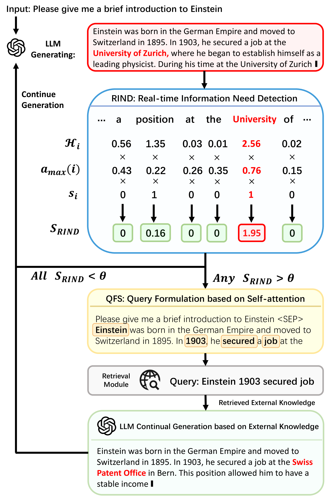

# [DRAGIN 是一项创新技术，它依据大型语言模型的实际信息需求进行动态检索增强生成。这项技术能够实时捕捉并满足LLM在生成过程中的信息需求，从而提升其表现力和准确性。](https://arxiv.org/abs/2403.10081)

发布时间：2024年03月15日

`RAG` `信息检索` `自然语言生成`

> DRAGIN: Dynamic Retrieval Augmented Generation based on the Real-time Information Needs of Large Language Models

> 动态检索增强生成技术（RAG）在LLMs运行时灵活决定何时进行检索以及检索何种信息。这一范式的核心在于捕捉最佳检索时机和精准构建检索请求。但现有的动态RAG方法在这两方面都有欠缺，其一，何时检索的策略往往依赖僵化规则；其二，决定检索何物时，通常仅关注LLM最新生成的部分语句或末尾标记，而忽略了可能跨越全文的实时信息需求。因此，我们创新提出了一种名为DRAGIN的新框架，它针对LLM在生成过程中的实时信息需求，智能决策何时检索及检索什么内容。我们在四个富含知识的生成任务数据集上综合评估了DRAGIN及其他现有方法，实验证明DRAGIN在所有任务中均表现出色，充分证明了我们方法的有效性。目前，我们已将DRAGIN的所有代码、数据和模型开源至GitHub平台：https://github.com/oneal2000/DRAGIN/tree/main。

> Dynamic retrieval augmented generation (RAG) paradigm actively decides when and what to retrieve during the text generation process of Large Language Models (LLMs). There are two key elements of this paradigm: identifying the optimal moment to activate the retrieval module (deciding when to retrieve) and crafting the appropriate query once retrieval is triggered (determining what to retrieve). However, current dynamic RAG methods fall short in both aspects. Firstly, the strategies for deciding when to retrieve often rely on static rules. Moreover, the strategies for deciding what to retrieve typically limit themselves to the LLM's most recent sentence or the last few tokens, while the LLM's real-time information needs may span across the entire context. To overcome these limitations, we introduce a new framework, DRAGIN, i.e., Dynamic Retrieval Augmented Generation based on the real-time Information Needs of LLMs. Our framework is specifically designed to make decisions on when and what to retrieve based on the LLM's real-time information needs during the text generation process. We evaluate DRAGIN along with existing methods comprehensively over 4 knowledge-intensive generation datasets. Experimental results show that DRAGIN achieves superior performance on all tasks, demonstrating the effectiveness of our method. We have open-sourced all the code, data, and models in GitHub: https://github.com/oneal2000/DRAGIN/tree/main

[Arxiv](https://arxiv.org/abs/2403.10081)