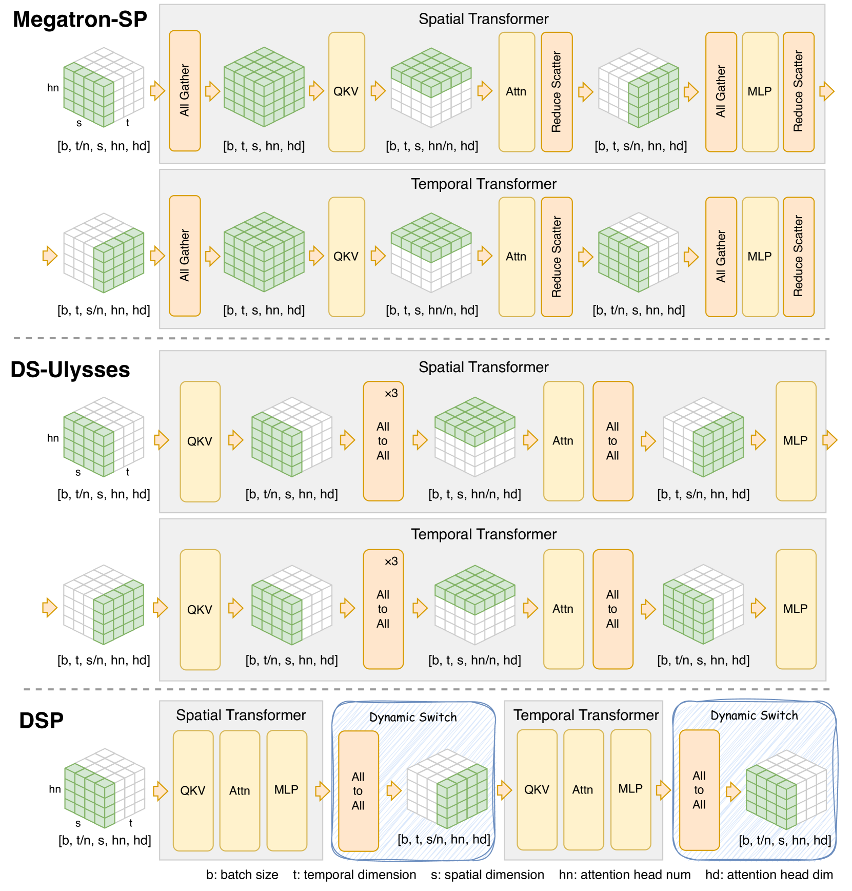
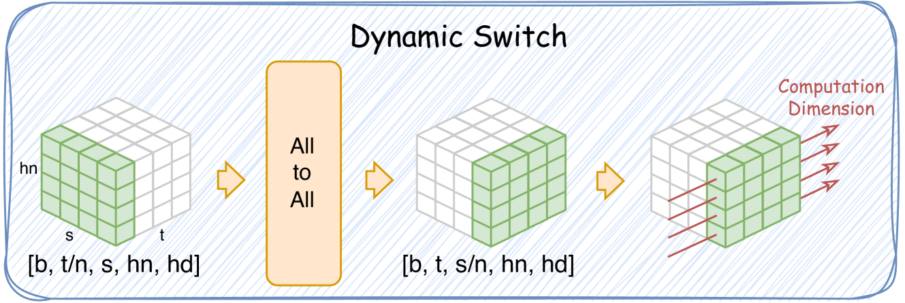
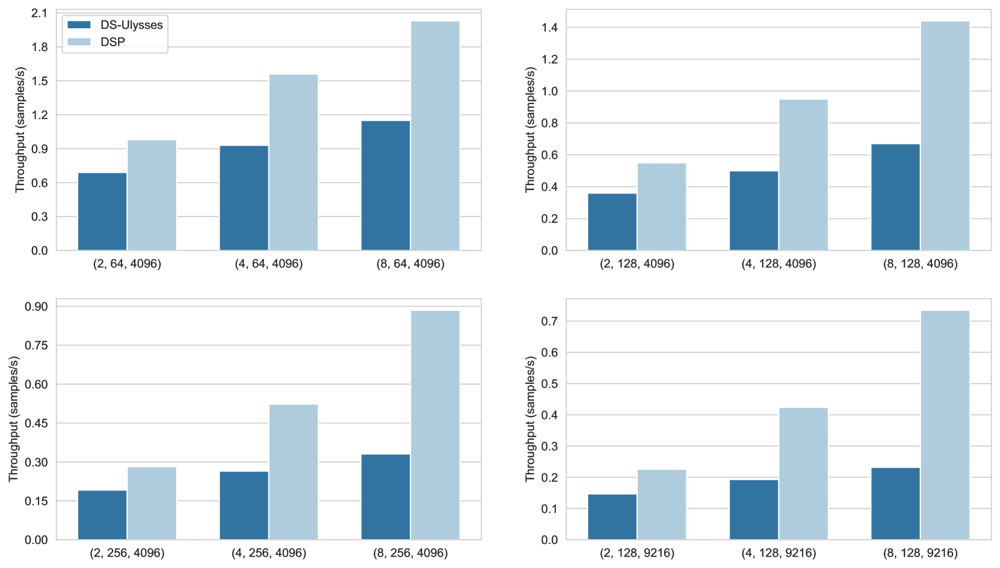

# [DSP技术为多维变换器引入了动态序列并行机制，旨在优化处理效率和性能。](https://arxiv.org/abs/2403.10266)

发布时间：2024年03月15日

`Agent` `视频处理`

> DSP: Dynamic Sequence Parallelism for Multi-Dimensional Transformers

> 面对语言生成、视频生成及多模态任务等应用场景中的大规模模型与长序列问题，急需寻求高效的序列并行解决方案。遗憾的是，现行的序列并行技术仅适用于单一维度，难以匹配跨多个维度进行注意力运算的多维度变压器结构。为此，本文创新性地提出了“动态序列并行化”（DSP）方案，旨在解决这一瓶颈。该方案的关键在于灵活运用多维度注意力机制的特点，依据当前计算阶段动态调整并行维度。如此一来，相较于传统的单维度并行方法强行应用于多维度模型时产生的大量通信开销，DSP 可实现更为精简高效的序列并行处理。实验证明，DSP 能够显著提升整体处理效率，在对比原有序列并行方法的基础上，提高幅度高达 42.0% 至 216.8%。

> Scaling large models with long sequences across applications like language generation, video generation and multimodal tasks requires efficient sequence parallelism. However, existing sequence parallelism methods all assume a single sequence dimension and fail to adapt to multi-dimensional transformer architectures that perform attention calculations across different dimensions. This paper introduces Dynamic Sequence Parallelism (DSP), a novel approach to enable efficient sequence parallelism for multi-dimensional transformer models. The key idea is to dynamically switch the parallelism dimension according to the current computation stage, leveraging the potential characteristics of multi-dimensional attention. This dynamic dimension switching allows sequence parallelism with minimal communication overhead compared to applying traditional single-dimension parallelism to multi-dimensional models. Experiments show DSP improves end-to-end throughput by 42.0% to 216.8% over prior sequence parallelism methods.

[Arxiv](https://arxiv.org/abs/2403.10266)