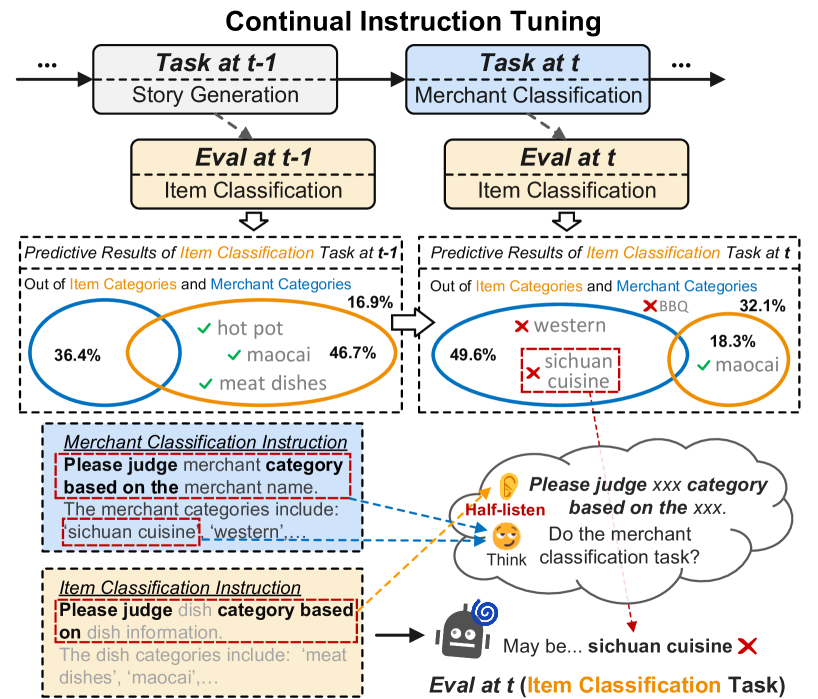
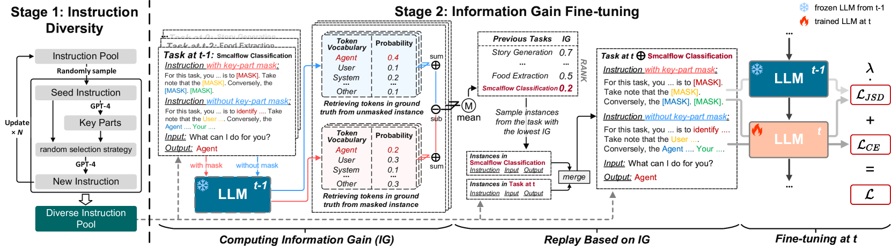
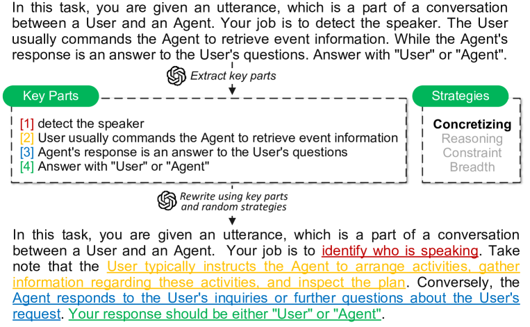
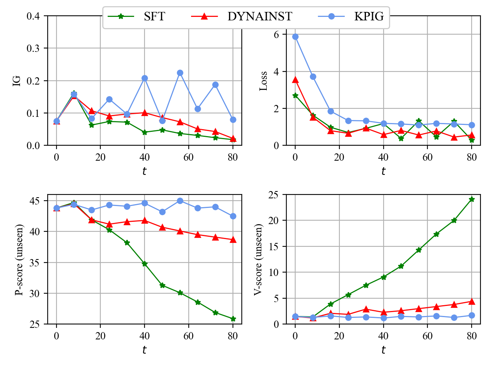

# 切勿一知半解：在连续指令调优过程中精准捕获关键信息要素

发布时间：2024年03月15日

`LLM应用` `持续学习`

> Don't Half-listen: Capturing Key-part Information in Continual Instruction Tuning

> 针对LLMs的指令调优技术能让它们在特定任务中精准契合人类目标，但连续指令调优（CIT）过程中可能出现灾难性遗忘现象，导致模型之前习得的能力退化。现有解决方案多聚焦于调整模型结构或重放数据，虽有助于记忆指令表层模式，但在新任务面前却可能陷入困扰。为此，本文创新性地提出了一种基于关键部分信息增益（KPIG）的持续指令调优方法。该方法通过对遮蔽部分计算信息增益，动态优化数据回放及训练目标，使LLMs能够更好地捕捉与正确回应紧密相关的任务导向信息，从而减轻对指令通用描述的过度依赖。同时，我们引入了P-分数和V-分数两种评估指标，用以衡量LLMs的泛化能力及遵循指令的执行力。实验证明，无论是在已见过还是未见过的任务上，我们的方法都能取得显著优势。

> Instruction tuning for large language models (LLMs) can drive them to produce results consistent with human goals in specific downstream tasks. However, the process of continual instruction tuning (CIT) for LLMs may bring about the catastrophic forgetting (CF) problem, where previously learned abilities are degraded. Recent methods try to alleviate the CF problem by modifying models or replaying data, which may only remember the surface-level pattern of instructions and get confused on held-out tasks. In this paper, we propose a novel continual instruction tuning method based on Key-part Information Gain (KPIG). Our method computes the information gain on masked parts to dynamically replay data and refine the training objective, which enables LLMs to capture task-aware information relevant to the correct response and alleviate overfitting to general descriptions in instructions. In addition, we propose two metrics, P-score and V-score, to measure the generalization and instruction-following abilities of LLMs. Experiments demonstrate our method achieves superior performance on both seen and held-out tasks.

[Arxiv](https://arxiv.org/abs/2403.10056)