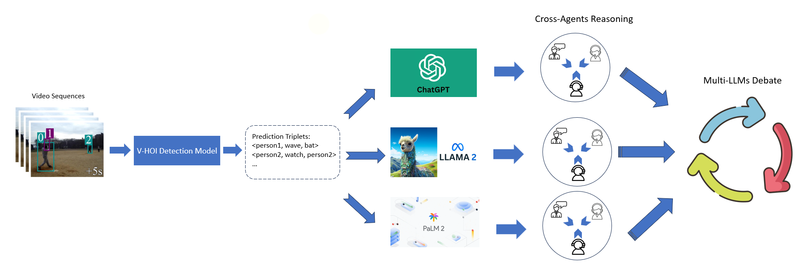
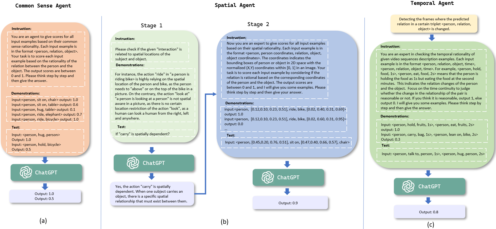
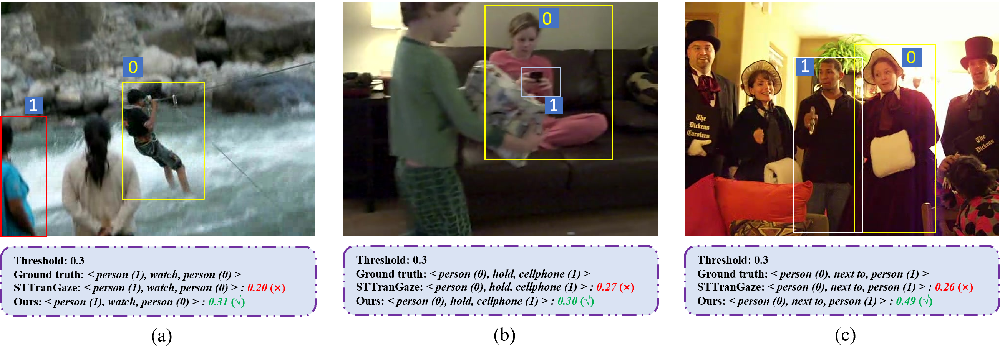

# [通过多台 LLM（大型语言模型）协同推理的方式，提升对以人类为中心的动态场景理解能力进一步优化后的](https://arxiv.org/abs/2403.10107)

发布时间：2024年03月15日

`Agent`

`机器人`

`自动驾驶`

> Enhancing Human-Centered Dynamic Scene Understanding via Multiple LLMs Collaborated Reasoning

> 在强化机器人和自主系统智能的过程中，关注人的动态场景理解至关重要，而视频中的人-物交互（V-HOI）检测正是这一领域的核心挑战，旨在全面解析视频内HOI关系以助力移动机器人和自动驾驶系统做出更优决策。尽管现有的V-HOI检测模型在特定数据集上取得了精准检测的进步，但在类人般的通用推理能力上仍有欠缺，难以有效推导HOI联系。为此，本研究创新性地构建了V-HOI Multi-LLMs协同推理（V-HOI MLCR）框架，借助一系列灵活搭配的模块，充分运用各类预训练大型语言模型（LLMs）所蕴含的强大推理优势，以期提升现有V-HOI检测模型的表现力。我们为V-HOI任务精心打造了分两步走的LLMs合作机制：第一步，设计“跨代理推理”方案，调动LLMs从多个维度展开推理；第二步，实施“多LLMs辩论”，依据各LLMs内部不同的知识储备达成最终推理结论。另外，我们还独创了一套辅助训练策略，引入大型视觉-语言模型CLIP，强化基础V-HOI模型的区分能力，使其能更好地与LLMs默契配合。通过展现该设计如何通过多视角推理切实提升基础V-HOI模型的预测准确度，我们验证了此方法的优越性。

> Human-centered dynamic scene understanding plays a pivotal role in enhancing the capability of robotic and autonomous systems, in which Video-based Human-Object Interaction (V-HOI) detection is a crucial task in semantic scene understanding, aimed at comprehensively understanding HOI relationships within a video to benefit the behavioral decisions of mobile robots and autonomous driving systems. Although previous V-HOI detection models have made significant strides in accurate detection on specific datasets, they still lack the general reasoning ability like human beings to effectively induce HOI relationships. In this study, we propose V-HOI Multi-LLMs Collaborated Reasoning (V-HOI MLCR), a novel framework consisting of a series of plug-and-play modules that could facilitate the performance of current V-HOI detection models by leveraging the strong reasoning ability of different off-the-shelf pre-trained large language models (LLMs). We design a two-stage collaboration system of different LLMs for the V-HOI task. Specifically, in the first stage, we design a Cross-Agents Reasoning scheme to leverage the LLM conduct reasoning from different aspects. In the second stage, we perform Multi-LLMs Debate to get the final reasoning answer based on the different knowledge in different LLMs. Additionally, we devise an auxiliary training strategy that utilizes CLIP, a large vision-language model to enhance the base V-HOI models' discriminative ability to better cooperate with LLMs. We validate the superiority of our design by demonstrating its effectiveness in improving the prediction accuracy of the base V-HOI model via reasoning from multiple perspectives.

