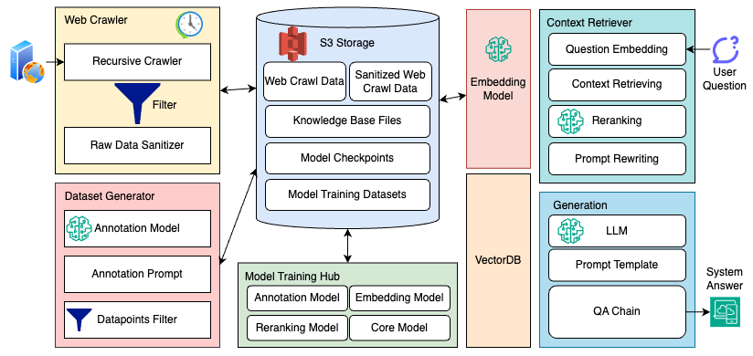
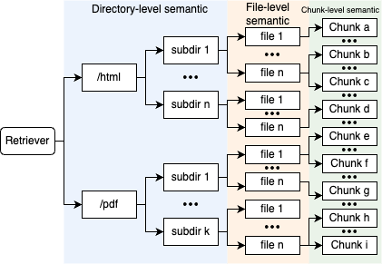
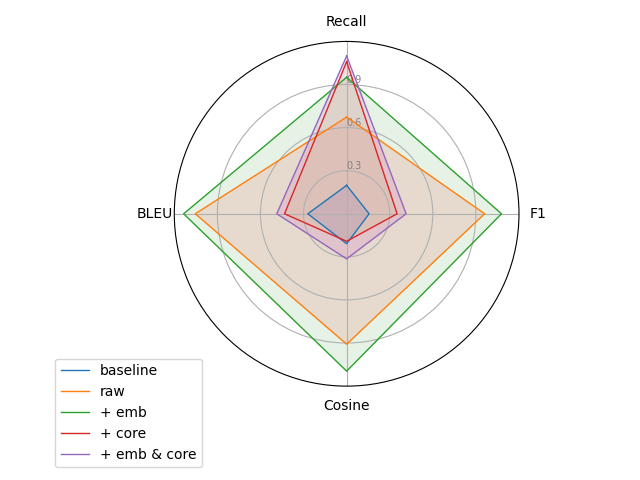

# 为解决LLM在处理特定领域查询时可能出现的虚构问题，本研究运用RAG技术提升其在私有知识库上的事实准确性，并进行了深入案例分析。

发布时间：2024年03月15日

`RAG` `行业领域自然语言处理` `信息检索`

> Enhancing LLM Factual Accuracy with RAG to Counter Hallucinations: A Case Study on Domain-Specific Queries in Private Knowledge-Bases

# 摘要

> 我们设计了一套完整的系统方案，借助于检索增强生成（RAG）技术来提升大型语言模型（LLMs）对于源自私有知识库的特定领域和时效性查询的实际准确性。该系统无缝融合了RAG流程、前期数据预处理及后期性能评测。面对LLM产生臆想答案的问题，我们采用来自CMU丰富资源并经过教师模型精心标注的精选数据集对模型进行优化训练。实验证明，此系统在应对领域特异性和时间敏感性问题时能有效地生成更为精确的答案。然而，研究同时也揭示了仅凭小规模且失衡的数据集对LLMs进行微调存在的局限性。此项研究彰显了RAG系统结合外部数据集强化LLMs，从而提升其在知识驱动型任务中的表现力的可能。目前，我们的代码和模型已在Github上开放获取。

> We proposed an end-to-end system design towards utilizing Retrieval Augmented Generation (RAG) to improve the factual accuracy of Large Language Models (LLMs) for domain-specific and time-sensitive queries related to private knowledge-bases. Our system integrates RAG pipeline with upstream datasets processing and downstream performance evaluation. Addressing the challenge of LLM hallucinations, we finetune models with a curated dataset which originates from CMU's extensive resources and annotated with the teacher model. Our experiments demonstrate the system's effectiveness in generating more accurate answers to domain-specific and time-sensitive inquiries. The results also revealed the limitations of fine-tuning LLMs with small-scale and skewed datasets. This research highlights the potential of RAG systems in augmenting LLMs with external datasets for improved performance in knowledge-intensive tasks. Our code and models are available on Github.

[Arxiv](https://arxiv.org/abs/2403.10446)