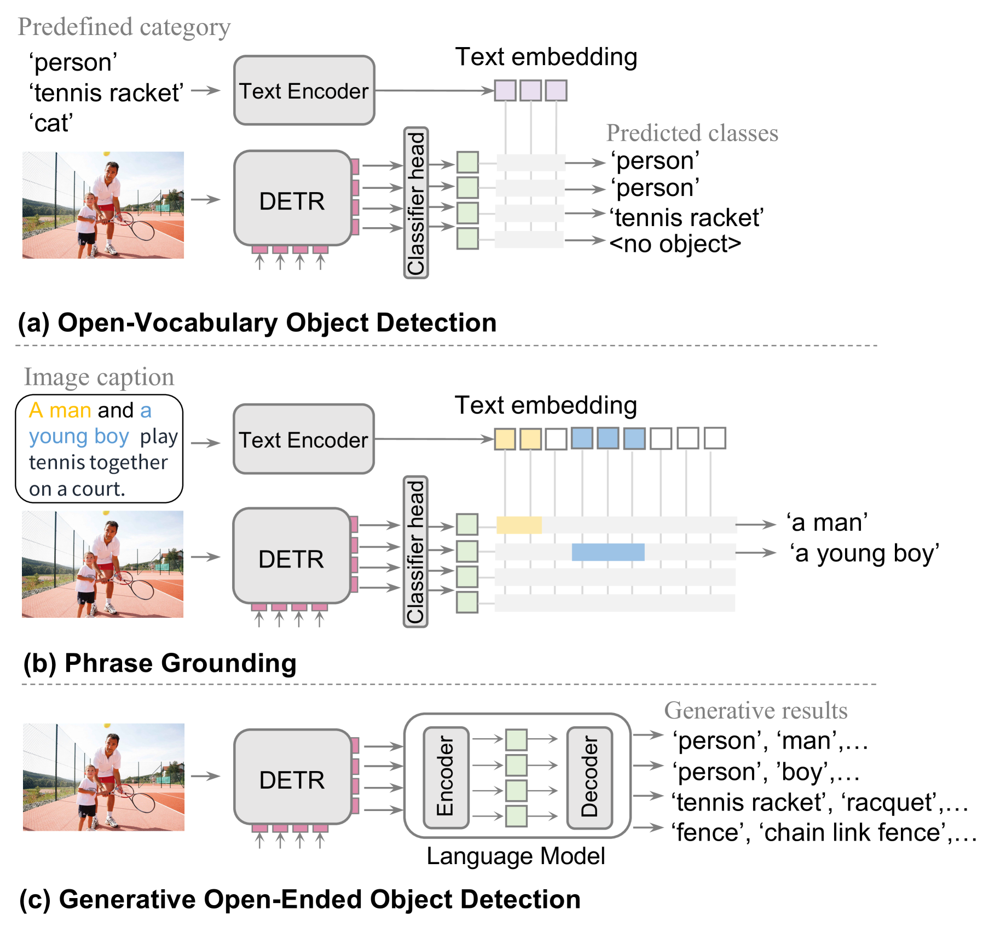
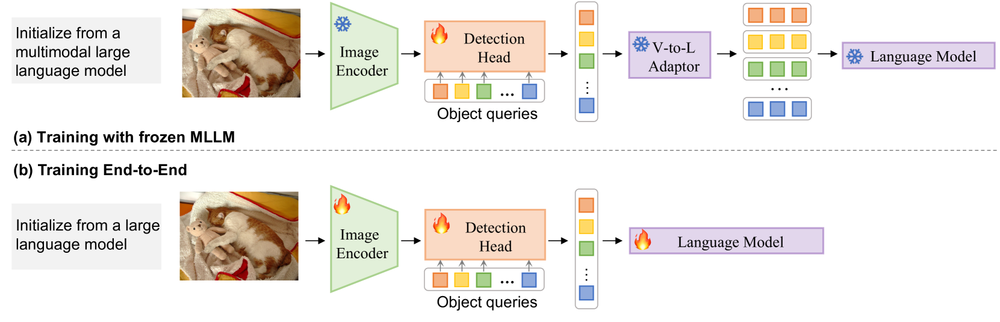
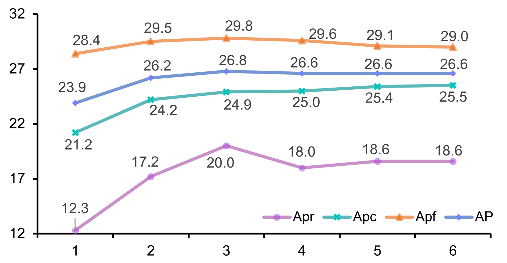
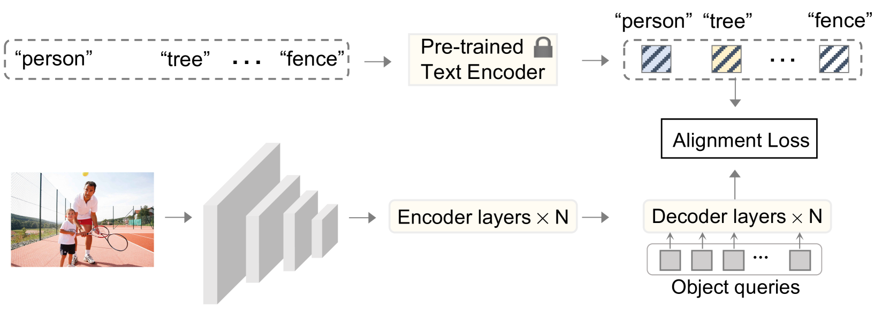

# 为了解决开放式物体检测的挑战，我们提出了一种“生成区域-语言预训练”方法。该技术旨在通过联合学习图像区域特征与相关描述性语言表达，以实现更强大、更具开放性的物体检测能力。

发布时间：2024年03月15日

`Agent` `物体检测` `生成式模型`

> Generative Region-Language Pretraining for Open-Ended Object Detection

> 最近的研究焦点在于解决开放词汇对象检测任务，旨在超越训练时有限标签类别，实现推理时识别任意类别名所描述的物体。相比传统对象检测，开放词汇检测显著扩大了检测范畴，但依赖于预训练的视语模型计算图像区域与任意类别名的相似性。这也就意味着，尽管此任务具备开放集特性，但在推理阶段仍需预先设定对象类别，引出了新的问题：如果在推理阶段无法确切知道对象类别又该如何？为此，本文提出一种更具普适性和实践意义的新场景——生成式开放对象检测。为应对这一挑战，我们创新性地将对象检测建模为生成问题，并设计了一个简洁的框架“GenerateU”，它能够密集检测物体并灵活生成物体名称。特别的是，我们利用可变形DETR作为区域提议生成器，并结合语言模型将视觉区域转化为物体名称。为了公正评价自由格式物体检测的效果，我们还推出了一种量化衡量生成结果性能的评估方法。大量的实验结果显示，GenerateU在零样本检测上展现出强大的实力。比如，在LVIS数据集上，即使在推理阶段未曾接触过类别名称，GenerateU的性能也与开放词汇对象检测方法GLIP不相上下。相关代码已开源，访问地址为：https://github.com/FoundationVision/GenerateU。

> In recent research, significant attention has been devoted to the open-vocabulary object detection task, aiming to generalize beyond the limited number of classes labeled during training and detect objects described by arbitrary category names at inference. Compared with conventional object detection, open vocabulary object detection largely extends the object detection categories. However, it relies on calculating the similarity between image regions and a set of arbitrary category names with a pretrained vision-and-language model. This implies that, despite its open-set nature, the task still needs the predefined object categories during the inference stage. This raises the question: What if we do not have exact knowledge of object categories during inference? In this paper, we call such a new setting as generative open-ended object detection, which is a more general and practical problem. To address it, we formulate object detection as a generative problem and propose a simple framework named GenerateU, which can detect dense objects and generate their names in a free-form way. Particularly, we employ Deformable DETR as a region proposal generator with a language model translating visual regions to object names. To assess the free-form object detection task, we introduce an evaluation method designed to quantitatively measure the performance of generative outcomes. Extensive experiments demonstrate strong zero-shot detection performance of our GenerateU. For example, on the LVIS dataset, our GenerateU achieves comparable results to the open-vocabulary object detection method GLIP, even though the category names are not seen by GenerateU during inference. Code is available at: https:// github.com/FoundationVision/GenerateU .

[Arxiv](https://arxiv.org/abs/2403.10191)