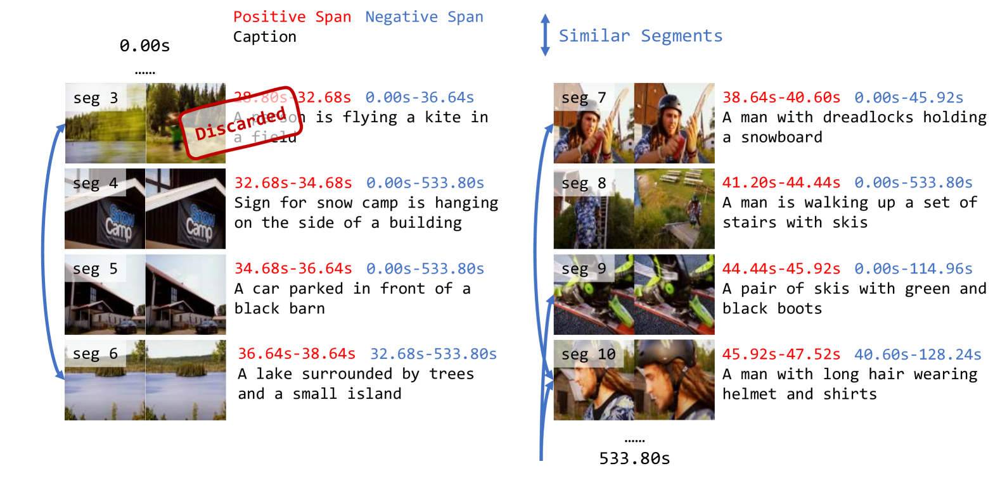
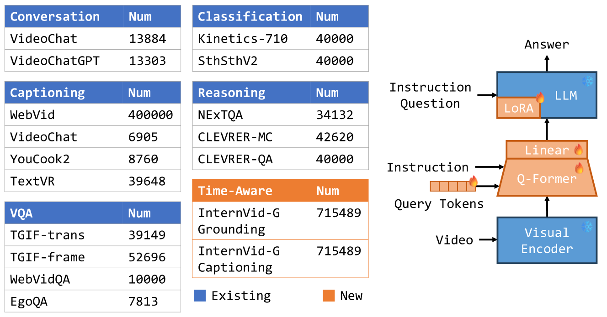
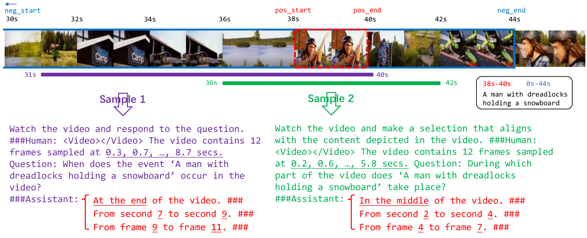
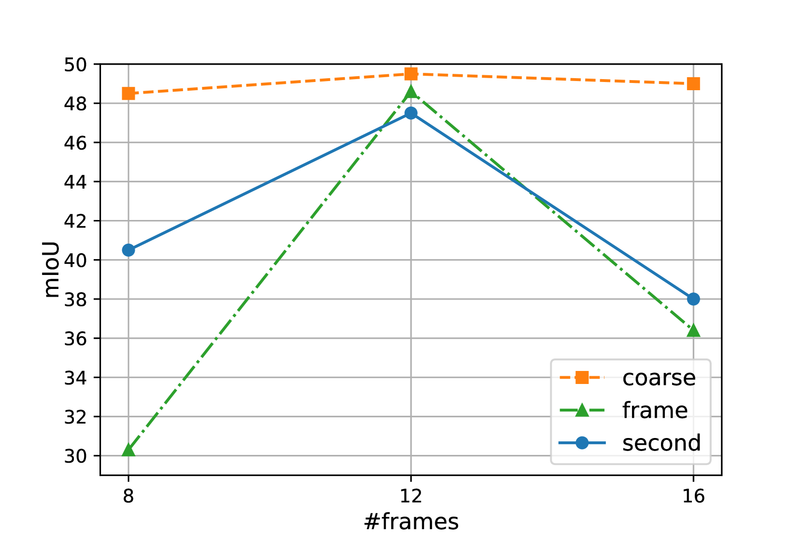
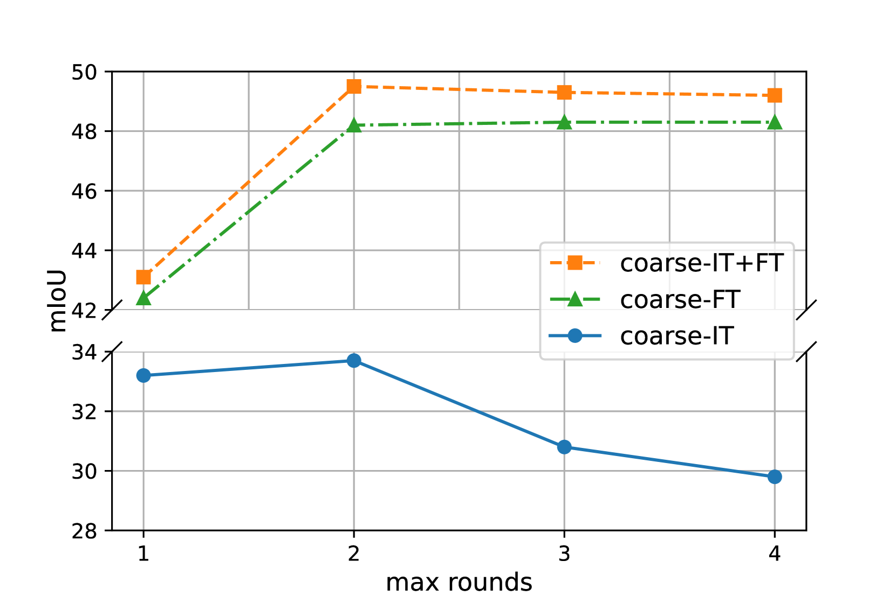
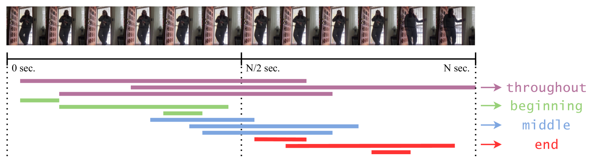
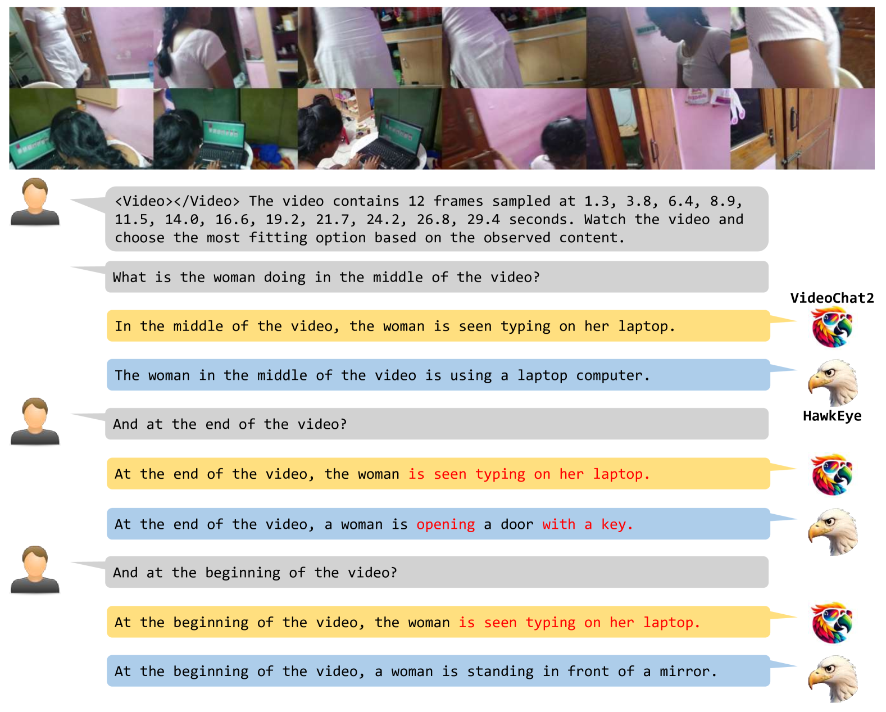
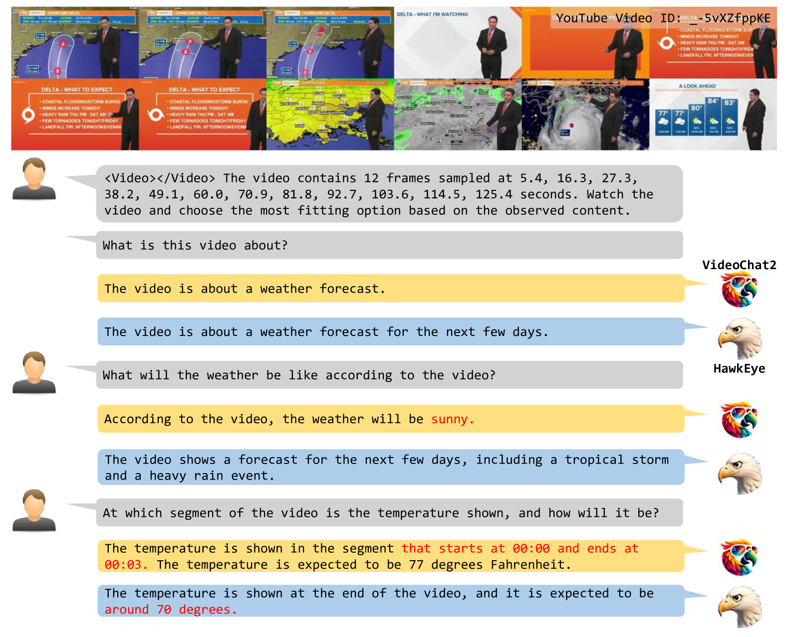
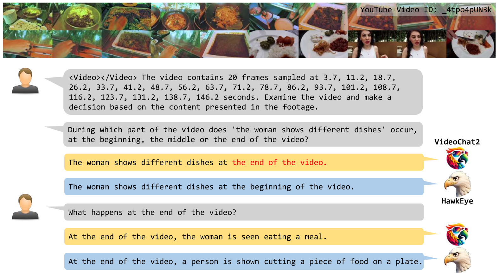
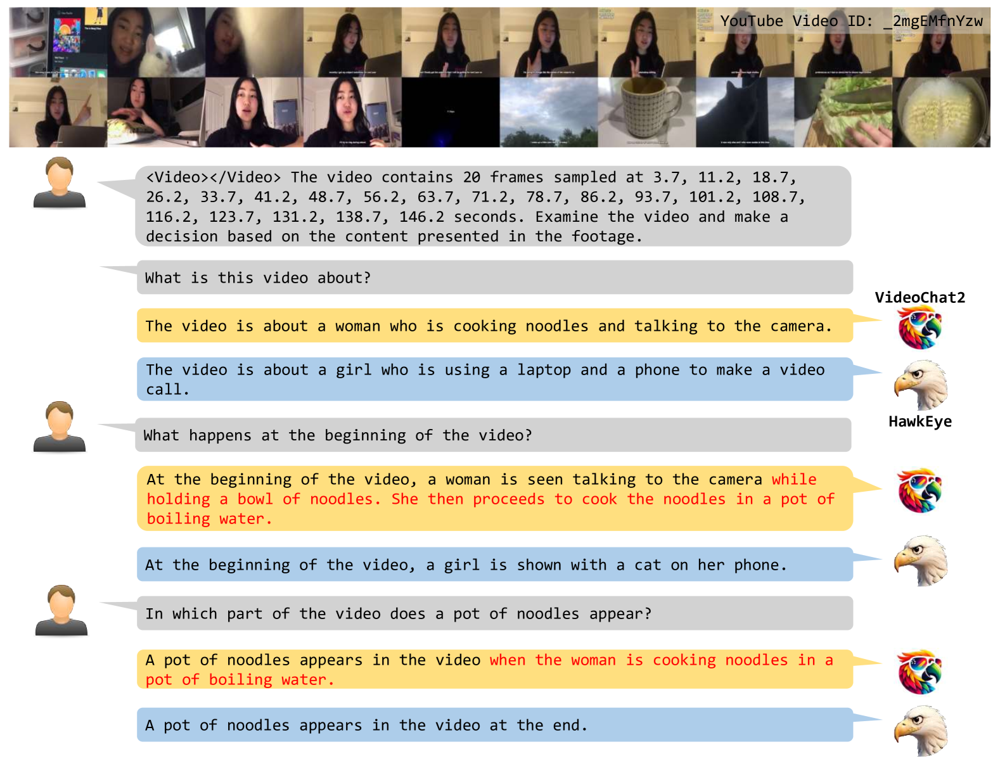

# [HawkEye项目致力于训练能够将文本内容有效定位到对应视频片段的视频-文本大型语言模型。](https://arxiv.org/abs/2403.10228)

发布时间：2024年03月15日

`LLM应用` `视频理解` ``

> HawkEye: Training Video-Text LLMs for Grounding Text in Videos

> 视频-文本LLMs在处理简单视频问答及对话时展现出了非凡实力，但在复杂冗长视频中针对文本查询的定位能力却几近随机，难以理解和推理其中的时间信息——而这正是视频区别于图像的核心所在。本文介绍的HawkEye是首批能够全面实现从文本到文本方式完成时序视频定位的视频-文本LLM之一。为满足时序视频定位训练所需的数据需求，我们构建了一个大规模的视频-文本资源库InternVid-G，内含片段级别的标题和否定片段信息，并以此为基础创新性地为视频-文本LLMs设计了两项具有时间意识的训练目标。同时，我们还提出了一种对视频片段采用粗糙但稳健的表达方式，该方法相较于其他选择更易于LLMs学习和掌握。大量的实验证明，HawkEye在时序视频定位任务上表现出色，并在其他视频-文本任务上同样能与当前的视频-文本LLMs相媲美，充分证明了其卓越的视频-文本多模态理解力。

> Video-text Large Language Models (video-text LLMs) have shown remarkable performance in answering questions and holding conversations on simple videos. However, they perform almost the same as random on grounding text queries in long and complicated videos, having little ability to understand and reason about temporal information, which is the most fundamental difference between videos and images. In this paper, we propose HawkEye, one of the first video-text LLMs that can perform temporal video grounding in a fully text-to-text manner. To collect training data that is applicable for temporal video grounding, we construct InternVid-G, a large-scale video-text corpus with segment-level captions and negative spans, with which we introduce two new time-aware training objectives to video-text LLMs. We also propose a coarse-grained method of representing segments in videos, which is more robust and easier for LLMs to learn and follow than other alternatives. Extensive experiments show that HawkEye is better at temporal video grounding and comparable on other video-text tasks with existing video-text LLMs, which verifies its superior video-text multi-modal understanding abilities.

[Arxiv](https://arxiv.org/abs/2403.10228)