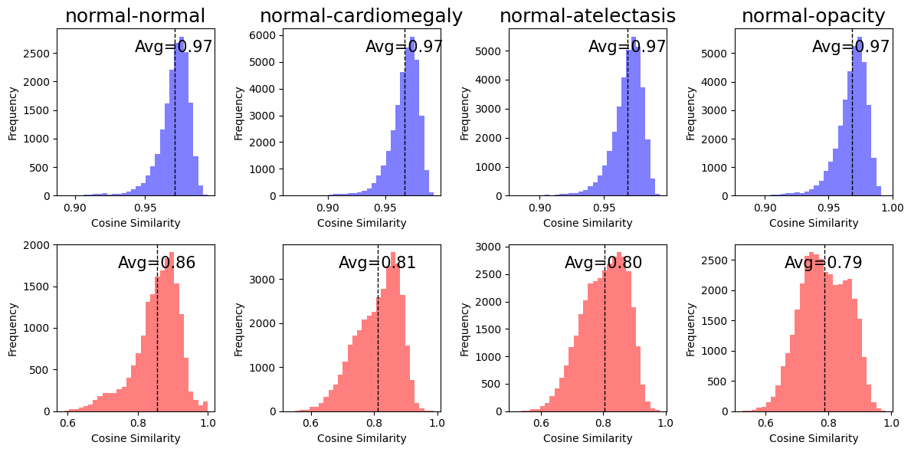
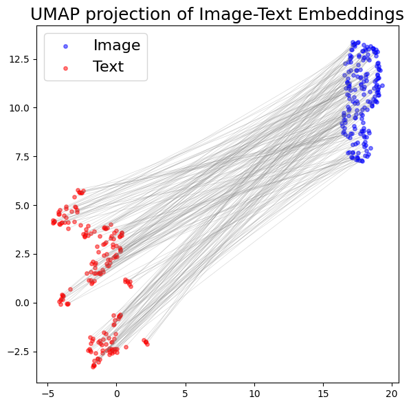
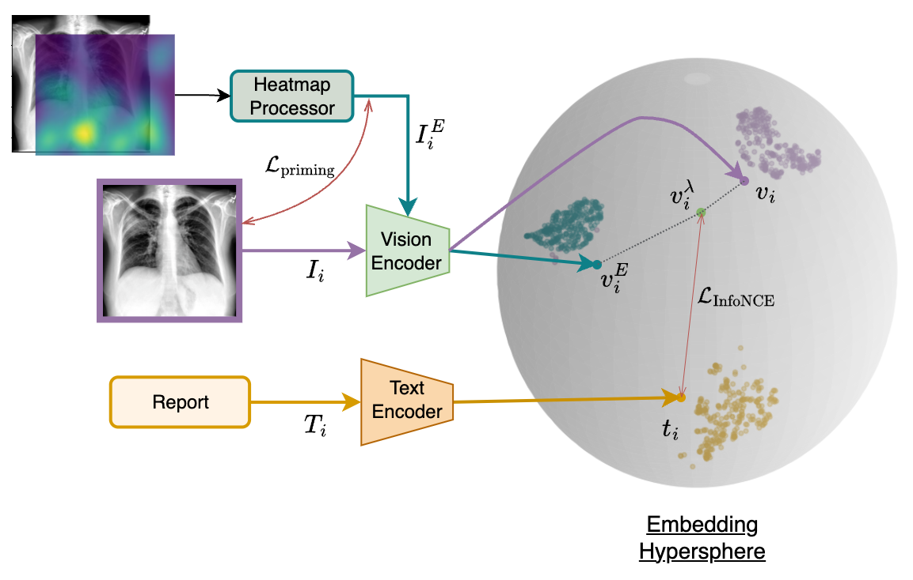
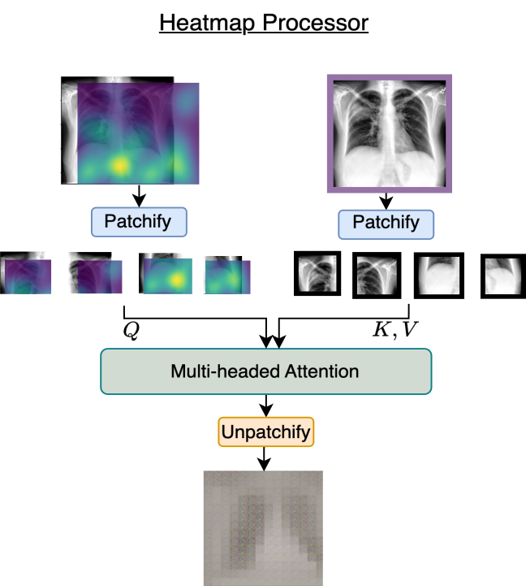
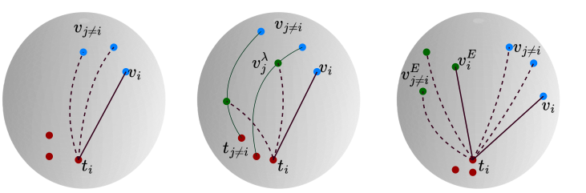
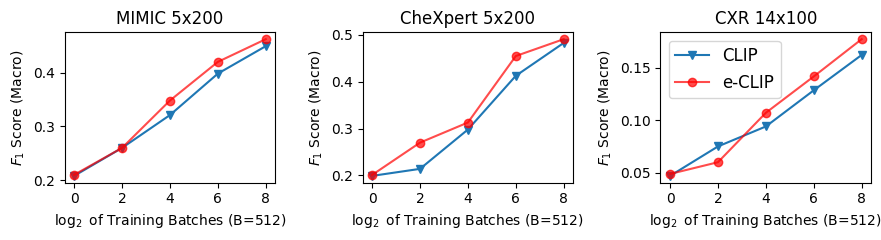
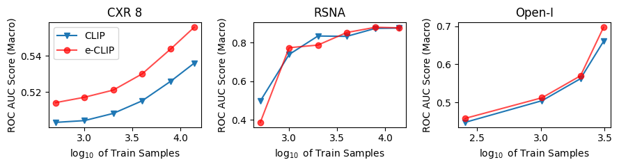
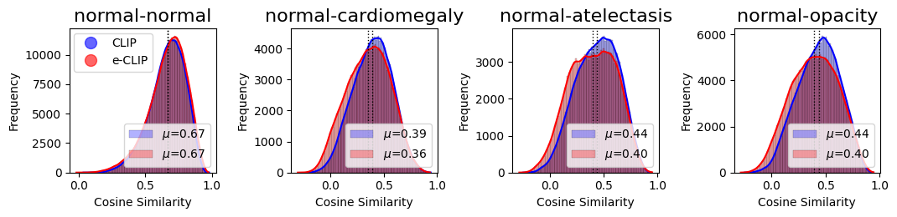
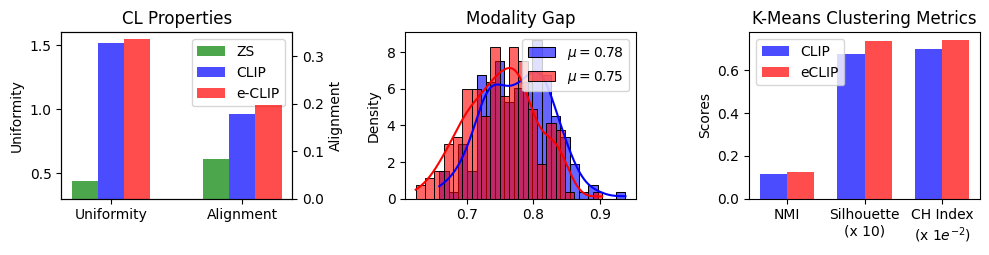

# [借助专家标注优化医疗多模态对比学习技术，提升模型性能和准确性。](https://arxiv.org/abs/2403.10153)

发布时间：2024年03月15日

`LLM应用` `医学影像分析`

> Improving Medical Multi-modal Contrastive Learning with Expert Annotations

> 我们推出创新升级的 eCLIP 模型，在原 CLIP 的基础上整合了以放射科医生眼球追踪热力图为形式的专家标注，专攻对比式多模态医学影像分析中的两大难题——数据稀少和“模态鸿沟”。这一鸿沟指的是图像与文本嵌入间的显著差距，严重影响了表征质量及跨模态交互性。eCLIP 内置热图处理模块，并借助 mixup 数据增强技术高效利用宝贵的专家标注资源，大大提升了模型学习效能。更重要的是，无论何种变体，eCLIP 都能无缝接入 CLIP 架构，无需改动核心结构。通过在一系列任务上的详尽测试，如零样本推断、线性探测、跨模态检索以及利用冻结状态的大型语言模型生成放射报告的检索增强生成（RAG）等，eCLIP 显示出持续优化的嵌入品质。实验证明其增强了对齐度和一致性，充分证实了 eCLIP 能够在医疗影像领域利用优质标注实现更深入、全面的多模态分析。

> We introduce eCLIP, an enhanced version of the CLIP model that integrates expert annotations in the form of radiologist eye-gaze heatmaps. It tackles key challenges in contrastive multi-modal medical imaging analysis, notably data scarcity and the "modality gap" -- a significant disparity between image and text embeddings that diminishes the quality of representations and hampers cross-modal interoperability. eCLIP integrates a heatmap processor and leverages mixup augmentation to efficiently utilize the scarce expert annotations, thus boosting the model's learning effectiveness. eCLIP is designed to be generally applicable to any variant of CLIP without requiring any modifications of the core architecture. Through detailed evaluations across several tasks, including zero-shot inference, linear probing, cross-modal retrieval, and Retrieval Augmented Generation (RAG) of radiology reports using a frozen Large Language Model, eCLIP showcases consistent improvements in embedding quality. The outcomes reveal enhanced alignment and uniformity, affirming eCLIP's capability to harness high-quality annotations for enriched multi-modal analysis in the medical imaging domain.

[Arxiv](https://arxiv.org/abs/2403.10153)