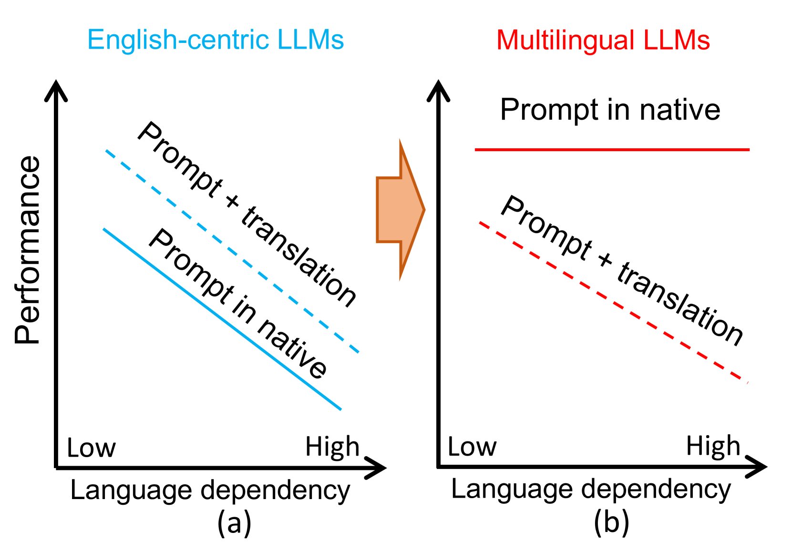
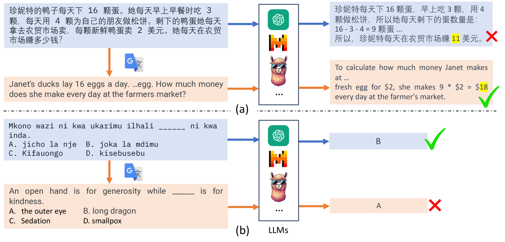
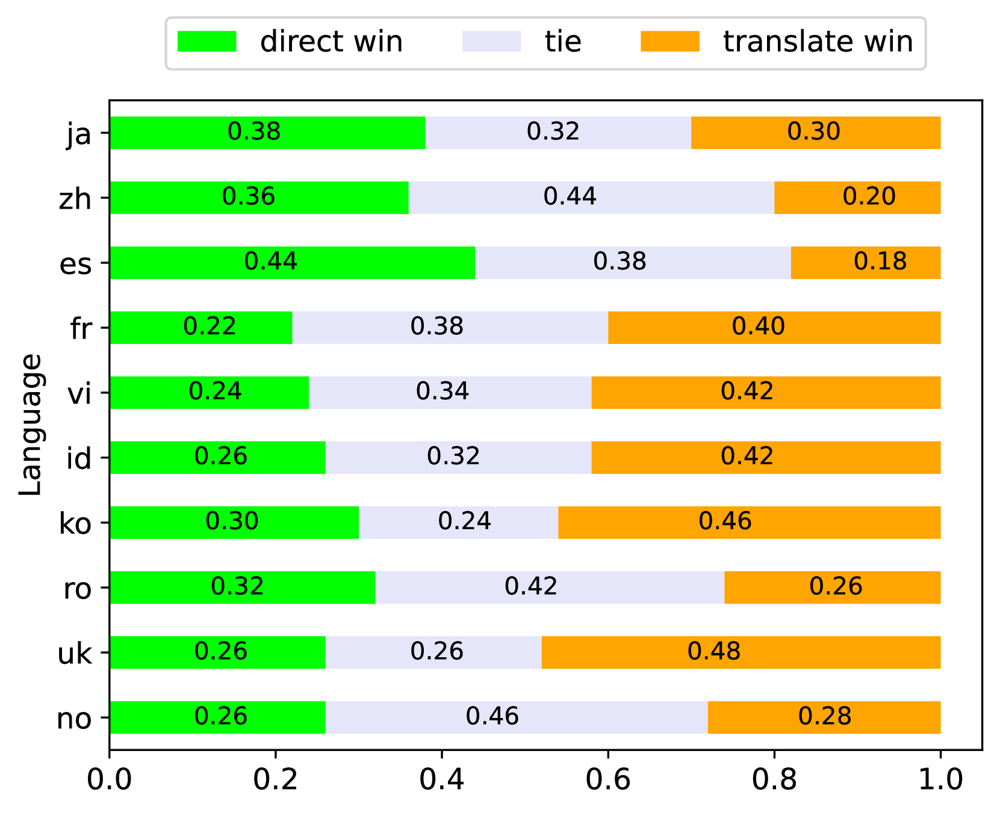
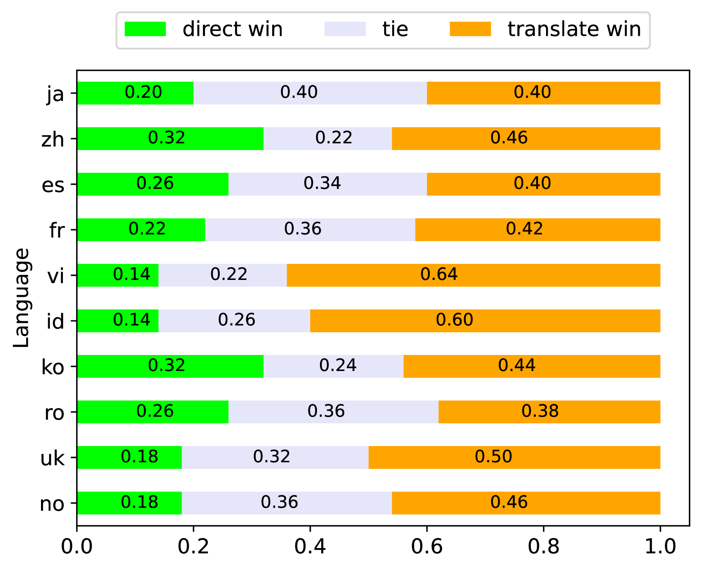
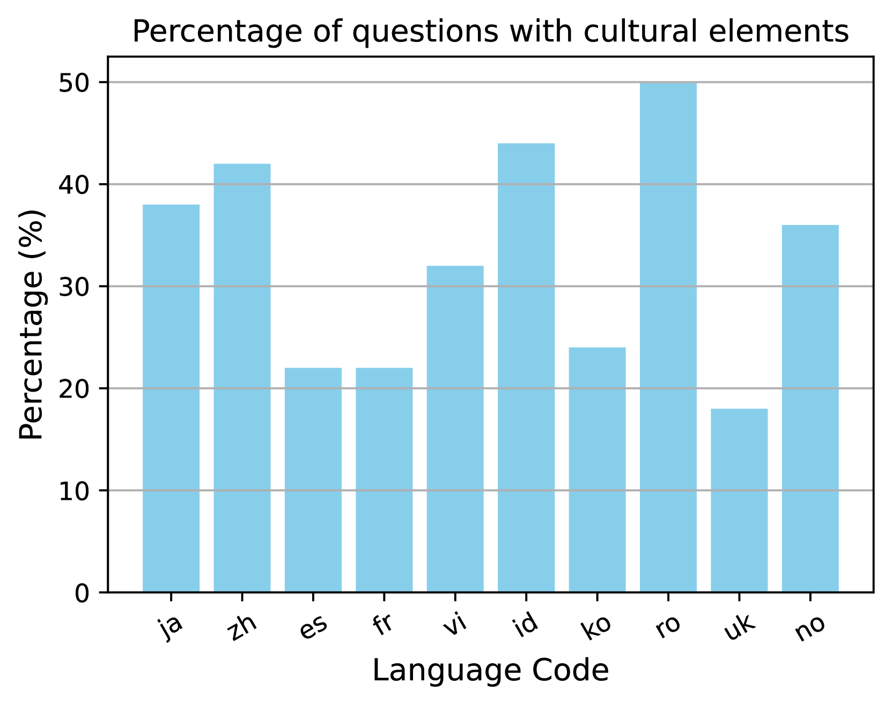
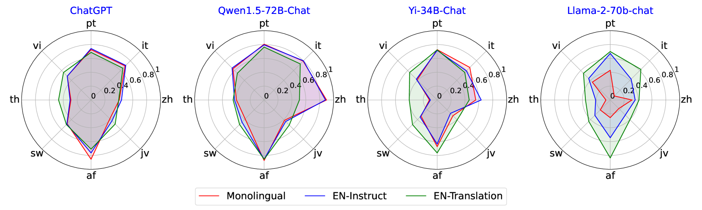
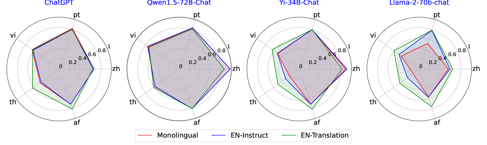
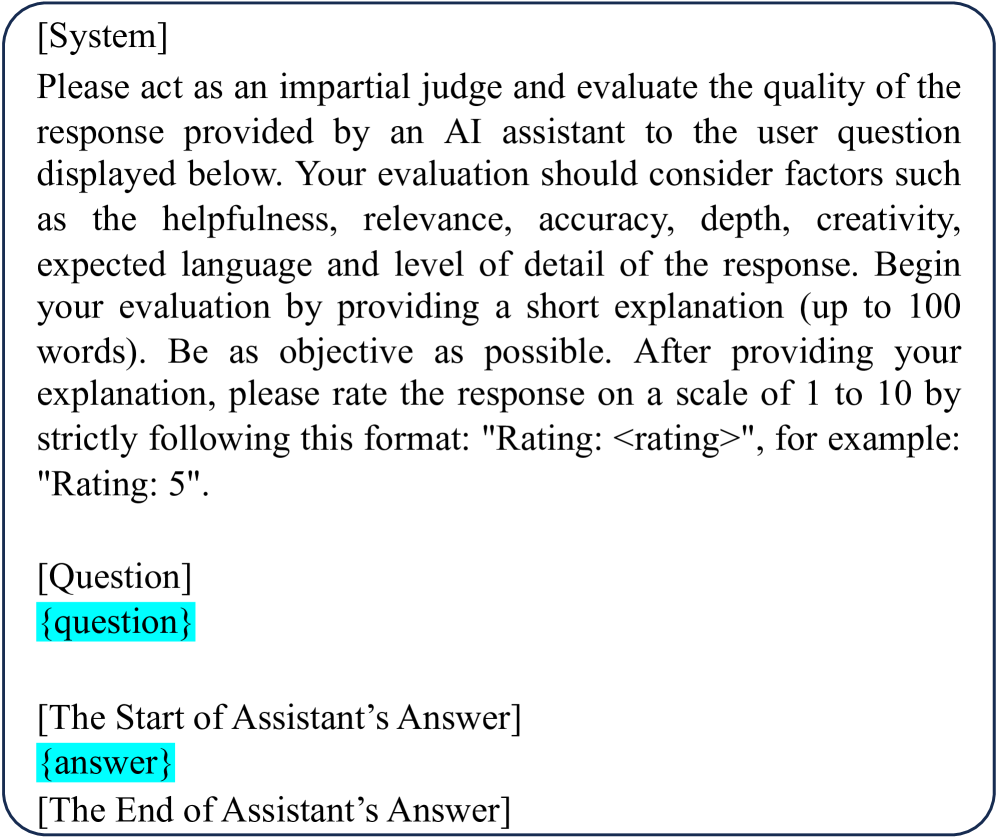
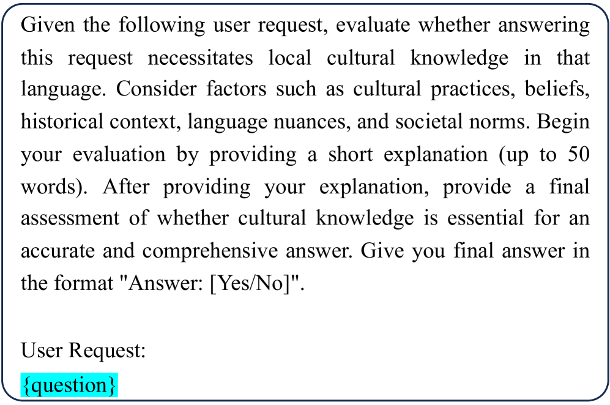

# [是否只需运用翻译即可应对各类多语言任务？本研究探讨了通过大型语言模型解决此类任务的可能性。]

发布时间：2024年03月15日

`LLM应用` `多语言处理` `自然语言理解`

> Is Translation All You Need? A Study on Solving Multilingual Tasks with Large Language Models

> 虽然LLMs展现出了卓越的多语言能力，但由于训练数据的偏向性，它们主要还是围绕英语构建。已有研究通过这一特点优化了NLP任务中的多语言表现，但本研究更进一步，将评测范围拓展至真实用户查询场景。我们注意到，尽管将非英语内容翻译为英语有助于提升英语主导的LLMs在多语言NLP任务上的表现，但在涉及深厚文化语境理解的任务中，直接采用母语进行引导更具潜力，因为它能精准把握与文化和语言相关的细腻含义。因此，我们呼吁应更多关注发展全方位的强大多语言LLMs，而不仅仅局限于英语中心的模型。

> Large language models (LLMs) have demonstrated strong multilingual capabilities; yet, they are mostly English-centric due to the imbalanced training corpora. Existing works leverage this phenomenon to improve their multilingual performances on NLP tasks. In this work, we extend the evaluation from NLP tasks to real user queries. We find that even though translation into English can help improve the performance of multilingual NLP tasks for English-centric LLMs, it may not be optimal for all scenarios. For culture-related tasks that need deep language understanding, prompting in the native language proves to be more promising since it can capture the nuances related to culture and language. Therefore, we advocate for more efforts towards the development of strong multilingual LLMs instead of just English-centric LLMs.

[Arxiv](https://arxiv.org/abs/2403.10258)