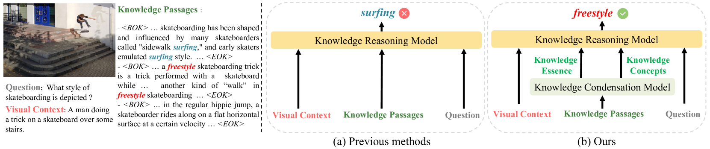
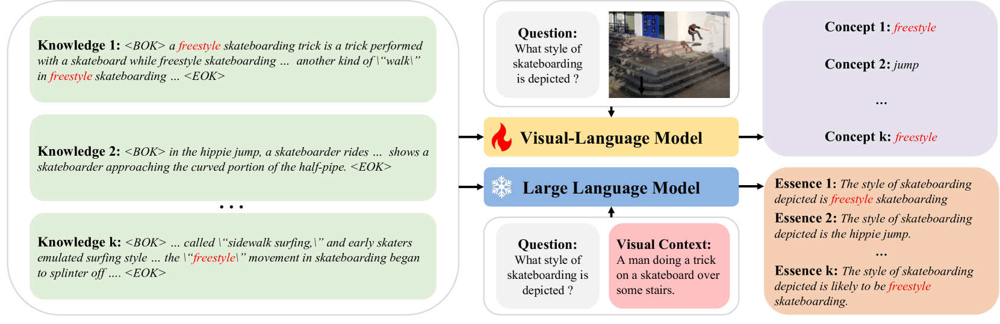
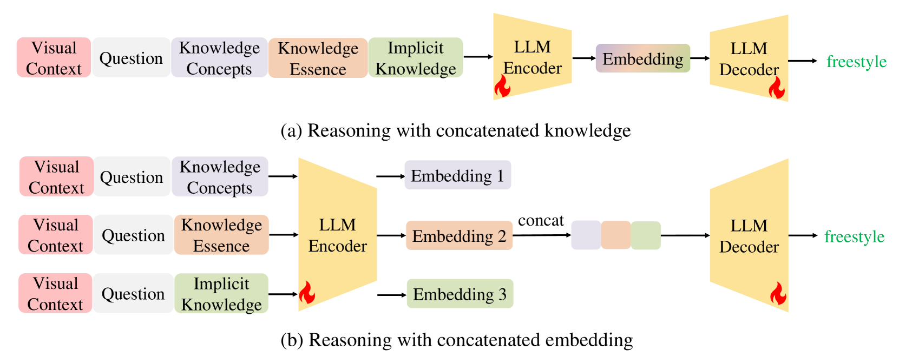
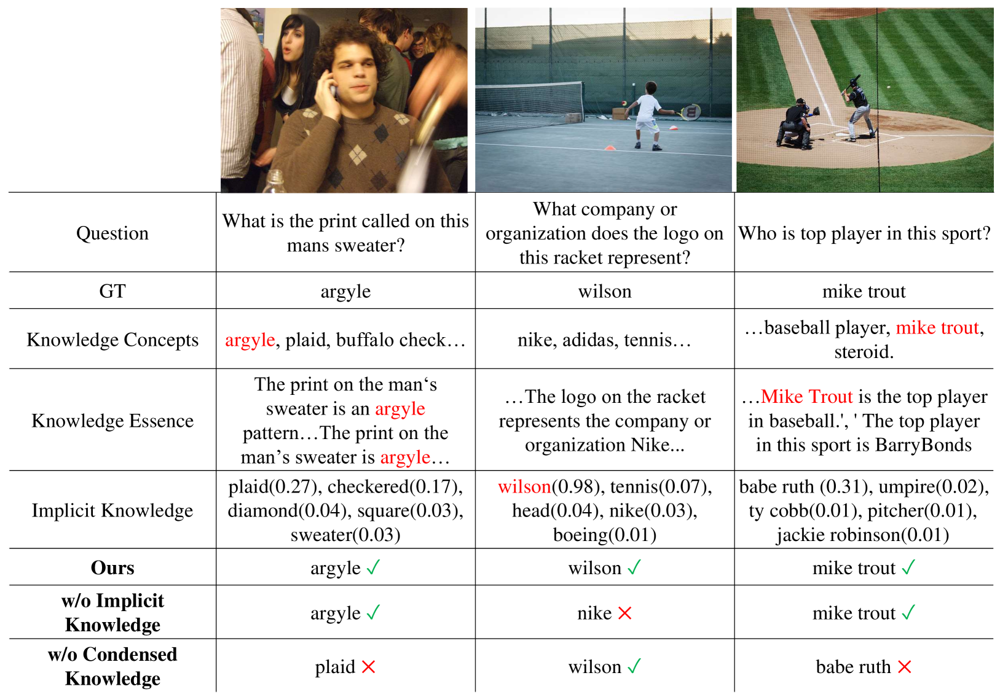
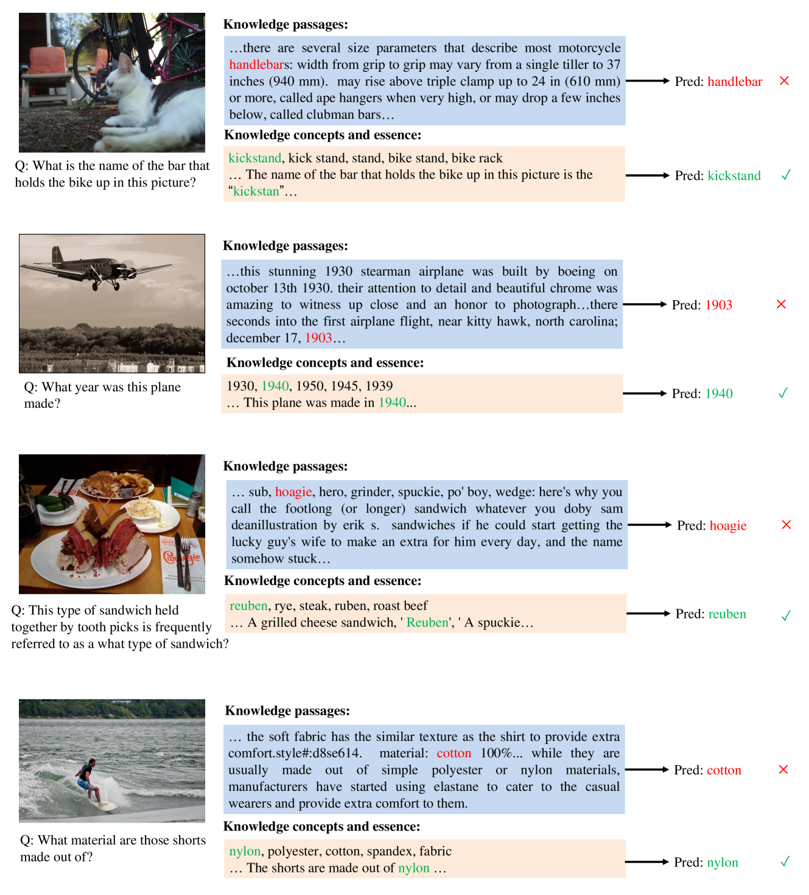

# [在知识驱动的视觉问答（VQA）中，知识提炼与推理技术发挥着关键作用。该研究专注于如何有效地整合和提炼相关知识，并运用高级推理方法以提升 VQA 的准确性和智能性。](https://arxiv.org/abs/2403.10037)

发布时间：2024年03月15日

`Agent` `视觉问答` `知识图谱`

> Knowledge Condensation and Reasoning for Knowledge-based VQA

> 面对KB-VQA这一结合视觉内容与外部知识解答问题的艰巨任务，现有的研究通常先从知识库获取相关段落，但其中常常混杂着无关或噪声信息，导致模型表现受限。为此，我们创新性地提出两款相辅相成的模型：知识提炼模型和知识推理模型。我们双管齐下，对获取的知识段落进行高效提炼：一方面运用视觉-语言模型强大的多模态感知与推理能力，从冗长的段落中精准萃取与视觉场景及问题紧密相关的精炼知识概念；另一方面，借助大语言模型卓越的文本理解力，将段落浓缩整合成能够直接支撑问题解答的知识核心。这两类浓缩后的知识精华被完美融入我们的知识推理模型，在综合信息的海洋中明智地导航，最终得出确定无疑的答案。广泛深入的实验充分证明了我们方法的优越性，相较于以往方法，它在KB-VQA数据集上取得了前所未有的顶级表现（OK-VQA上达65.1%，A-OKVQA上达到60.1%），而且整个过程无需利用GPT-3（175B）生成的知识辅助。

> Knowledge-based visual question answering (KB-VQA) is a challenging task, which requires the model to leverage external knowledge for comprehending and answering questions grounded in visual content. Recent studies retrieve the knowledge passages from external knowledge bases and then use them to answer questions. However, these retrieved knowledge passages often contain irrelevant or noisy information, which limits the performance of the model. To address the challenge, we propose two synergistic models: Knowledge Condensation model and Knowledge Reasoning model. We condense the retrieved knowledge passages from two perspectives. First, we leverage the multimodal perception and reasoning ability of the visual-language models to distill concise knowledge concepts from retrieved lengthy passages, ensuring relevance to both the visual content and the question. Second, we leverage the text comprehension ability of the large language models to summarize and condense the passages into the knowledge essence which helps answer the question. These two types of condensed knowledge are then seamlessly integrated into our Knowledge Reasoning model, which judiciously navigates through the amalgamated information to arrive at the conclusive answer. Extensive experiments validate the superiority of the proposed method. Compared to previous methods, our method achieves state-of-the-art performance on knowledge-based VQA datasets (65.1% on OK-VQA and 60.1% on A-OKVQA) without resorting to the knowledge produced by GPT-3 (175B).

[Arxiv](https://arxiv.org/abs/2403.10037)