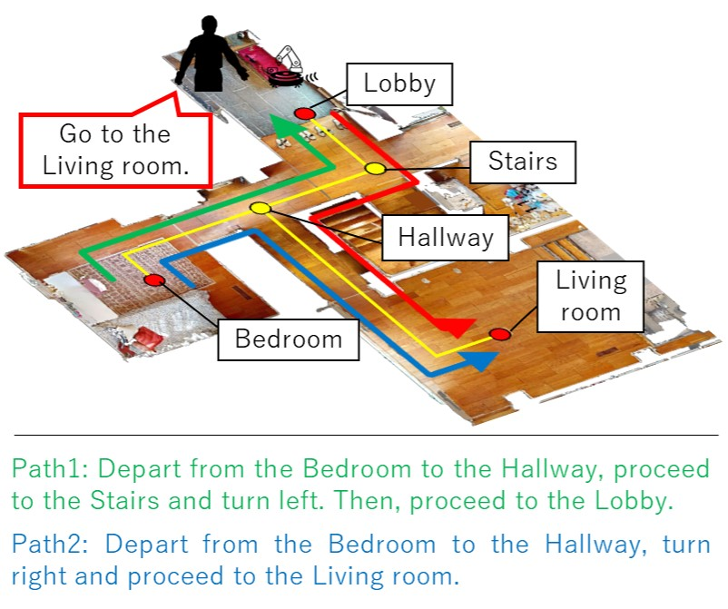
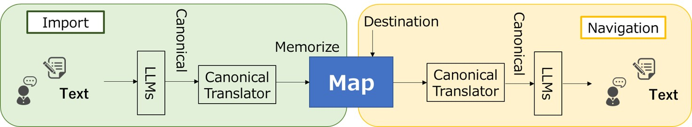
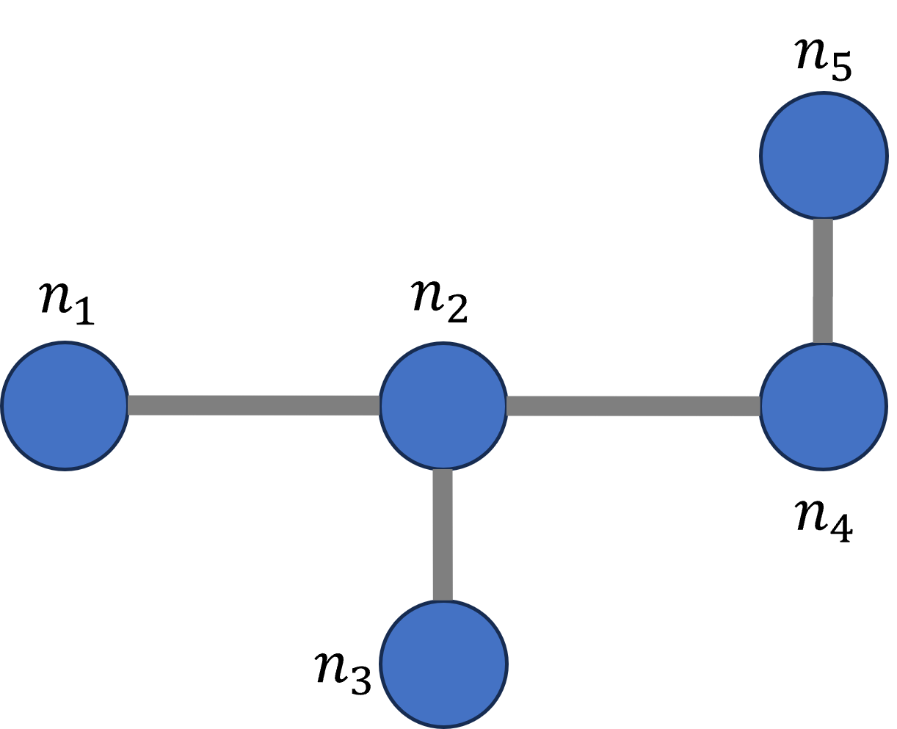

# 将语言指令转化为地图：探究如何从自然语言路径指示中生成拓扑地图

发布时间：2024年03月15日

`LLM应用` `地理信息系统`

> Language to Map: Topological map generation from natural language path instructions

> 在这篇论文里，我们创新性地提出了一种将自然语言描述的路径信息转化为地图的方法。当前的视觉与语言导航技术虽有助于人机交互，却需用户在每次导航过程中详尽描述路径细节，造成了不小的沟通负担。为此，我们设计出一种利用文本路径创建拓扑地图，并基于此地图自动生成新路径的技术方案。考虑到大型语言模型（LLMs）强大的语义解析能力，我们进一步研发了两种策略：一是利用LLMs记忆中的隐式地图存储路径信息，二是借助LLMs生成包含节点、边及节点动作的显式拓扑地图。这样，在具备充足信息的前提下，即便面对未曾明确描述过的路径，也能估算出路点及其对应的行进路线。实验结果显示，在实际环境中生成路径指示时，采用显式地图的方法较之存储在LLMs内的隐式地图，取得了更为显著的精确度提升。

> In this paper, a method for generating a map from path information described using natural language (textual path) is proposed. In recent years, robotics research mainly focus on vision-and-language navigation (VLN), a navigation task based on images and textual paths. Although VLN is expected to facilitate user instructions to robots, its current implementation requires users to explain the details of the path for each navigation session, which results in high explanation costs for users. To solve this problem, we proposed a method that creates a map as a topological map from a textual path and automatically creates a new path using this map. We believe that large language models (LLMs) can be used to understand textual path. Therefore, we propose and evaluate two methods, one for storing implicit maps in LLMs, and the other for generating explicit maps using LLMs. The implicit map is in the LLM's memory. It is created using prompts. In the explicit map, a topological map composed of nodes and edges is constructed and the actions at each node are stored. This makes it possible to estimate the path and actions at waypoints on an undescribed path, if enough information is available. Experimental results on path instructions generated in a real environment demonstrate that generating explicit maps achieves significantly higher accuracy than storing implicit maps in the LLMs.

[Arxiv](https://arxiv.org/abs/2403.10008)