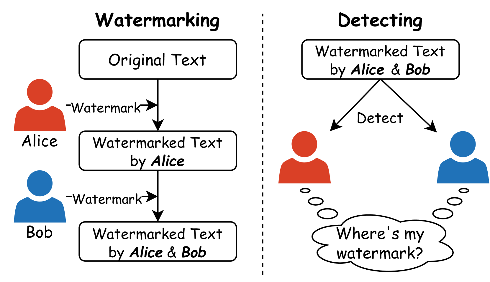
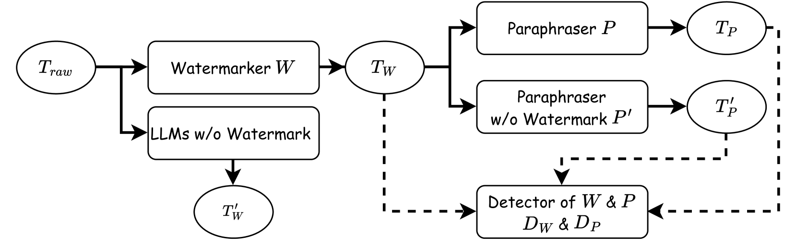
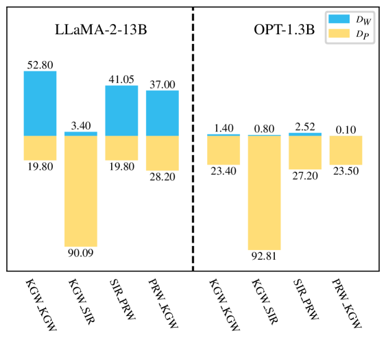

# [探究 LLMS 中的水印碰撞现象，揭示隐藏在模型重叠区域的奥秘。](https://arxiv.org/abs/2403.10020)

发布时间：2024年03月15日

`LLM应用`

`版权保护`

``

> Lost in Overlap: Exploring Watermark Collision in LLMs

> 随着LLMs在内容生成领域的普及，文本版权保护成为焦点，logit类水印技术悄然兴起，以隐形标识符解决此难题。然而，在不同LLMs广泛应用水印技术时，在问题回答、释义等常规任务中，水印碰撞这一现象无法避免，特别是当同一文本中并存两个水印的“双重碰撞”情况。本研究揭示了水印碰撞对上、下游水印检测算法识别性能的潜在威胁。

> The proliferation of large language models (LLMs) in generating content raises concerns about text copyright. Watermarking methods, particularly logit-based approaches, embed imperceptible identifiers into text to address these challenges. However, the widespread use of watermarking across diverse LLMs has led to an inevitable issue known as watermark collision during common tasks like question answering and paraphrasing. This study focuses on dual watermark collisions, where two watermarks are present simultaneously in the same text. The research demonstrates that watermark collision poses a threat to detection performance for detectors of both upstream and downstream watermark algorithms.

