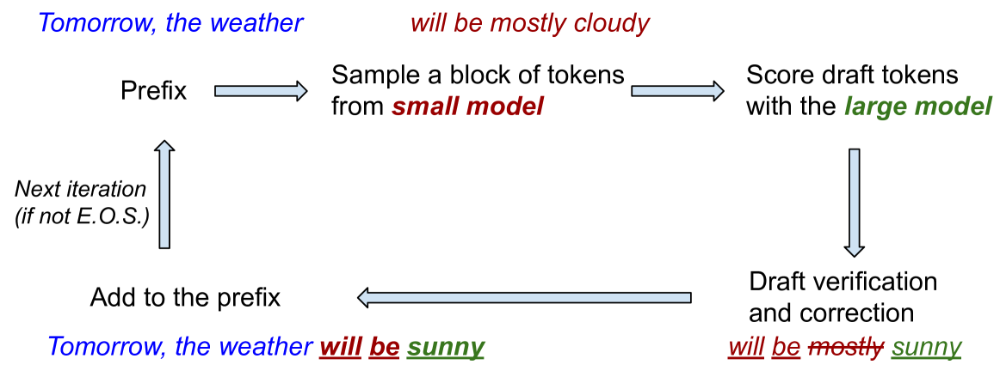

# [为加快推测性解码的速度，我们提出了一种针对块级草稿的最优验证方法。](https://arxiv.org/abs/2403.10444)

发布时间：2024年03月15日

`LLM应用` `模型加速`

> Optimal Block-Level Draft Verification for Accelerating Speculative Decoding

> 推测性解码作为一种有效手段，成功实现了在LLMs推理阶段的无损加速。现有做法通常先由小型模型初拟出一组令牌，再由大型模型并行验证，只保留部分令牌以保证最终输出符合大型模型的分布规律。但以往的研究均采用逐令牌独立验证的方式。在此项研究中，我们创新性地提出了一种改进的块级草稿验证算法，无需增加额外计算资源或生成更多草稿令牌，就能进一步提升实时解码速度。我们巧妙地将草稿验证过程转化为一个块级最优传输问题，这使得我们能够探索更多元化的验证策略，并有望在一个草稿块内接纳更多高质量令牌。我们提出的块级验证算法经过大量任务和数据集的实证检验，相较于传统的逐令牌验证方式，在实时加速效果上展现出一致性的提升。值得一提的是，据目前所知，我们的研究是首个通过优化草稿验证算法改进推测性解码成效的工作。

> Speculative decoding has shown to be an effective method for lossless acceleration of large language models (LLMs) during inference. In each iteration, the algorithm first uses a smaller model to draft a block of tokens. The tokens are then verified by the large model in parallel and only a subset of tokens will be kept to guarantee that the final output follows the distribution of the large model. In all of the prior speculative decoding works, the draft verification is performed token-by-token independently. In this work, we propose a better draft verification algorithm that provides additional wall-clock speedup without incurring additional computation cost and draft tokens. We first formulate the draft verification step as a block-level optimal transport problem. The block-level formulation allows us to consider a wider range of draft verification algorithms and obtain a higher number of accepted tokens in expectation in one draft block. We propose a verification algorithm that achieves the optimal accepted length for the block-level transport problem. We empirically evaluate our proposed block-level verification algorithm in a wide range of tasks and datasets, and observe consistent improvements in wall-clock speedup when compared to token-level verification algorithm. To the best of our knowledge, our work is the first to establish improvement over speculative decoding through a better draft verification algorithm.

[Arxiv](https://arxiv.org/abs/2403.10444)