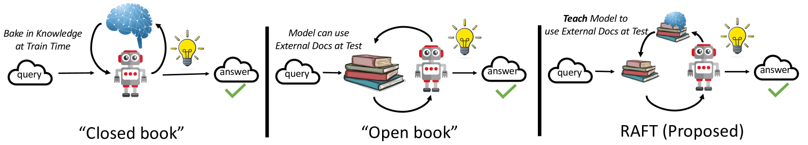
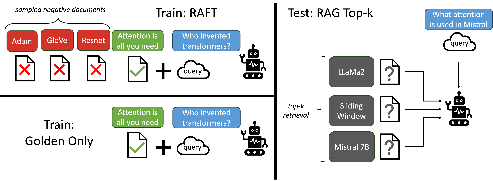
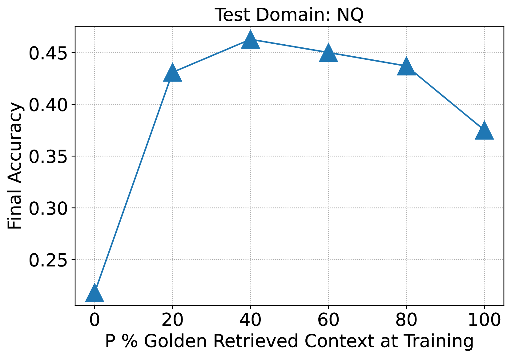
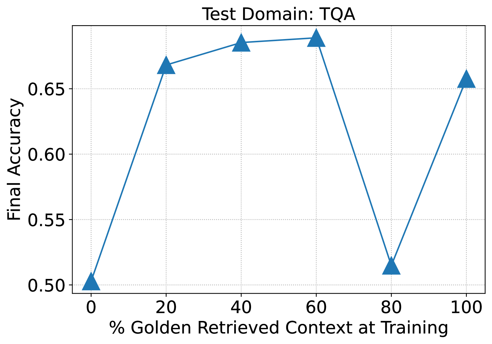
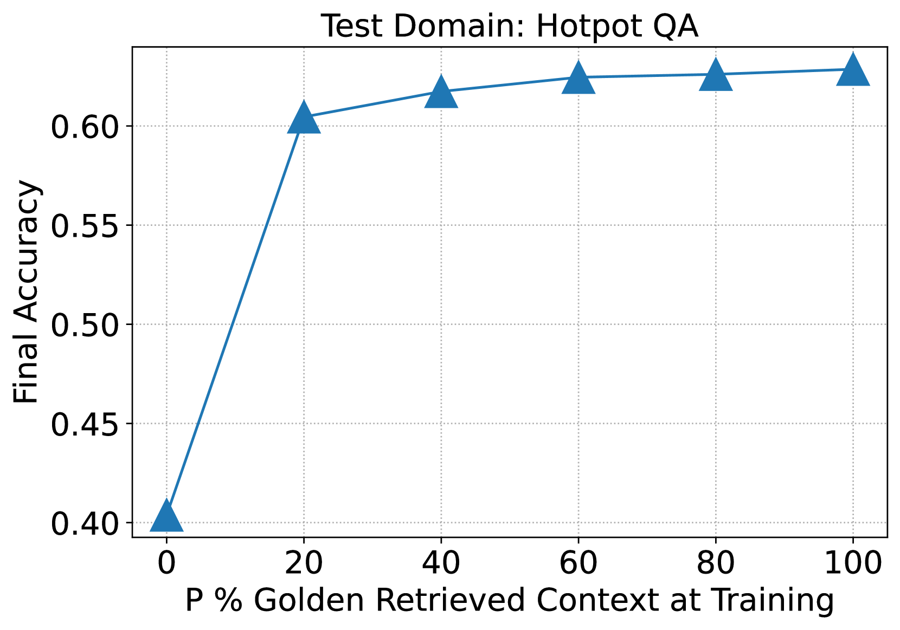
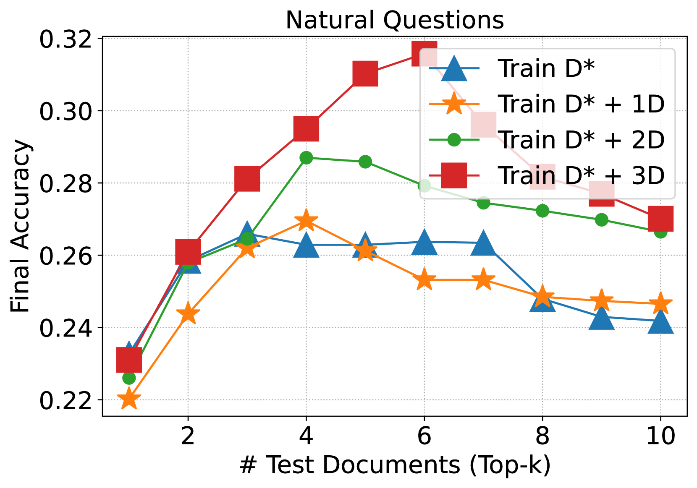
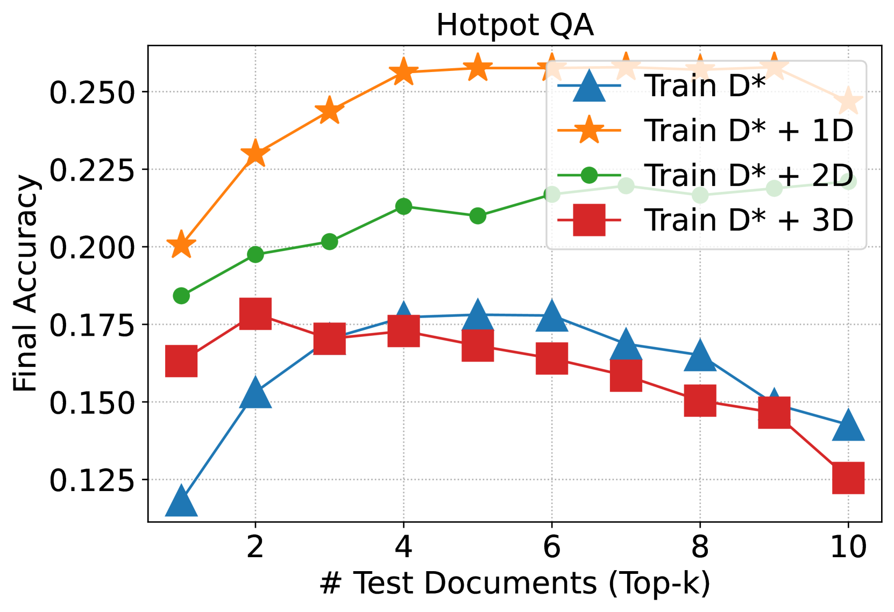

# [RAFT 方法致力于让语言模型更好地适应特定领域的 RAG。](https://arxiv.org/abs/2403.10131)

发布时间：2024年03月15日

`RAG`

``

`预训练模型`

> RAFT: Adapting Language Model to Domain Specific RAG

> 现今，对大规模文本数据集进行大型语言模型（LLMs）的预训练已成为常规做法。而在实际应用LLMs时，通常还会通过RAG引导或微调手段引入如时效新闻或专属领域知识等新信息。不过，如何最有效地让模型获取这类新知识的方法尚无定论。本文提出了“检索增强微调”（RAFT）这一训练策略，它能在特定领域下显著提升模型“开卷作答”的能力。RAFT机制下，面对一个问题及一堆检索文档，模型会被训练筛选出无关的干扰文档，并直接引用相关文档中能够解答问题的关键内容。RAFT还融合了链式思考型回应方式，以增强模型的推理力。实验证明，在PubMed、HotpotQA和Gorilla等多个数据集中，RAFT能持续提升特定领域RAG模型的表现，从而为改进预训练LLMs提供了一种有效的后期优化方案。RAFT的源代码和演示已开源在github.com/ShishirPatil/gorilla。

> Pretraining Large Language Models (LLMs) on large corpora of textual data is now a standard paradigm. When using these LLMs for many downstream applications, it is common to additionally bake in new knowledge (e.g., time-critical news, or private domain knowledge) into the pretrained model either through RAG-based-prompting, or fine-tuning. However, the optimal methodology for the model to gain such new knowledge remains an open question. In this paper, we present Retrieval Augmented FineTuning (RAFT), a training recipe that improves the model's ability to answer questions in a "open-book" in-domain settings. In RAFT, given a question, and a set of retrieved documents, we train the model to ignore those documents that don't help in answering the question, which we call, distractor documents. RAFT accomplishes this by citing verbatim the right sequence from the relevant document that would help answer the question. This coupled with RAFT's chain-of-thought-style response helps improve the model's ability to reason. In domain-specific RAG, RAFT consistently improves the model's performance across PubMed, HotpotQA, and Gorilla datasets, presenting a post-training recipe to improve pre-trained LLMs to in-domain RAG. RAFT's code and demo are open-sourced at github.com/ShishirPatil/gorilla.

