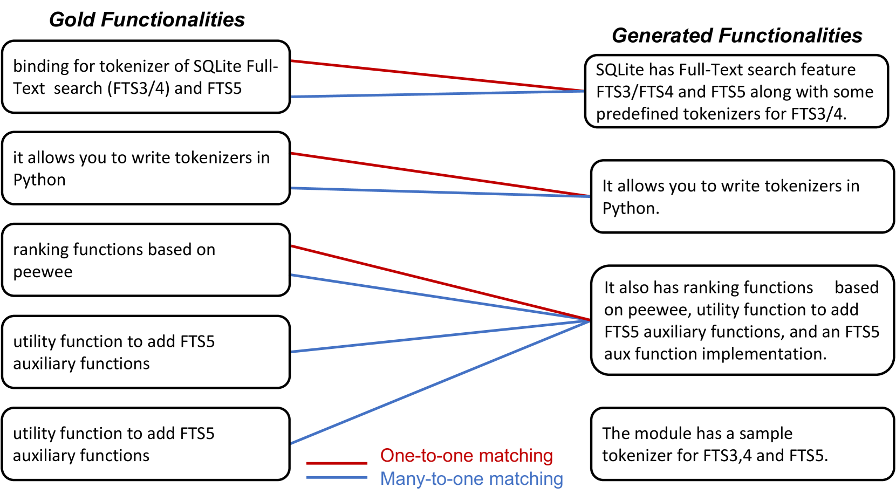
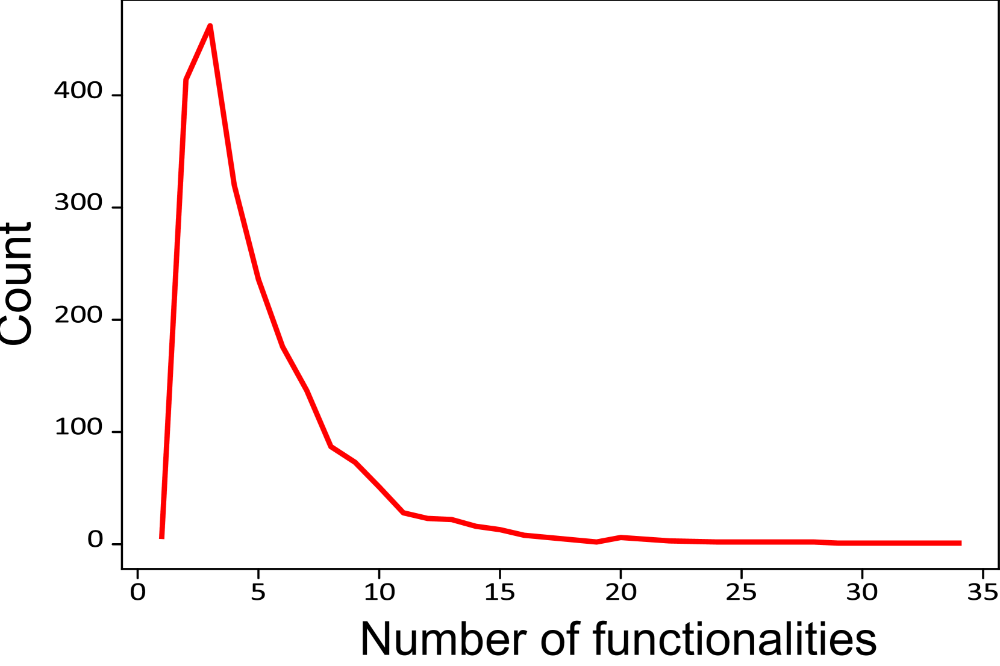

# [深入研读README，挖掘其中隐含的功能信息](https://arxiv.org/abs/2403.10205)

发布时间：2024年03月15日

`LLM应用` `软件工程` `代码理解`

> Read between the lines -- Functionality Extraction From READMEs

> 本篇论文聚焦于一项新颖而实用的任务变体——从Git README文件中抽取出功能性内容，尽管它本质上是文本摘要的一部分，但其独特的难点使通用的文本生成系统难以应对。这项任务的提出紧跟当前利用大型语言模型解决诸如代码重构、代码摘要等编程任务的研究热潮。同时，我们发布了名为FuncRead的人工标注数据集，并为此任务精心打造了一系列模型。经过全面实验，我们惊喜地发现，相对比基于ChatGPT或Bard等流行大型语言模型构建的各类基线模型，小巧精悍的微调模型表现更胜一筹。其中，我们最优的微调版70亿参数CodeLlama模型，在F1指标上分别较ChatGPT和Bard取得了70%和20%的巨大提升。

> While text summarization is a well-known NLP task, in this paper, we introduce a novel and useful variant of it called functionality extraction from Git README files. Though this task is a text2text generation at an abstract level, it involves its own peculiarities and challenges making existing text2text generation systems not very useful. The motivation behind this task stems from a recent surge in research and development activities around the use of large language models for code-related tasks, such as code refactoring, code summarization, etc. We also release a human-annotated dataset called FuncRead, and develop a battery of models for the task. Our exhaustive experimentation shows that small size fine-tuned models beat any baseline models that can be designed using popular black-box or white-box large language models (LLMs) such as ChatGPT and Bard. Our best fine-tuned 7 Billion CodeLlama model exhibit 70% and 20% gain on the F1 score against ChatGPT and Bard respectively.

[Arxiv](https://arxiv.org/abs/2403.10205)