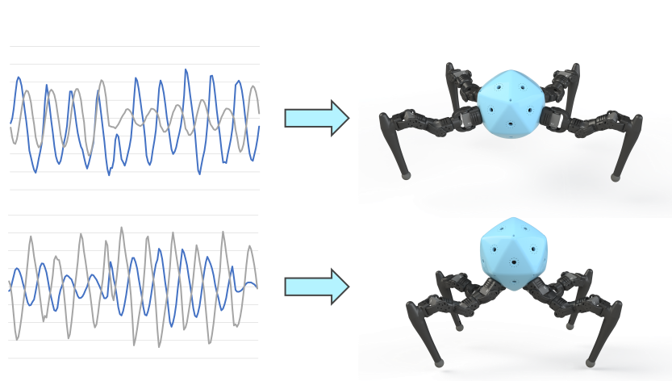
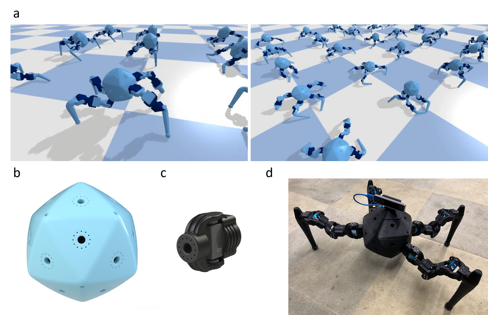
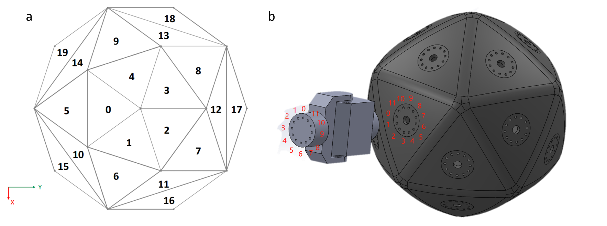
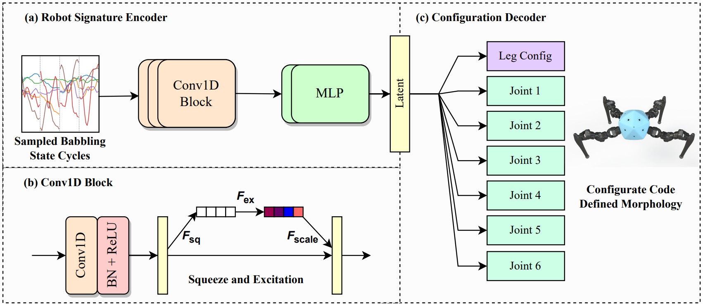
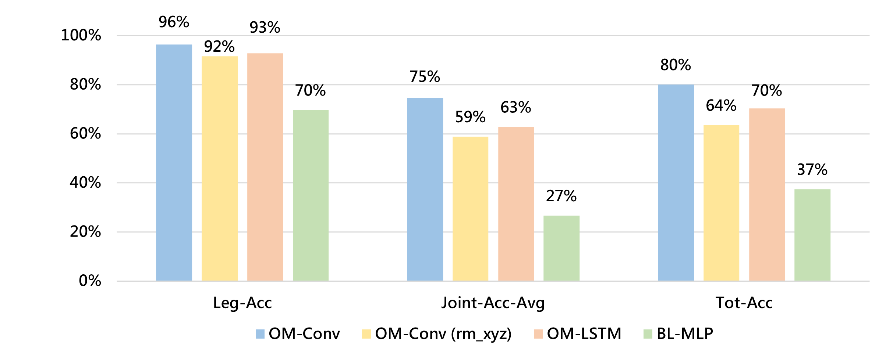
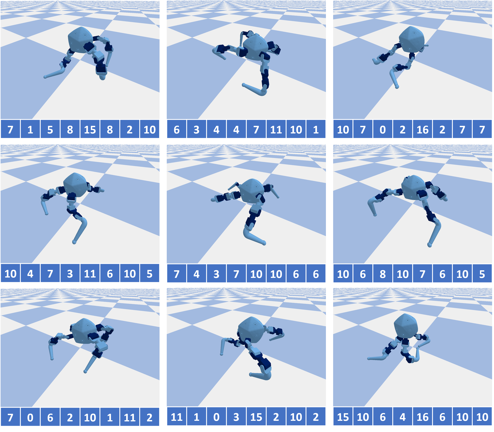
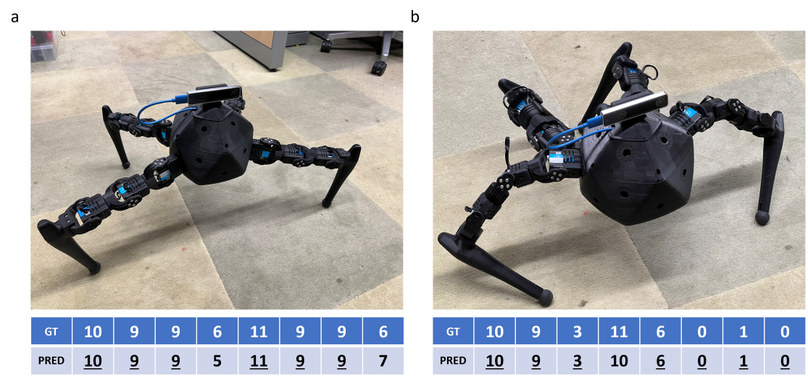

# [通过对运动数据的分析，本研究致力于识别和解析可重构机器人的特性。](https://arxiv.org/abs/2403.10496)

发布时间：2024年03月15日

`Agent` `机器人` `自我建模`

> Reconfigurable Robot Identification from Motion Data

> 当大型语言模型与视觉-语言模型联手赋能机器人时，机器人就能灵活解读复杂的语言指令和视觉信息。但有一个核心难题尚待解决：若要让机器人充分利用这些先进技术，它们必须深入理解自身的物理形态。AI模型的认知能力和对物理形态理解之间的鸿沟引出了一个问题——机器人能否通过与环境互动，自主认知并适应其物理形态和功能呢？这一问题凸显了研发不依赖外部传感器输入或预设结构知识，能够自我建模的机器人的趋势。在此，我们提出了运用本体感受进行元自我建模的方法，即通过感知自身位置和动作，推断机器人的形态特征。为了系统探究机器人运动与其形态间的关联，我们设计了一款拥有12个自由度的可重构四足机器人，并配备了一个包含20万个不同配置的独特数据集。我们采用了一种结合了机器人特征编码器和配置解码器的深度神经网络模型，成功展示出系统能够精准依据本体感受信号预测机器人配置的能力。此项研究深化了机器人自我建模领域的探索，旨在提升机器人在现实环境中对自身物理形态及适应性的理解能力。

> Integrating Large Language Models (VLMs) and Vision-Language Models (VLMs) with robotic systems enables robots to process and understand complex natural language instructions and visual information. However, a fundamental challenge remains: for robots to fully capitalize on these advancements, they must have a deep understanding of their physical embodiment. The gap between AI models cognitive capabilities and the understanding of physical embodiment leads to the following question: Can a robot autonomously understand and adapt to its physical form and functionalities through interaction with its environment? This question underscores the transition towards developing self-modeling robots without reliance on external sensory or pre-programmed knowledge about their structure. Here, we propose a meta self modeling that can deduce robot morphology through proprioception (the internal sense of position and movement). Our study introduces a 12 DoF reconfigurable legged robot, accompanied by a diverse dataset of 200k unique configurations, to systematically investigate the relationship between robotic motion and robot morphology. Utilizing a deep neural network model comprising a robot signature encoder and a configuration decoder, we demonstrate the capability of our system to accurately predict robot configurations from proprioceptive signals. This research contributes to the field of robotic self-modeling, aiming to enhance understanding of their physical embodiment and adaptability in real world scenarios.

[Arxiv](https://arxiv.org/abs/2403.10496)