# [Repoformer，一种专为仓库级别代码补全设计的选择性检索技术，旨在提升代码补全任务的效果和精准度。](https://arxiv.org/abs/2403.10059)

发布时间：2024年03月15日

`RAG` `软件开发` ``

> Repoformer: Selective Retrieval for Repository-Level Code Completion

> 随着 RAG 技术的最新突破，代码库级别的代码补全步入了一个崭新时代。然而，现行方法中固化的检索机制导致了效率与鲁棒性双重困境，许多检索到的上下文对 code LMs 来说并无裨益，甚至产生负面影响。为此，本论文提出一种创新的选择性 RAG 架构，能够在无需检索的情况下灵活规避这一过程。为支持这一架构的有效运作，我们开发了一种自我监督学习策略，让 code LM 能够精准自评检索对其输出质量的改善效果，并可靠地利用可能存在噪音的检索内容。利用这种兼具选择性检索策略与生成模型功能的 LM，我们的框架在RepoEval、CrossCodeEval等多个基准测试以及一个全新基准上均超越了基于固定检索方式的当前最优提示技术。此外，我们的选择性检索方案还带来了显著的效率提升，最高可达70%的推理加速，且性能不受损害。实验证明，无论是在何种生成模型、检索器还是编程语言环境下，我们的框架都能出色适应并发挥效用。以上成就标志着我们在构建更为精确高效代码库级别代码补全工具的道路上迈出了重要的一步。

> Recent advances in retrieval-augmented generation (RAG) have initiated a new era in repository-level code completion. However, the invariable use of retrieval in existing methods exposes issues in both efficiency and robustness, with a large proportion of the retrieved contexts proving unhelpful or harmful to code language models (code LMs). To tackle the challenges, this paper proposes a selective RAG framework where retrieval is avoided when unnecessary. To power this framework, we design a self-supervised learning approach that enables a code LM to accurately self-evaluate whether retrieval can improve its output quality and robustly leverage the potentially noisy retrieved contexts. Using this LM as both the selective retrieval policy and the generation model, our framework consistently outperforms the state-of-the-art prompting with an invariable retrieval approach on diverse benchmarks including RepoEval, CrossCodeEval, and a new benchmark. Meanwhile, our selective retrieval strategy results in strong efficiency improvements by as much as 70% inference speedup without harming the performance. We demonstrate that our framework effectively accommodates different generation models, retrievers, and programming languages. These advancements position our framework as an important step towards more accurate and efficient repository-level code completion.

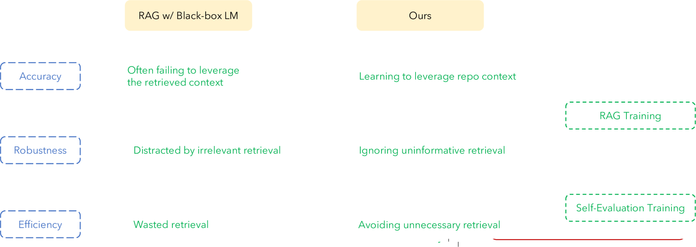

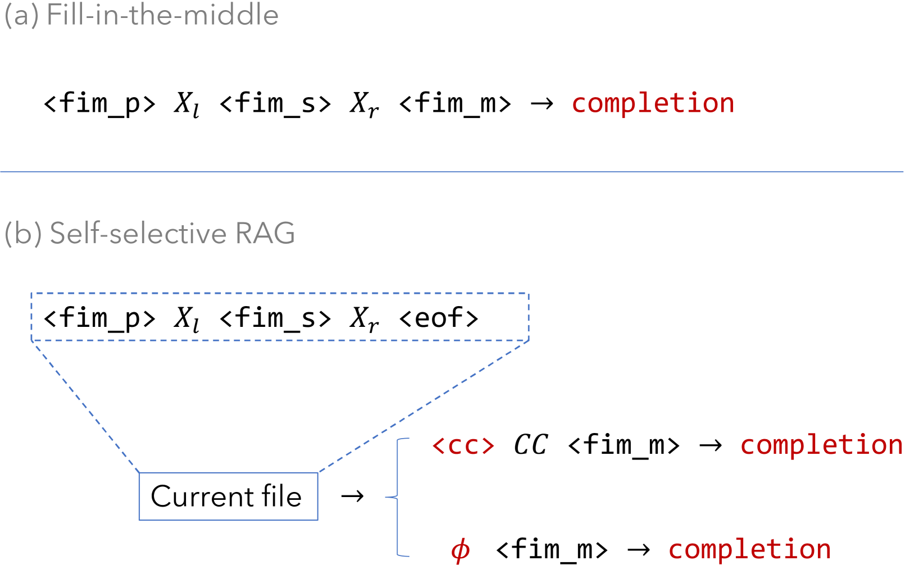

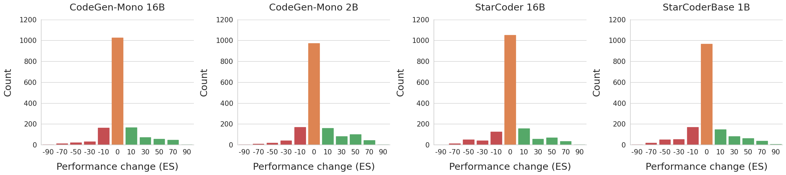

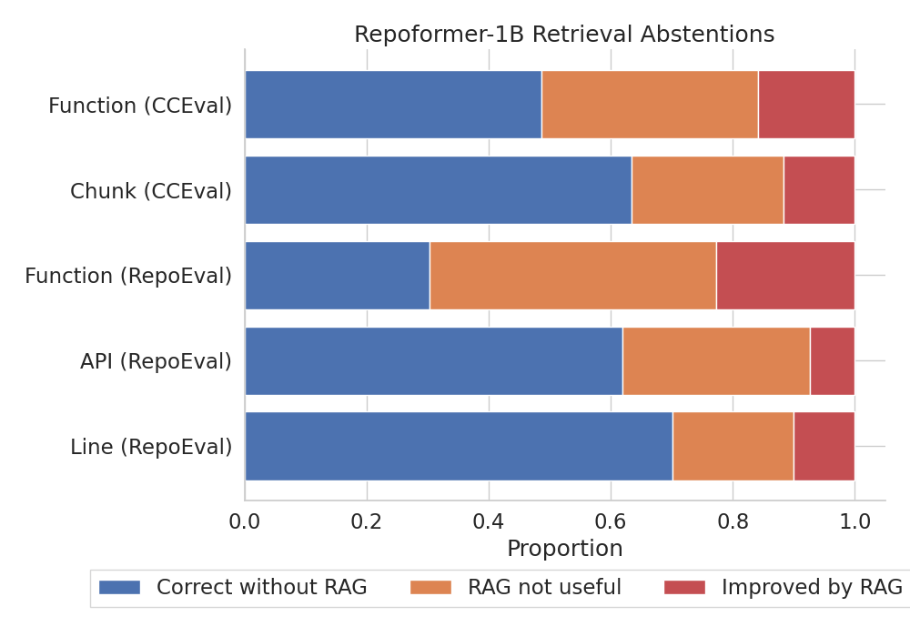

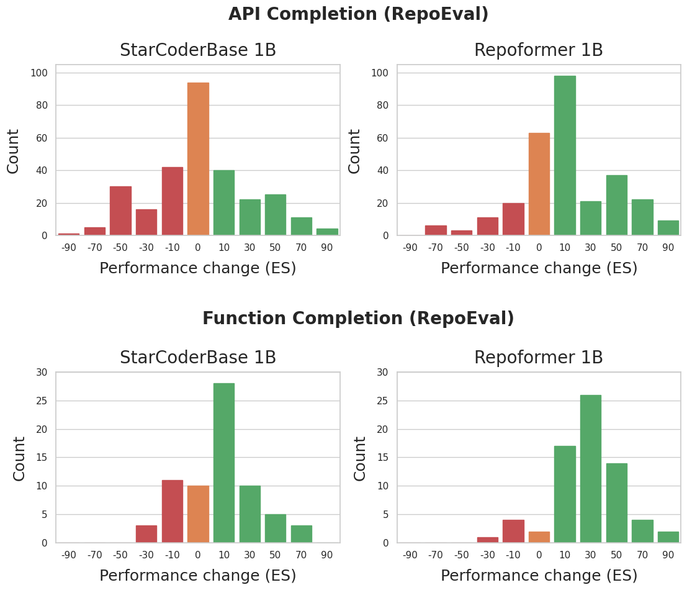

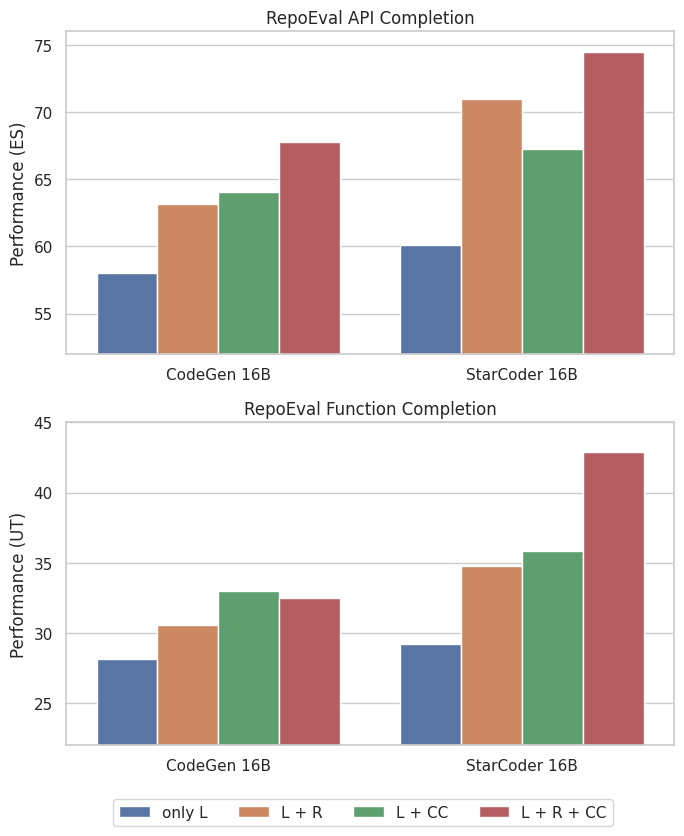

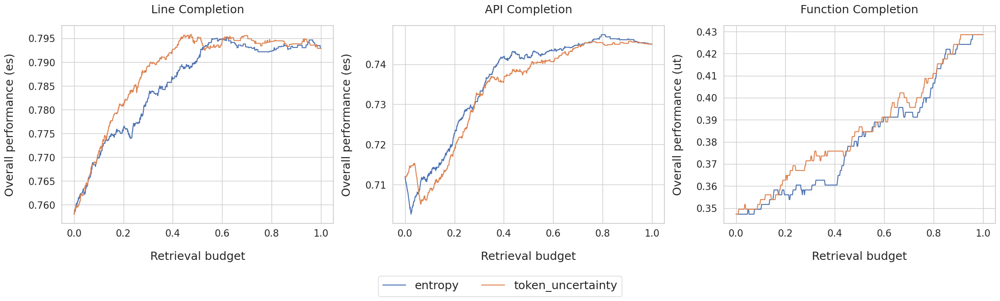

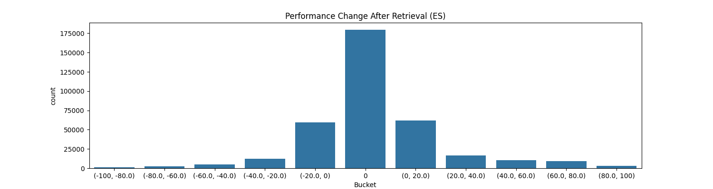

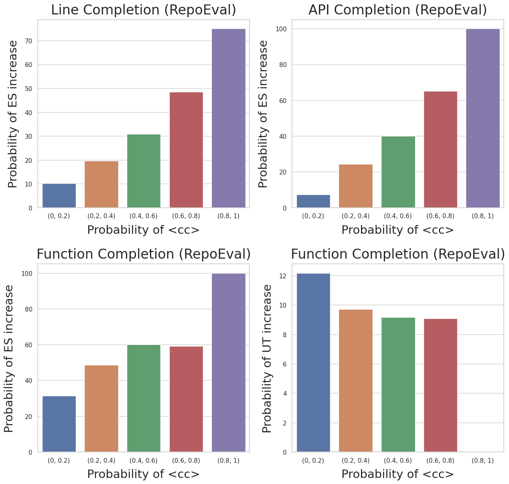

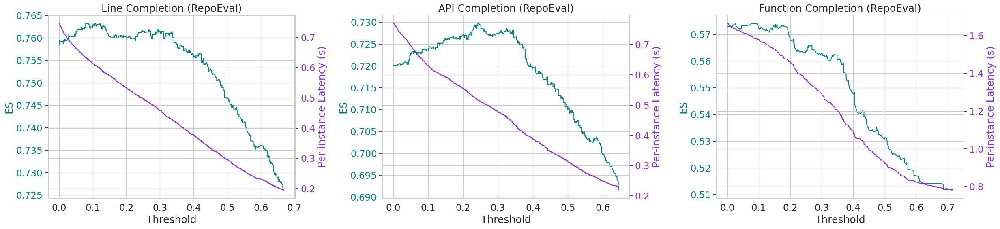

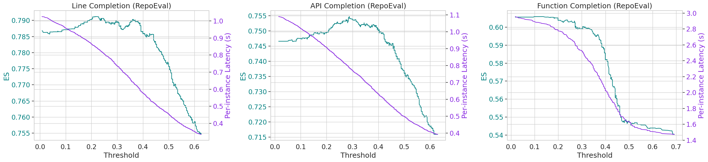

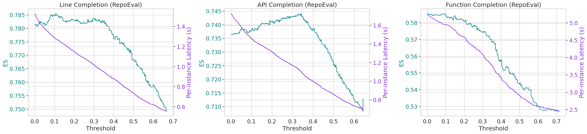

[Arxiv](https://arxiv.org/abs/2403.10059)