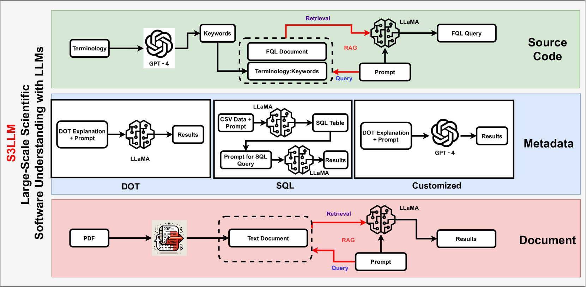

# S3LLM项目借助LLMs的力量，整合了源代码、元数据与相关文档资源，以实现对大型科学软件深层次、全方位的理解。

发布时间：2024年03月15日

`LLM应用` `软件工程`

> S3LLM: Large-Scale Scientific Software Understanding with LLMs using Source, Metadata, and Document

# 摘要

> 面对复杂多样的大规模科学软件，其广泛的代码库、冗长的代码量和特定计算架构带来的理解难题，如今借助于新兴的生成式AI技术，特别是大型语言模型LLMs，我们找到了全新的解读途径。本文推出的S3LLM是一个基于LLM构建的创新框架，它能通过简洁易用的界面，以互动对话的方式同步探究源代码、代码元数据及技术文本摘要。S3LLM巧妙运用开源LLaMA-2模型，将自然语言查询智能转化为特定领域的查询语言（如FQL），轻松高效地梳理遍历整个代码库。不仅如此，S3LLM还能兼容处理DOT、SQL等多种类型的元数据，以及个性化定制格式。更为出色的是，S3LLM集成了RAG和LangChain技术，可直接对海量文档进行深度查询。S3LLM展现了利用本地部署开源LLMs加速解析大规模科学计算软件的巨大潜力，极大地降低了对专家级编码技能的依赖，从而提升了理解和应用此类软件的效率与效果。现在您可以在https://github.com/ResponsibleAILab/s3llm上找到并了解S3LLM项目。

> The understanding of large-scale scientific software poses significant challenges due to its diverse codebase, extensive code length, and target computing architectures. The emergence of generative AI, specifically large language models (LLMs), provides novel pathways for understanding such complex scientific codes. This paper presents S3LLM, an LLM-based framework designed to enable the examination of source code, code metadata, and summarized information in conjunction with textual technical reports in an interactive, conversational manner through a user-friendly interface. S3LLM leverages open-source LLaMA-2 models to enhance code analysis through the automatic transformation of natural language queries into domain-specific language (DSL) queries. Specifically, it translates these queries into Feature Query Language (FQL), enabling efficient scanning and parsing of entire code repositories. In addition, S3LLM is equipped to handle diverse metadata types, including DOT, SQL, and customized formats. Furthermore, S3LLM incorporates retrieval augmented generation (RAG) and LangChain technologies to directly query extensive documents. S3LLM demonstrates the potential of using locally deployed open-source LLMs for the rapid understanding of large-scale scientific computing software, eliminating the need for extensive coding expertise, and thereby making the process more efficient and effective. S3LLM is available at https://github.com/ResponsibleAILab/s3llm.

[Arxiv](https://arxiv.org/abs/2403.10588)