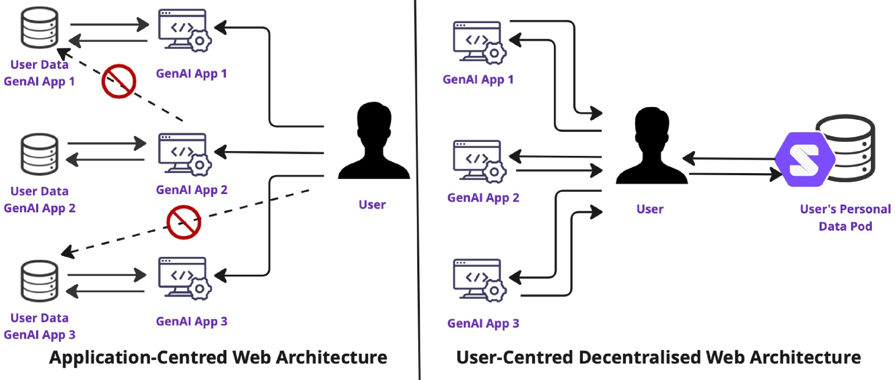
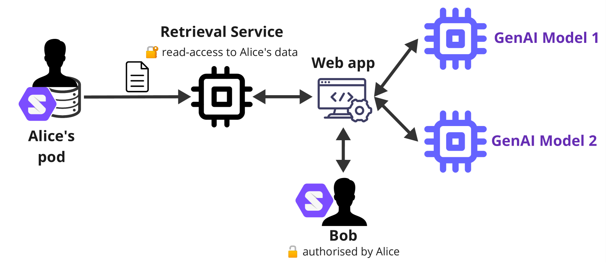
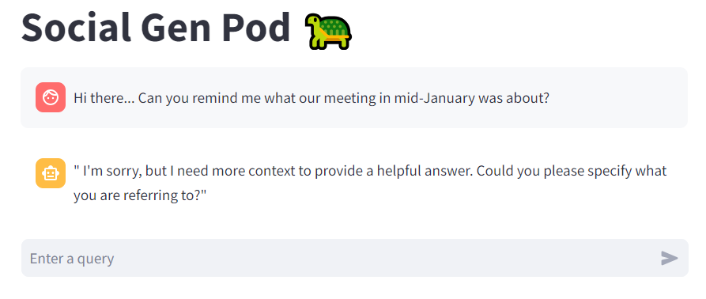
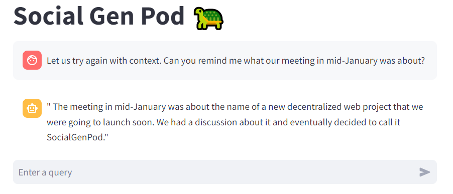
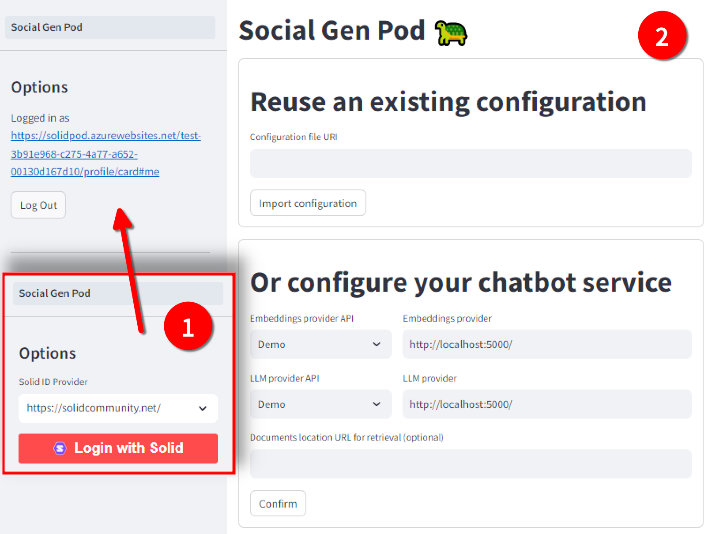
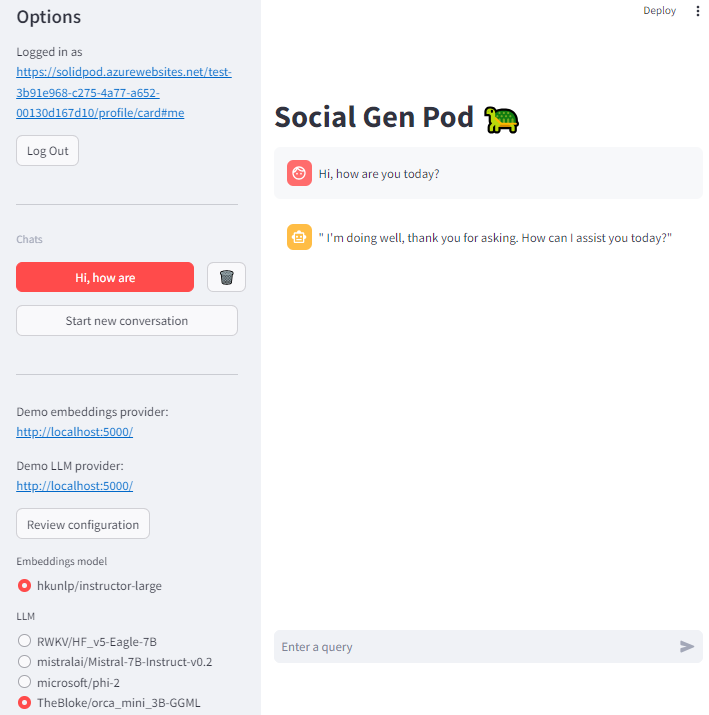

# [SocialGenPod 是一款注重隐私保护的生成式 AI 社交网络应用，它利用去中心化的个人数据存储技术。这款应用致力于在保障用户隐私的同时，提供基于 AI 的创新社交体验。](https://arxiv.org/abs/2403.10408)

发布时间：2024年03月15日

`Agent` `隐私保护` `人工智能`

> SocialGenPod: Privacy-Friendly Generative AI Social Web Applications with Decentralised Personal Data Stores

> 我们推出了 SocialGenPod，这是一种创新的去中心化解决方案，旨在保护隐私的同时部署生成式 AI Web 应用。不同于传统的集中式网络和数据架构，它将用户数据与应用和服务提供商紧密捆绑，我们借助去中心化 Web 规范——Solid，让用户数据能够与生成式 AI 应用彻底解绑。通过一个原型实例，我们展示了 SocialGenPod 如何让用户体验与多种大型语言模型的对话，并可通过选用检索增强生成技术，基于用户可直接或间接访问的任意 Solid Pod 中私密文档生成有事实依据的回答。SocialGenPod 精心运用 Solid 访问控制机制，确保用户能全权掌控自己 Pods 中数据的访问权限。无论是聊天记录、应用配置还是个人文档等各种用户数据，都会安全储存在用户的个人专属 Pod 内，独立于特定模型或应用提供者之外。这样的设计不仅提升了隐私保护能力，还使得数据能够在不同服务和应用间轻松迁移。此外，我们也探讨了当前前沿模型所提出的巨大计算需求这一难题，指出这是本领域未来研究亟待解决的关键问题。目前，我们的原型已经开源并可在 GitHub 地址 https://github.com/Vidminas/socialgenpod/ 下载获取。

> We present SocialGenPod, a decentralised and privacy-friendly way of deploying generative AI Web applications. Unlike centralised Web and data architectures that keep user data tied to application and service providers, we show how one can use Solid -- a decentralised Web specification -- to decouple user data from generative AI applications. We demonstrate SocialGenPod using a prototype that allows users to converse with different Large Language Models, optionally leveraging Retrieval Augmented Generation to generate answers grounded in private documents stored in any Solid Pod that the user is allowed to access, directly or indirectly. SocialGenPod makes use of Solid access control mechanisms to give users full control of determining who has access to data stored in their Pods. SocialGenPod keeps all user data (chat history, app configuration, personal documents, etc) securely in the user's personal Pod; separate from specific model or application providers. Besides better privacy controls, this approach also enables portability across different services and applications. Finally, we discuss challenges, posed by the large compute requirements of state-of-the-art models, that future research in this area should address. Our prototype is open-source and available at: https://github.com/Vidminas/socialgenpod/.

[Arxiv](https://arxiv.org/abs/2403.10408)