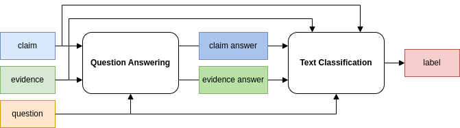
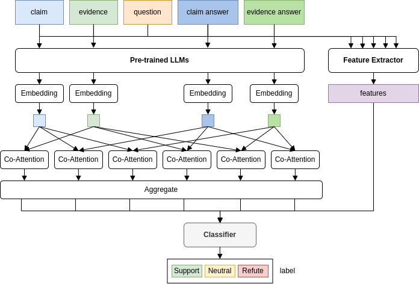

# [Team Trifecta 在 Factify5WQA 项目中以微调技术树立了事实核查的新标杆](https://arxiv.org/abs/2403.10281)

发布时间：2024年03月15日

`LLM应用` `事实核查`

> Team Trifecta at Factify5WQA: Setting the Standard in Fact Verification with Fine-Tuning

> 本文介绍了一种名为Pre-CoFactv3的综合框架，它结合了问题回答与文本分类模块，专为事实核查任务设计。该框架巧妙运用了上下文学习技术、经过微调的大型语言模型LLMs及FakeNet模型来解决事实核查难题。实验中，我们广泛探索并对比了多种途径，包括采用不同预训练的LLMs、融入FakeNet以及应用多样化的集成策略。尤为值得一提的是，我们的团队Trifecta在AAAI-24 Factify 3.0研讨会上勇夺桂冠，不仅将基线准确率提升了103%，而且相对于亚军保持了高达70%的优势，充分证明了我们方法的有效性和其在推动事实核查研究领域的重要潜力。

> In this paper, we present Pre-CoFactv3, a comprehensive framework comprised of Question Answering and Text Classification components for fact verification. Leveraging In-Context Learning, Fine-tuned Large Language Models (LLMs), and the FakeNet model, we address the challenges of fact verification. Our experiments explore diverse approaches, comparing different Pre-trained LLMs, introducing FakeNet, and implementing various ensemble methods. Notably, our team, Trifecta, secured first place in the AAAI-24 Factify 3.0 Workshop, surpassing the baseline accuracy by 103% and maintaining a 70% lead over the second competitor. This success underscores the efficacy of our approach and its potential contributions to advancing fact verification research.

[Arxiv](https://arxiv.org/abs/2403.10281)