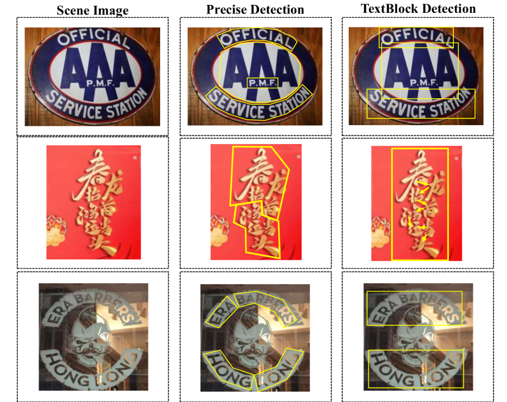
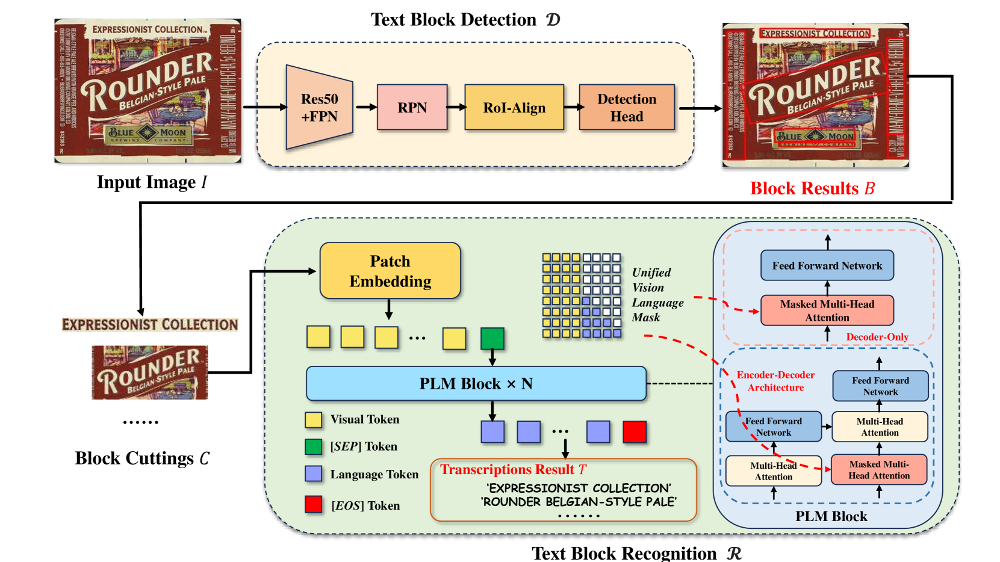
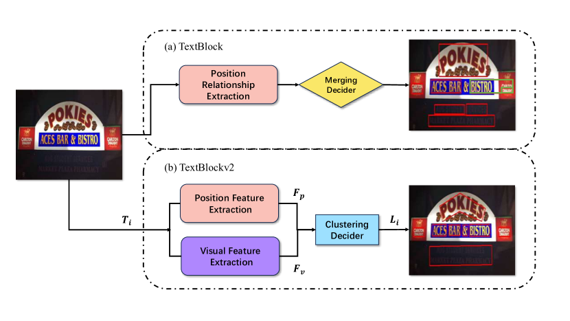
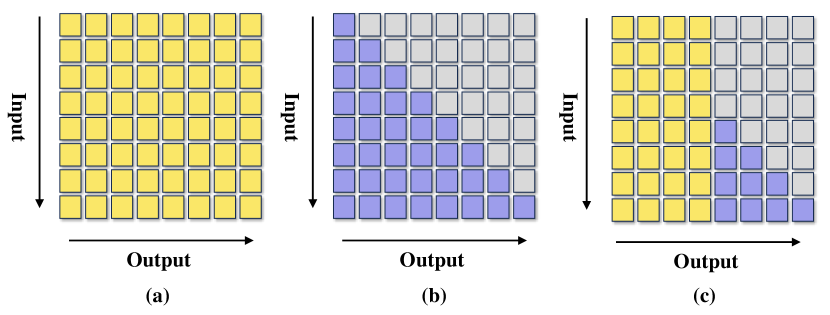
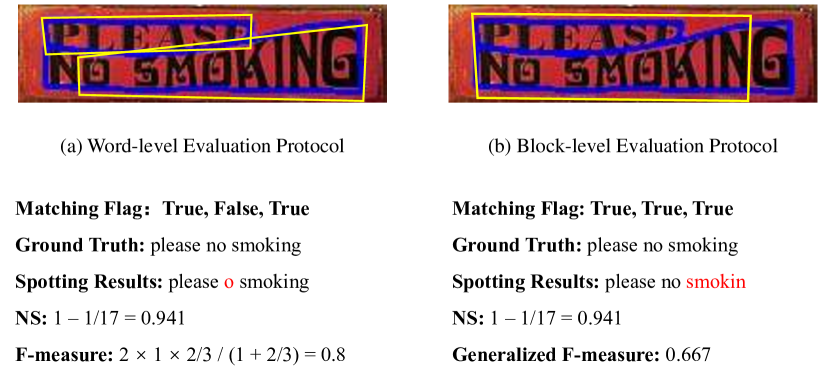

# [TextBlockV2：迈向基于预训练语言模型、无需精细检测的精准场景文字识别技术](https://arxiv.org/abs/2403.10047)

发布时间：2024年03月15日

`LLM应用` `图像处理` ``

> TextBlockV2: Towards Precise-Detection-Free Scene Text Spotting with Pre-trained Language Model

> 现有场景文本探测技术致力于从图像中精确定位与转录文字，但要同时做到精确检测和识别极具挑战。受人眼快速定位及PLM在视觉任务上优秀表现的启发，我们提出两个思考：1）机器能否如人一般，无需精细检测就能捕捉场景文本？2）除单词或字符外，文本块是否也能成为一种有效的场景文本探测方式？因此，我们创新设计了一种场景文本探测器，它巧妙运用尖端PLM技术提高性能，无须过分依赖精细化检测。我们首先采用简易检测器初步锁定文本块位置，再利用大规模OCR数据集对PLM进行微调以确保精准识别。得益于预训练阶段积累的深厚语言理解能力，基于PLM的识别模块能够从容应对诸如多行排列、倒置、遮挡及检测不完整的复杂文本情况。经过在多个公开基准上的广泛实验验证，结合优化后的PLM识别模块与文本块检测模式，我们的场景文本探测器展现出超越同类的强大性能。另外，我们还尝试直接从整体场景图像中识别文本，进一步展现PLM乃至LLMs的巨大潜力。

> Existing scene text spotters are designed to locate and transcribe texts from images. However, it is challenging for a spotter to achieve precise detection and recognition of scene texts simultaneously. Inspired by the glimpse-focus spotting pipeline of human beings and impressive performances of Pre-trained Language Models (PLMs) on visual tasks, we ask: 1) "Can machines spot texts without precise detection just like human beings?", and if yes, 2) "Is text block another alternative for scene text spotting other than word or character?" To this end, our proposed scene text spotter leverages advanced PLMs to enhance performance without fine-grained detection. Specifically, we first use a simple detector for block-level text detection to obtain rough positional information. Then, we finetune a PLM using a large-scale OCR dataset to achieve accurate recognition. Benefiting from the comprehensive language knowledge gained during the pre-training phase, the PLM-based recognition module effectively handles complex scenarios, including multi-line, reversed, occluded, and incomplete-detection texts. Taking advantage of the fine-tuned language model on scene recognition benchmarks and the paradigm of text block detection, extensive experiments demonstrate the superior performance of our scene text spotter across multiple public benchmarks. Additionally, we attempt to spot texts directly from an entire scene image to demonstrate the potential of PLMs, even Large Language Models (LLMs).

[Arxiv](https://arxiv.org/abs/2403.10047)