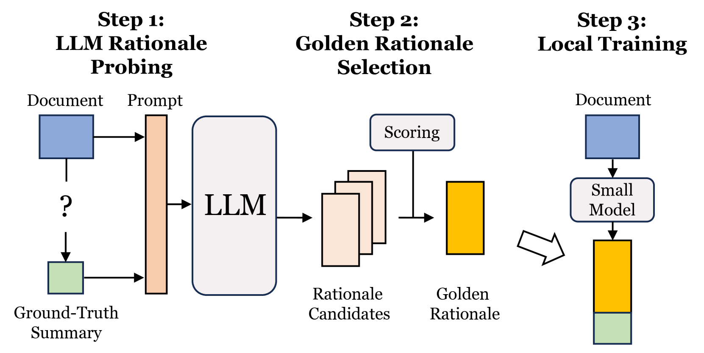
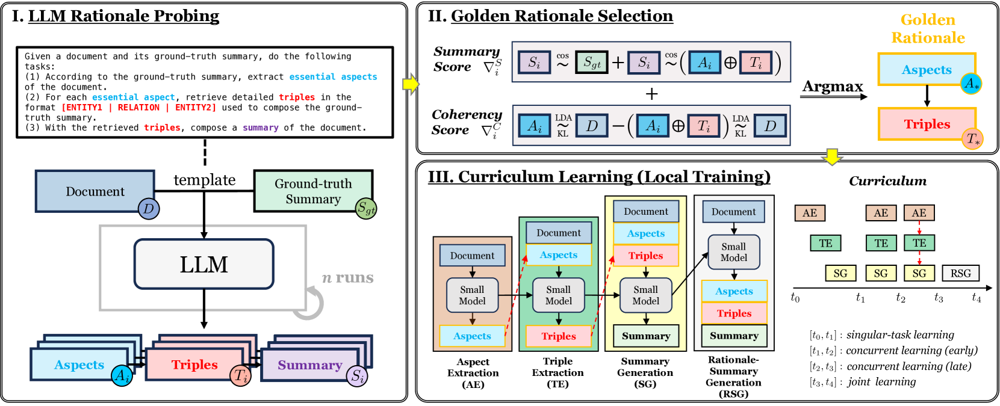
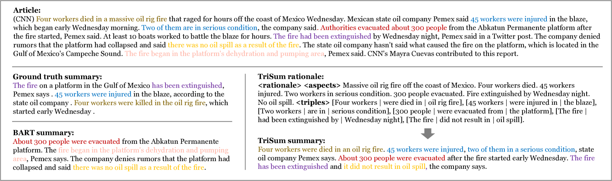
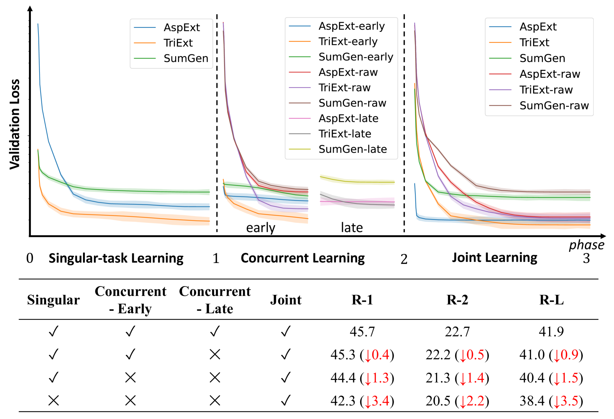
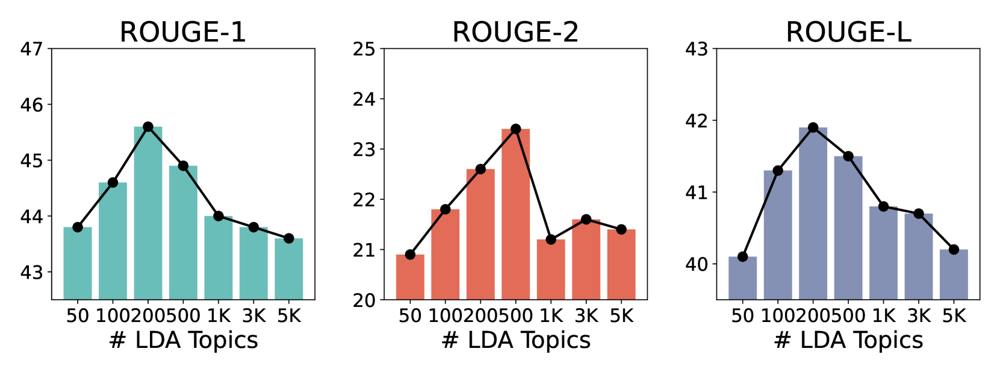
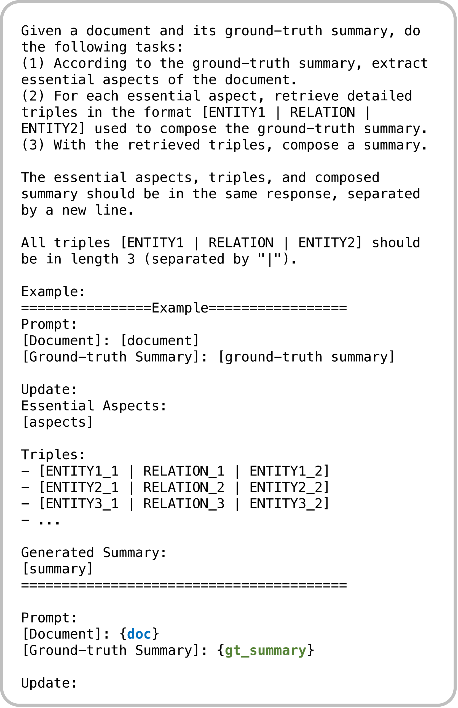
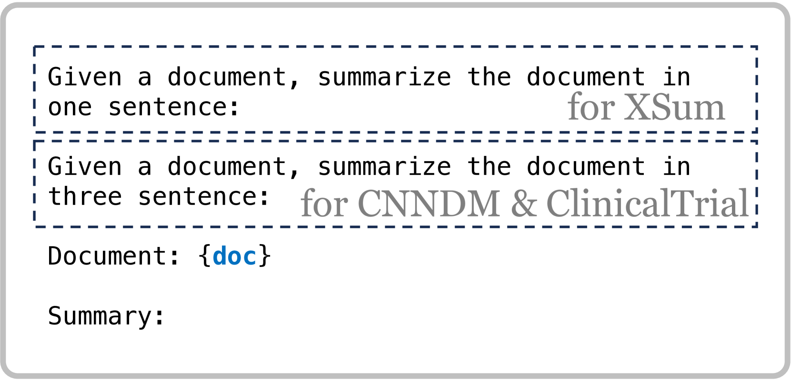
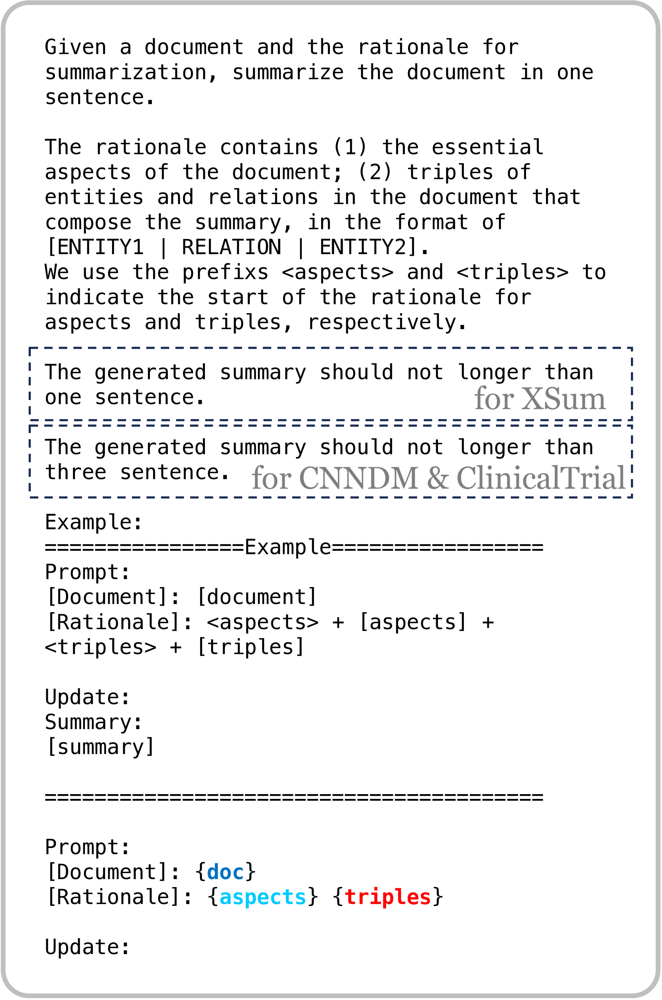
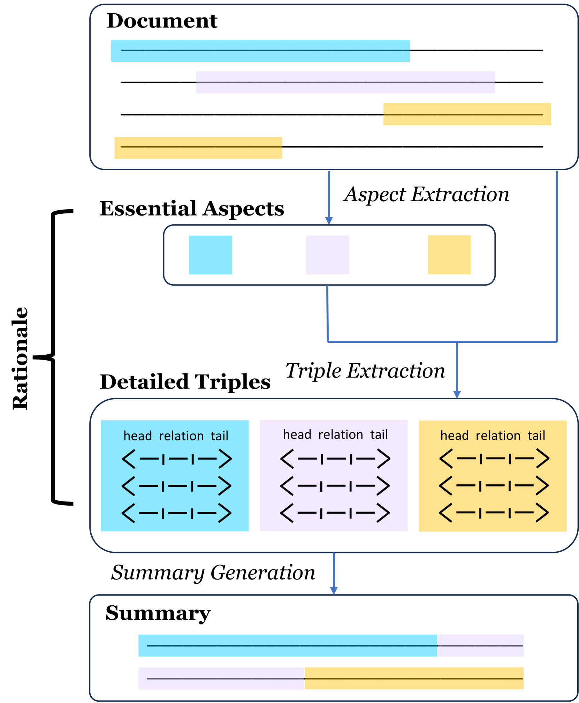
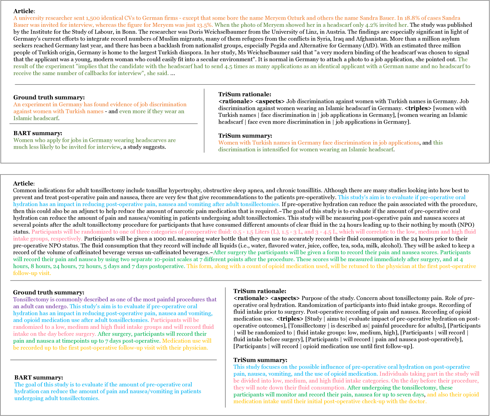

# TriSum 方法致力于在大型语言模型中汲取摘要能力，借助结构化的推理方式实现这一目标。进一步细化步骤2的翻译：TriSum 是一项研究，它探索如何利用大型语言模型中的结构化推理机制来培养和提升文本摘要能力。

发布时间：2024年03月15日

`LLM应用` `文本摘要` `隐私保护`

> TriSum: Learning Summarization Ability from Large Language Models with Structured Rationale

> 随着LLMs的崛起，文本摘要技术取得了显著进步，但由于其庞大体积、计算要求高以及数据传输过程中的隐私顾虑，在资源有限和重视隐私的场景下应用受限。为此，我们创新推出了TriSum框架，它能将LLMs强大的文本摘要能力压缩进小巧且本地运行的模型之中。起初，LLMs运用双重评分机制筛选出高质量的方面-三元组理由和摘要集合；随后，采用逐渐升级的任务难度课程学习策略，以这些精选任务训练小型本地模型。这一方法成功提升了本地模型在CNN/DailyMail、XSum和ClinicalTrial等多个基准上的性能表现，分别超越基线4.5%、8.5%和7.4%，并且因其揭示了摘要生成背后的逻辑依据，进而增强了模型的可解释性。

> The advent of large language models (LLMs) has significantly advanced natural language processing tasks like text summarization. However, their large size and computational demands, coupled with privacy concerns in data transmission, limit their use in resource-constrained and privacy-centric settings. To overcome this, we introduce TriSum, a framework for distilling LLMs' text summarization abilities into a compact, local model. Initially, LLMs extract a set of aspect-triple rationales and summaries, which are refined using a dual-scoring method for quality. Next, a smaller local model is trained with these tasks, employing a curriculum learning strategy that evolves from simple to complex tasks. Our method enhances local model performance on various benchmarks (CNN/DailyMail, XSum, and ClinicalTrial), outperforming baselines by 4.5%, 8.5%, and 7.4%, respectively. It also improves interpretability by providing insights into the summarization rationale.

[Arxiv](https://arxiv.org/abs/2403.10351)