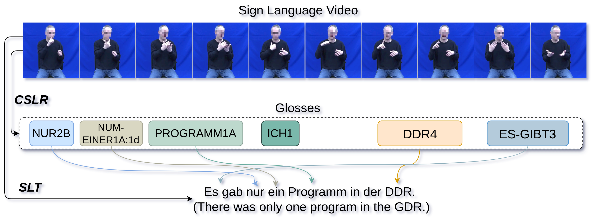

# 通过运用 LLM 技术，我们可以将手语识别直接转化为流畅的口语句子。

发布时间：2024年03月15日

`LLM应用` `手语翻译` `视频处理`

> Using an LLM to Turn Sign Spottings into Spoken Language Sentences

# 摘要

> 手语翻译（SLT），即从手语视频生成口语句子，是一项艰巨的任务。本文提出了一种创新的混合方案Spotter+GPT，巧妙融合了手语识别技术与预训练大型语言模型的力量，以提升SLT的表现。具体来说，首先利用专门训练于语言学手语数据集上的识别器对手语视频进行解析，精准识别出手语动作。接着，这些识别出的手语输入至功能强大的语言模型，经过转化，生成既连贯又符合语境的口语句子。

> Sign Language Translation (SLT) is a challenging task that aims to generate spoken language sentences from sign language videos. In this paper, we introduce a hybrid SLT approach, Spotter+GPT, that utilizes a sign spotter and a pretrained large language model to improve SLT performance. Our method builds upon the strengths of both components. The videos are first processed by the spotter, which is trained on a linguistic sign language dataset, to identify individual signs. These spotted signs are then passed to the powerful language model, which transforms them into coherent and contextually appropriate spoken language sentences.

[Arxiv](https://arxiv.org/abs/2403.10434)