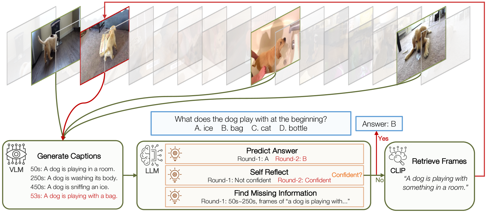
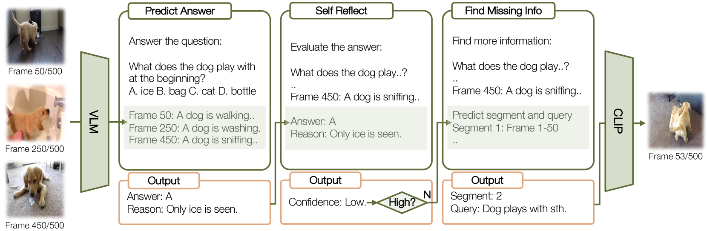
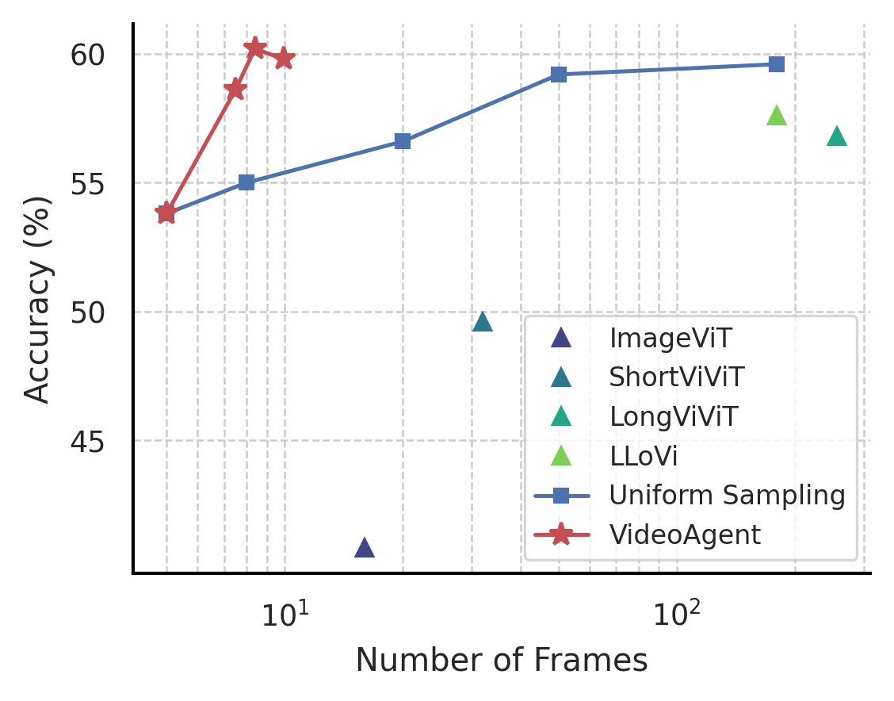
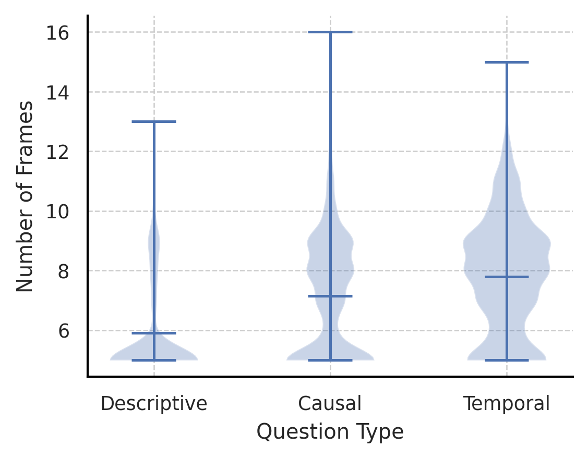
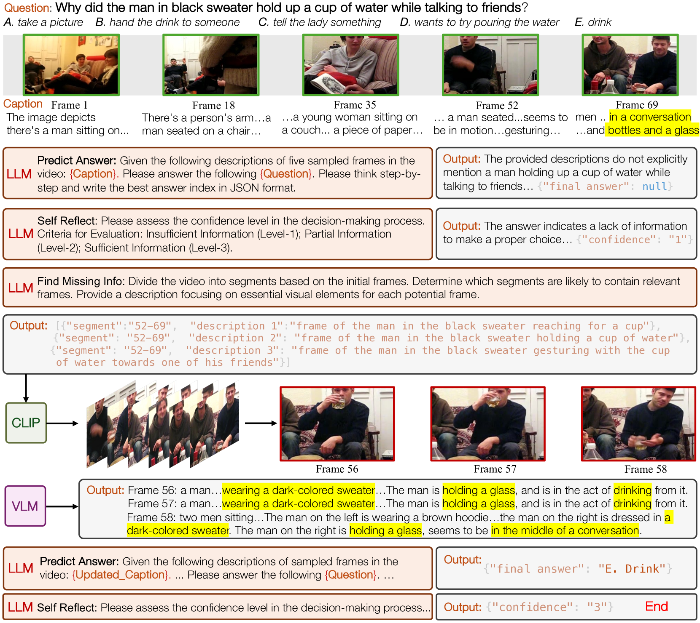
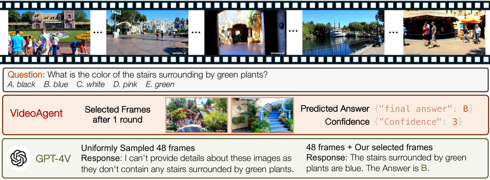

# VideoAgent 是一项通过运用大型语言模型作为智能代理，实现对长格式视频内容深度理解的技术方案。

发布时间：2024年03月15日

`Agent` `视频理解` `计算机视觉`

> VideoAgent: Long-form Video Understanding with Large Language Model as Agent

# 摘要

> 面对长视频理解这一计算机视觉领域的重大难题，我们模仿人类对此类信息的认知方式，重点关注跨模态、长时序的交互式推理与规划能力。为此，我们创新提出了一种名为VideoAgent的智能代理系统，其核心是一个大型语言模型，能循环识别并汇总关键信息以解答问题；同时，利用视觉-语言基础模型作为辅助工具，实现视觉信息的翻译与检索。经过在颇具挑战性的EgoSchema和NExT-QA基准上的严格评估，VideoAgent仅凭借平均每段视频片段8.4帧和8.2帧的数据，就取得了54.1%和71.3%的出色零样本准确率。这些成绩不仅体现了我们方法相较于现有最先进方法的高效与精准优势，也有力彰显了基于代理的方法在推动长视频理解深入发展方面的巨大潜力。

> Long-form video understanding represents a significant challenge within computer vision, demanding a model capable of reasoning over long multi-modal sequences. Motivated by the human cognitive process for long-form video understanding, we emphasize interactive reasoning and planning over the ability to process lengthy visual inputs. We introduce a novel agent-based system, VideoAgent, that employs a large language model as a central agent to iteratively identify and compile crucial information to answer a question, with vision-language foundation models serving as tools to translate and retrieve visual information. Evaluated on the challenging EgoSchema and NExT-QA benchmarks, VideoAgent achieves 54.1% and 71.3% zero-shot accuracy with only 8.4 and 8.2 frames used on average. These results demonstrate superior effectiveness and efficiency of our method over the current state-of-the-art methods, highlighting the potential of agent-based approaches in advancing long-form video understanding.

[Arxiv](https://arxiv.org/abs/2403.10517)